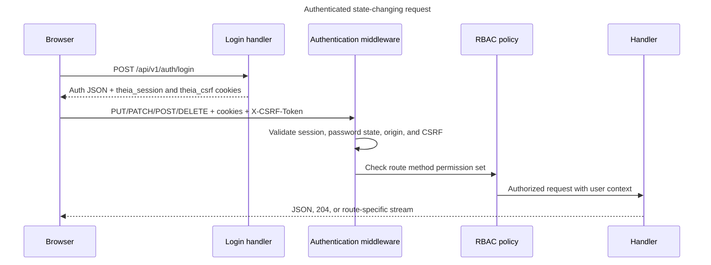
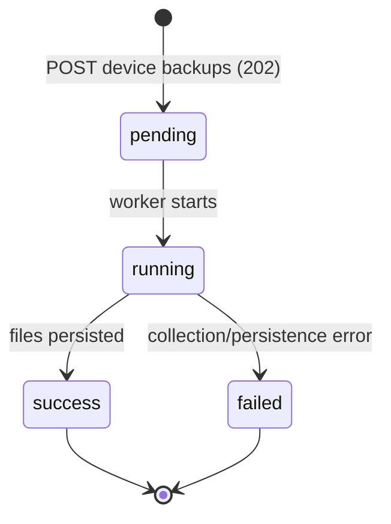
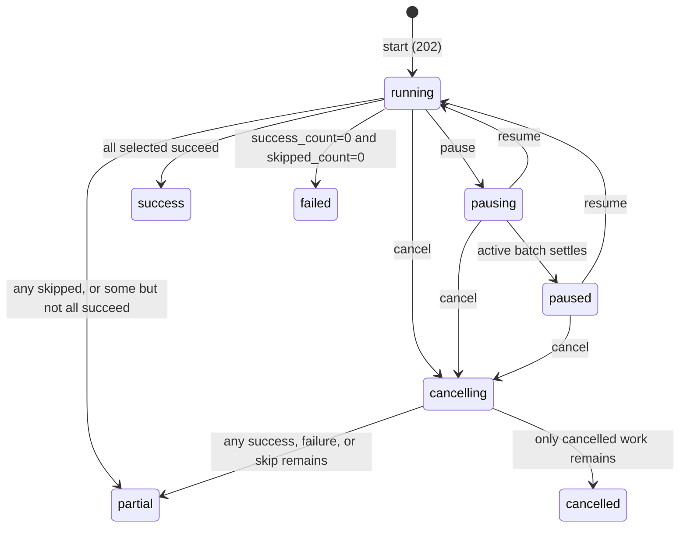
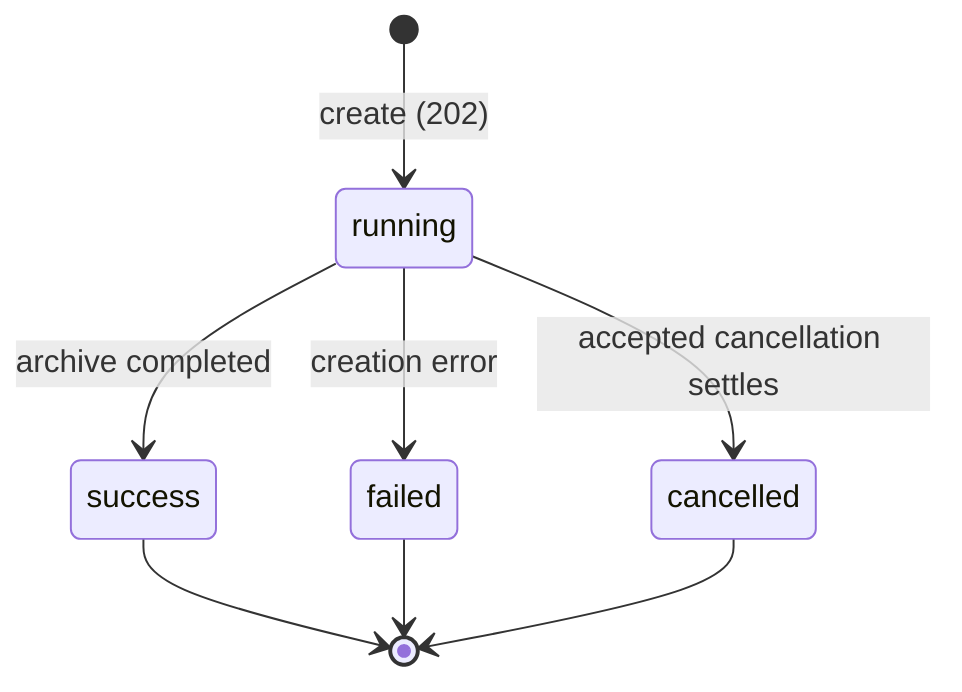
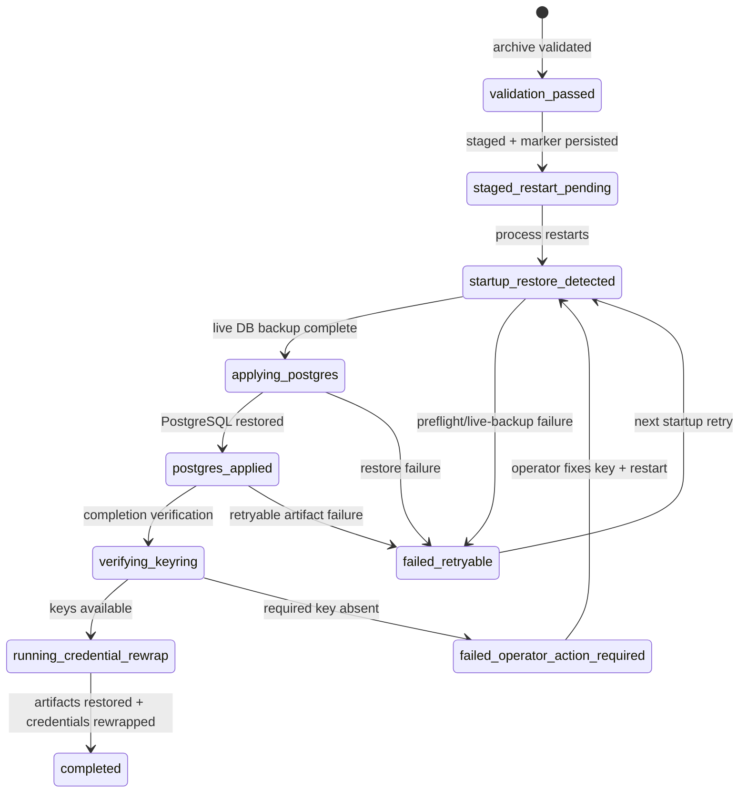

# Theia API Reference

## Purpose and Scope

This document is the maintainer reference for every externally reachable Theia HTTP and WebSocket surface. It records the transport, security, authorization, and central route-registration contracts implemented by the repository. It is not a promise that every endpoint is a stable public third-party compatibility contract; unless a compatibility note says otherwise, the first-party frontend and backend may evolve together.

Use [ARCHITECTURE.md](ARCHITECTURE.md) for component ownership, [README.md](README.md) for the product overview, and [SETUP.md](SETUP.md) for deployment and operator procedures.

## Base URLs and Versioning

All centrally registered application routes use the `/api/v1` prefix.

| Environment | API base URL | Transport model |
| --- | --- | --- |
| Direct development | `http://localhost:8080/api/v1` | The browser or an API client connects directly to the Go backend. The Vite frontend runs at `http://localhost:3000` and can proxy relative API requests. |
| Production | `http://localhost/api/v1` | nginx serves the compiled frontend and proxies same-origin `/api` requests to the internal backend. Prefer relative `/api/v1/...` URLs in browser code. |
| Staging compose | `http://localhost:3001/api/v1` | The staging frontend entry point proxies API traffic to the backend. |

`VITE_API_URL` selects the Vite proxy target at build/development time; it does not introduce another server-side API version. Direct cross-origin REST and WebSocket access must use an exact origin allowed by `THEIA_ALLOWED_ORIGINS`, while same-host proxy traffic is accepted without an extra allowlist entry.

## HTTP Conventions

- The normal protected JSON chain wraps request bodies with a 1 MiB reader limit. Public authentication and connector-launch routes use a 16 KiB wrapper. Endpoints that fully consume those readers through the shared `decodeJSON` helper observe over-limit input as `413`; a handler that stops after one decoded value can leave an oversized suffix unread, as detailed under [Common Request Contracts](#common-request-contracts). Instance restore accepts a streaming multipart body capped at the configured compressed-archive limit plus a 1 MiB multipart envelope; the default compressed limit is 256 MiB. Binary-download profiles do not apply the JSON body wrapper.
- JSON request bodies use `Content-Type: application/json`; JSON clients should send `Accept: application/json`. The JSON middleware sets `application/json` on normal responses, while download and WebSocket handlers set their own content type or upgrade the connection.
- Route placeholders such as `{deviceID}`, `{mapID}`, and `{backupID}` are UUID strings unless the handler names another identifier, such as `{key}`, `{vendorID}`, `{os}`, or `{arch}`. Timestamp strings are emitted in RFC 3339-compatible UTC form; some handlers retain sub-second precision.
- `GET` read policies commonly register `HEAD` with the same permission. The catalog preserves that metadata exactly. See the `HEAD` implementation caveat in [Maintenance Checklist](#maintenance-checklist).
- CORS preflight `OPTIONS` receives `204 No Content`. Allowed browser methods are `GET`, `POST`, `PUT`, `PATCH`, `DELETE`, and `OPTIONS`; credentialed responses echo an allowed exact origin.
- Unsupported methods normally return `405 Method Not Allowed` with the shared error envelope. Unknown route shapes return `404 Not Found` when they reach a route-aware dispatcher.

## Authentication and Session Security

Password login uses `POST /api/v1/auth/login`. A successful login returns an authentication envelope and sets two cookies with path `/`, an expiry, `Max-Age`, and `SameSite=Strict`:

- `theia_session` contains the password-session token and is `HttpOnly`.
- `theia_csrf` contains the matching CSRF token and is intentionally readable by the frontend.
- Both cookies are marked `Secure` when the backend sees TLS or `X-Forwarded-Proto: https`.

The frontend reads `theia_csrf` and sends it as `X-CSRF-Token` on JSON requests made through its mutating transport helper. Authenticated `POST`, `PUT`, `PATCH`, and `DELETE` requests require that header, except login. Session-aware logout and password change validate it inside the authentication handler. Logout expires both cookies and returns `204`; invalid-session detection also clears both cookies.

The authentication envelope is `{"authenticated":<boolean>,"user":<safe-user>}`. The safe user includes ID, username, email, display name, status, `must_change_password`, role IDs, and permission keys, but no password or credential secret. An unauthenticated `GET /api/v1/auth/me` is a successful anonymous envelope rather than a `401`.

On first login, `must_change_password=true` restricts normal protected HTTP and WebSocket use. Protected requests receive `403` with code `password_change_required` until the current user completes `POST /api/v1/auth/password/change`; session inspection and logout remain available. The password-change response refreshes the safe user in the existing session.

An administrator can issue a one-time reset token through the protected administration route. The token is redeemed without a session at `POST /api/v1/auth/password/reset` using `token` and `new_password`; success returns `204`. Invalid, expired, reused-password, and password-policy failures retain distinct status/code semantics.

Public auth routes bypass global RBAC middleware but are not all anonymous operations. The catalog therefore distinguishes `Public` from `Session-aware public`. The connector-launch route is also public to password-session middleware, but authenticates a bridge credential through `Authorization: Bridge <secret>` and applies a per-client rate limit.



## Authorization and RBAC

The central registry assigns one of four effective access modes:

- `Public`: no password-session or RBAC requirement; route-specific credentials or limits may still apply.
- `Session-aware public`: bypasses global RBAC, but the authentication handler optionally or mandatorily resolves the session and may validate CSRF.
- `Protected`: requires a valid `theia_session`, an acceptable origin, CSRF on mutations, and at least one permission listed for the concrete method.
- `WebSocket upgrade`: authenticates the password session and `topology:read` permission before preserving the unwrapped response writer for the HTTP upgrade.

Multiple permissions on one method are alternatives at the central middleware boundary: possession of any listed permission passes that check. Handlers may narrow access further. For example, administration handlers recheck their operation-specific permission, and setting a user to a non-active status additionally requires `users:disable`.

REST origin validation permits requests with no `Origin`, an origin whose host exactly matches the request host, or an exact configured origin. Other browser origins receive `403`. WebSocket requests pass the same session and RBAC checks, then the WebSocket handler independently validates the same-host/configured origin before upgrading. Wildcard origins are not used.

## Common Request Contracts

- Shared-decoder mutating JSON: endpoints that call `decodeJSON` require exactly one JSON value with no trailing second value. Send `Content-Type: application/json`; authenticated requests include both session cookie and `X-CSRF-Token`.
- Read-only JSON: normally no body; query parameters and conditional headers are route-specific.
- Restore: `multipart/form-data` with a streaming `file` part whose filename ends in `.tar.gz`; `dry_run=true` validates without staging a restart.
- Binary downloads: no request body. Platform downloads use `{os}` in `windows`, `linux`, or `darwin` and `{arch}` in `amd64` or `arm64`.
- WebSocket: an HTTP `GET` upgrade carrying the session cookie. Optional runtime-resume query data and subsequent control frames belong to the WebSocket protocol rather than a JSON HTTP body.

For endpoints using `decodeJSON`, malformed JSON, an empty required body, a trailing JSON value, or an invalid field encoding returns `400` with `{"error":"invalid request body"}`. When that helper encounters `http.MaxBytesReader` overflow, it returns `413` with `{"error":"request body too large"}`. Restore and selection limits retain their route-specific `413` messages.

Two current mutations use a single `json.Decoder.Decode` instead of `decodeJSON`: `PATCH /api/v1/settings/me` in [`user_settings_handler.go`](internal/api/user_settings_handler.go) and `POST /api/v1/canvas/maps/{mapID}/devices/{deviceID}` in [`canvas_map_handler.go`](internal/api/canvas_map_handler.go). They do not perform the shared second decode, so a trailing JSON value or an oversized suffix that the first decode does not consume can be ignored. If their one decode does encounter an error, including `http.MaxBytesError`, they map it to `400 invalid request body` rather than `413`. Canvas-map device addition also treats an empty body (`io.EOF`) as valid and applies its default options.

## Common Response and Error Contracts

Successful JSON shapes are handler-owned. Many resource handlers use `{"data":...}`, authentication uses `authenticated`/`user`, and administration uses operation-specific top-level keys. `201`, `202`, and `204` are used where the handler explicitly creates, queues, or completes without a body. Binary and WebSocket responses are not JSON.

The shared non-authentication error boundary is:

```json
{"error":"synthetic explanation"}
```

Authentication, CSRF, password-state, and RBAC failures add a stable machine code:

```json
{"error":"permission denied","code":"permission_denied"}
```

Common semantics are:

| Status | Meaning |
| --- | --- |
| `400` | Malformed JSON, invalid identifier, validation failure, or invalid route input. |
| `401` | Missing/invalid session, invalid login/reset credential, or invalid bridge credential. |
| `403` | Disallowed origin, missing/invalid CSRF, password change required, or insufficient permission. |
| `404` | Route-shaped resource or backing file not found. |
| `405` | The path exists but the dispatcher does not implement that method. |
| `409` | A uniqueness, active-operation, state-transition, or reuse conflict. |
| `413` | A shared-decoder JSON overflow, selection quota, archive quota, or multipart upload limit is detected. Single-decode exceptions can instead return `400` or leave an unread oversized suffix unobserved. |
| `429` | Bridge authentication or bulk-download concurrency rate limit; bulk download also supplies `Retry-After`. |
| `500` | Internal failure. The response hides the internal error as `internal error, ref: <correlation-id>` and logs the real error with that reference. |

The shared frontend transport treats the backend `error` string as the error-message boundary. `requestJSON` sends `Accept: application/json` for reads. `requestJSONWithBody` JSON-encodes the optional body, adds the CSRF header when the cookie exists, and maps `204` to `null`. It maps `400` and `409` to `ValidationError`, sanitizes `500` into `ServerError` while retaining the correlation ID, and represents other non-success statuses as a generic `Error`. The backend auth `code` remains available to direct clients, but the shared `ErrorPayload` currently guarantees only the optional `error` string.

## Route Catalog

This catalog contains exactly one row for each entry in [`apiRouteSpecs`](internal/api/routes.go). Permission strings are the runtime RBAC keys. `GET` and `HEAD` are shown together only when both are present in the metadata; method-specific permissions remain separate. Request and response cells deliberately name stable handler-level boundaries rather than duplicating field-by-field domain schemas.

### Authentication and Session

| Route | Path | Methods and permission(s) | Auth | Request | Response | Handler |
| --- | --- | --- | --- | --- | --- | --- |
| Login | `/api/v1/auth/login` | `POST` — none | Public | `LoginPayload` JSON | `AuthSession` JSON; sets session and CSRF cookies | [`AuthHandler.handleLogin`](internal/api/session_handler.go) |
| Logout | `/api/v1/auth/logout` | `POST`, `DELETE` — none | Session-aware public | Empty body; session cookie and CSRF when a session exists | Empty `204`; clears auth cookies | [`AuthHandler.handleLogout`](internal/api/session_handler.go) |
| Current session | `/api/v1/auth/me` | `GET` — none | Session-aware public | No body | `AuthSession` JSON, including anonymous state | [`AuthHandler.handleMe`](internal/api/session_handler.go) |
| Legacy current session | `/api/v1/me` | `GET` — none | Session-aware public | No body | `AuthSession` JSON; restricted legacy alias | [`AuthHandler.handleMe`](internal/api/session_handler.go) |
| Change current password | `/api/v1/auth/password/change` | `POST` — none | Session-aware public | `ChangePasswordPayload` JSON plus CSRF | Updated `AuthSession` JSON | [`AuthHandler.handlePasswordChange`](internal/api/session_handler.go) |
| Redeem password reset | `/api/v1/auth/password/reset` | `POST` — none | Public | `ResetPasswordPayload` JSON | Empty `204` | [`AuthHandler.handlePasswordReset`](internal/api/session_handler.go) |
| Legacy session | `/api/v1/session` | `GET`, `DELETE`, `POST` — none | Session-aware public | `GET`/`DELETE`: no body; `DELETE` uses CSRF when session exists | `GET`: `AuthSession`; `DELETE`: `204`; deprecated `POST`: `410 Gone` | [`AuthHandler.handleLegacySession`](internal/api/session_handler.go) |

### Account and Bridge Settings

| Route | Path | Methods and permission(s) | Auth | Request | Response | Handler |
| --- | --- | --- | --- | --- | --- | --- |
| Current-user settings | `/api/v1/settings/me` | `GET`, `HEAD` — `account:manage`<br>`PATCH` — `account:manage` | Protected | Reads: no body; `PATCH`: single-decode `UpdateUserSettingsInput` JSON; trailing/unread overflow may be ignored and decode errors map to `400` | `UserSettingsResult` JSON | [`UserSettingsHandler.HandleMe`](internal/api/user_settings_handler.go) |
| Current-user bridge settings | `/api/v1/settings/bridge` | `GET`, `HEAD` — `account:manage` | Protected | No body | Bridge settings JSON | [`UserSettingsHandler.HandleBridge`](internal/api/user_settings_handler.go) |
| Generate bridge secret | `/api/v1/settings/bridge/secret` | `POST` — `account:manage` | Protected | Empty body | `BridgeSecretResult` JSON, `201` | [`UserSettingsHandler.HandleBridgeSecret`](internal/api/user_settings_handler.go) |
| Rotate bridge secret | `/api/v1/settings/bridge/secret/rotate` | `POST` — `account:manage` | Protected | Reason JSON | `BridgeSecretResult` JSON, `201` | [`UserSettingsHandler.HandleBridgeSecret`](internal/api/user_settings_handler.go) |
| Revoke bridge secret | `/api/v1/settings/bridge/secret/revoke` | `POST` — `account:manage` | Protected | Reason JSON | `BridgeCredentialMetadata` JSON | [`UserSettingsHandler.HandleBridgeSecretRevoke`](internal/api/user_settings_handler.go) |
| Bridge connector config | `/api/v1/settings/bridge/connector/config` | `GET`, `HEAD` — `account:manage` | Protected | No body | Connector config and available downloads JSON | [`UserSettingsHandler.HandleConnectorConfig`](internal/api/user_settings_handler.go) |
| User bridge connector download | `/api/v1/settings/bridge/connector/download/{os}/{arch}` | `GET`, `HEAD` — `account:manage` | Protected | No body; platform path parameters | Binary executable stream | [`UserSettingsHandler.HandleConnectorDownload`](internal/api/user_settings_handler.go) |
| Settings collection | `/api/v1/settings` | `GET`, `HEAD` — `settings:read` | Protected | No body | `settingsResponse` JSON with secret metadata/redaction | [`SettingsHandler.HandleGetAll`](internal/api/settings_handler.go) |
| Setting item | `/api/v1/settings/{key}` | `GET`, `HEAD` — `settings:read`<br>`PUT` — `settings:update` | Protected | Reads: no body; `PUT`: value JSON | `settingsResponse` JSON | [`SettingsHandler.HandleGet / HandleUpdate`](internal/api/settings_handler.go) |

### Runtime and Topology

| Route | Path | Methods and permission(s) | Auth | Request | Response | Handler |
| --- | --- | --- | --- | --- | --- | --- |
| Runtime overview | `/api/v1/runtime/overview` | `GET`, `HEAD` — `topology:read` | Protected | No body | `runtimeOverviewResponse`; `HEAD` returns headers only; `Cache-Control: no-store` | [`RuntimeOverviewHandler.Handle`](internal/api/runtime_overview_handler.go) |
| Structural topology canvas | `/api/v1/topology/canvas` | `GET`, `HEAD` — `topology:read` | Protected | No body; optional `If-None-Match` | `canvasTopologyResponse` JSON with ETag, or `304` | [`CanvasTopologyHandler.HandleGet`](internal/api/canvas_topology_handler.go) |
| Canvas bootstrap | `/api/v1/canvas` | `GET`, `HEAD` — `topology:read` | Protected | No body | Structural and runtime `canvasTopologyResponse`; no-store | [`CanvasTopologyHandler.HandleGetCanvas`](internal/api/canvas_topology_handler.go) |

### Canvas Maps and Areas

| Route | Path | Methods and permission(s) | Auth | Request | Response | Handler |
| --- | --- | --- | --- | --- | --- | --- |
| Canvas maps | `/api/v1/canvas/maps` | `GET`, `HEAD` — `topology:read`<br>`POST` — `topology:update` | Protected | Reads: no body; `POST`: `canvasMapCreateRequest` JSON | Map list or created `canvasMapResponse` JSON | [`CanvasMapHandler.HandleList / HandleCreate`](internal/api/canvas_map_handler.go) |
| Canvas map | `/api/v1/canvas/maps/{mapID}` | `GET`, `HEAD` — `topology:read`<br>`PATCH`, `DELETE` — `topology:update` | Protected | `GET`: no body; `PATCH`: `canvasMapPatchRequest`; `DELETE`: empty body | Map JSON or empty `204` | [`CanvasMapHandler.HandleGet / HandlePatch / HandleDelete`](internal/api/canvas_map_handler.go) |
| Duplicate canvas map | `/api/v1/canvas/maps/{mapID}/duplicate` | `POST` — `topology:update` | Protected | `canvasMapDuplicateRequest` JSON | Created map JSON, `201` | [`CanvasMapHandler.HandleDuplicate`](internal/api/canvas_map_handler.go) |
| Set primary canvas map | `/api/v1/canvas/maps/{mapID}/primary` | `POST` — `topology:update` | Protected | Empty body | Updated map JSON | [`CanvasMapHandler.HandleSetPrimary`](internal/api/canvas_map_handler.go) |
| Canvas map topology | `/api/v1/canvas/maps/{mapID}/topology` | `GET`, `HEAD` — `topology:read` | Protected | No body; optional `If-None-Match` | Map-scoped topology JSON with ETag, or `304` | [`CanvasMapHandler.HandleTopology`](internal/api/canvas_map_handler.go) |
| Canvas map bootstrap | `/api/v1/canvas/maps/{mapID}/bootstrap` | `GET`, `HEAD` — `topology:read` | Protected | No body | Map topology plus optional runtime bootstrap JSON; no-store | [`CanvasMapHandler.HandleBootstrap`](internal/api/canvas_map_handler.go) |
| Canvas map positions | `/api/v1/canvas/maps/{mapID}/positions` | `GET`, `HEAD` — `topology:read`<br>`PUT` — `topology:update` | Protected | Reads: no body; `PUT`: `bulkPositionsRequest` JSON | Position list or save result JSON | [`CanvasMapHandler.HandleListPositions / HandleSavePositions`](internal/api/canvas_map_handler.go) |
| Canvas map device-area assignments | `/api/v1/canvas/maps/{mapID}/device-areas` | `PUT` — `topology:update` | Protected | `canvasMapUpdateDeviceAreasRequest` JSON | Updated map JSON | [`CanvasMapHandler.HandleUpdateDeviceAreas`](internal/api/canvas_map_handler.go) |
| Canvas map areas | `/api/v1/canvas/maps/{mapID}/areas` | `GET`, `HEAD` — `topology:read`<br>`POST` — `topology:update` | Protected | Reads: no body; `POST`: `areaRequest` JSON | Area list or created area JSON | [`CanvasMapHandler.HandleListAreas / HandleCreateArea`](internal/api/canvas_map_handler.go) |
| Canvas map area | `/api/v1/canvas/maps/{mapID}/areas/{areaID}` | `PUT`, `DELETE` — `topology:update` | Protected | `PUT`: `areaRequest`; `DELETE`: empty body | Updated area JSON or empty `204` | [`CanvasMapHandler.HandleUpdateArea / HandleDeleteArea`](internal/api/canvas_map_handler.go) |
| Canvas map device | `/api/v1/canvas/maps/{mapID}/devices/{deviceID}` | `POST`, `PATCH`, `DELETE` — `topology:update` | Protected | `POST`: optional single-decode add options (empty allowed; trailing/unread overflow may be ignored; decode errors map to `400`); `PATCH`: shared-decoder visual-color patch; `DELETE`: empty body | Updated map JSON or empty `204` | [`CanvasMapHandler.HandleAddDevice / HandlePatchDevice / HandleRemoveDevice`](internal/api/canvas_map_handler.go) |
| Areas | `/api/v1/areas` | `GET`, `HEAD` — `topology:read`<br>`POST` — `topology:update` | Protected | Reads: no body; `POST`: `areaRequest` JSON | Area list or created area JSON | [`AreaHandler.HandleList / HandleCreate`](internal/api/area_handler.go) |
| Area | `/api/v1/areas/{areaID}` | `GET`, `HEAD` — `topology:read`<br>`PUT`, `DELETE` — `topology:update` | Protected | `GET`: no body; `PUT`: `areaRequest`; `DELETE`: empty body | `areaResponse` JSON or empty `204` | [`AreaHandler.HandleGet / HandleUpdate / HandleDelete`](internal/api/area_handler.go) |

### Devices, Links, and Positions

| Route | Path | Methods and permission(s) | Auth | Request | Response | Handler |
| --- | --- | --- | --- | --- | --- | --- |
| Devices | `/api/v1/devices` | `GET`, `HEAD` — `devices:read`<br>`POST` — `devices:create` or `devices:update` | Protected | Reads: no body; `POST`: `createDeviceRequest` JSON | JSON:API device list or created device, `201` | [`DeviceHandler.HandleList / HandleCreate`](internal/api/device_handler.go) |
| Batch add devices | `/api/v1/devices/batch` | `POST` — `devices:create` or `devices:update` | Protected | `batchAddRequest` JSON | `batchAddResponse` JSON | [`DeviceHandler.HandleBatchAdd`](internal/api/device_handler.go) |
| Orphan devices | `/api/v1/devices/orphans` | `GET`, `HEAD` — `devices:read` | Protected | No body | JSON:API device list | [`DeviceHandler.HandleListOrphans`](internal/api/device_handler.go) |
| Reveal WinBox credentials | `/api/v1/devices/{deviceID}/winbox-credentials/reveal` | `POST` — `credentials:reveal` | Protected | Required reason JSON | No-store plaintext credential JSON | [`DeviceCredentialProfileHandler.HandleRevealWinboxCredentials`](internal/api/device_credential_profile_handler.go) |
| Unassign device credential profile | `/api/v1/devices/{deviceID}/credential-profiles/{profileID}` | `DELETE` — `credentials:update` | Protected | Empty body | Empty `204` | [`DeviceCredentialProfileHandler.HandleUnassign`](internal/api/device_credential_profile_handler.go) |
| Device credential profiles | `/api/v1/devices/{deviceID}/credential-profiles` | `GET`, `HEAD` — `credentials:read`<br>`POST` — `credentials:update` | Protected | Reads: no body; `POST`: profile ID JSON | Assigned-profile list or assignment JSON | [`DeviceCredentialProfileHandler.HandleListAssignments / HandleAssign`](internal/api/device_credential_profile_handler.go) |
| Device WinBox profile | `/api/v1/devices/{deviceID}/winbox-profile` | `PUT`, `DELETE` — `credentials:update` | Protected | `PUT`: profile ID JSON; `DELETE`: empty body | Assignment JSON or empty `204` | [`DeviceCredentialProfileHandler.HandleSetWinbox / HandleClearWinbox`](internal/api/device_credential_profile_handler.go) |
| Legacy WinBox credentials read | `/api/v1/devices/{deviceID}/winbox-credentials` | `GET`, `HEAD` — `credentials:read` | Protected | No body | Deprecated plaintext read returns `410 Gone` | [`DeviceCredentialProfileHandler.HandleGetWinboxCredentials`](internal/api/device_credential_profile_handler.go) |
| Latest device backup | `/api/v1/devices/{deviceID}/backups/latest` | `GET`, `HEAD` — `backups:read` | Protected | No body | Latest successful backup-job JSON | [`BackupHandler.HandleGetLatestBackup`](internal/api/backup_handler.go) |
| Device backups | `/api/v1/devices/{deviceID}/backups` | `GET`, `HEAD` — `backups:read`<br>`POST` — `backups:update` | Protected | Empty body | Backup-job list or accepted job JSON, `202` | [`BackupHandler.HandleListBackups / HandleTriggerBackup`](internal/api/backup_handler.go) |
| Device interfaces | `/api/v1/devices/{deviceID}/interfaces` | `GET`, `HEAD` — `topology:read` | Protected | No body | Filtered `interfaceResponse` list JSON | [`LinkHandler.HandleGetInterfaces`](internal/api/link_handler.go) |
| Probe device | `/api/v1/devices/{deviceID}/probe` | `POST` — `devices:update` | Protected | Empty body | Probe status JSON | [`DeviceHandler.HandleProbe`](internal/api/device_handler.go) |
| Test device SNMP | `/api/v1/devices/{deviceID}/snmp-test` | `POST` — `devices:update` | Protected | Empty body | SNMP test result JSON | [`DeviceHandler.HandleTestSNMP`](internal/api/device_handler.go) |
| Run topology discovery | `/api/v1/devices/{deviceID}/topology-discovery` | `POST` — `topology:update` | Protected | Empty body | Start status JSON | [`DeviceHandler.HandleRunTopologyDiscovery`](internal/api/device_handler.go) |
| Check address reachability | `/api/v1/devices/{deviceID}/addresses/reachability` | `POST` — `devices:update` | Protected | Empty body | Reachability result list JSON | [`DeviceHandler.HandleAddressReachability`](internal/api/device_handler.go) |
| Test device SSH credentials | `/api/v1/devices/{deviceID}/ssh-credentials/test` | `POST` — `devices:create` or `devices:update` | Protected | Empty body | Success/error test JSON | [`BackupHandler.HandleTestSSH`](internal/api/backup_handler.go) |
| Reset device SSH host key | `/api/v1/devices/{deviceID}/ssh-host-key/reset` | `POST` — `backups:update` | Protected | Empty body | Host-key removal result JSON | [`BackupHandler.HandleResetSSHHostKey`](internal/api/backup_handler.go) |
| Device | `/api/v1/devices/{deviceID}` | `GET`, `HEAD` — `devices:read`<br>`PUT` — `devices:update`<br>`DELETE` — `devices:delete` | Protected | `GET`: no body; `PUT`: `updateDeviceRequest`; `DELETE`: empty body | JSON:API device or empty `204` | [`DeviceHandler.HandleGet / HandleUpdate / HandleDelete`](internal/api/device_handler.go) |
| Links | `/api/v1/links` | `GET`, `HEAD` — `topology:read`<br>`POST` — `topology:update` | Protected | Reads: no body; `POST`: `createLinkRequest` JSON | Enriched link list or link JSON | [`LinkHandler.HandleList / HandleCreate`](internal/api/link_handler.go) |
| Link | `/api/v1/links/{linkID}` | `PUT`, `DELETE` — `topology:update` | Protected | `PUT`: `updateLinkRequest`; `DELETE`: empty body | Link JSON or empty `204` | [`LinkHandler.HandleUpdate / HandleDelete`](internal/api/link_handler.go) |
| Positions | `/api/v1/positions` | `GET`, `HEAD` — `topology:read`<br>`PUT` — `topology:update` | Protected | Reads: no body; `PUT`: `bulkPositionsRequest` JSON | Position list or save status JSON | [`PositionHandler.HandleList / HandleSaveAll`](internal/api/position_handler.go) |

### Monitoring and Credential Profiles

| Route | Path | Methods and permission(s) | Auth | Request | Response | Handler |
| --- | --- | --- | --- | --- | --- | --- |
| Grafana dashboard profiles | `/api/v1/grafana/dashboard-profiles` | `GET`, `HEAD` — `settings:read`<br>`POST` — `settings:update` | Protected | Reads: no body; `POST`: `grafanaDashboardProfileRequest` | Grafana config JSON, `201` on create | [`GrafanaDashboardHandler.HandleProfiles`](internal/api/grafana_dashboard_handler.go) |
| Grafana dashboard profile | `/api/v1/grafana/dashboard-profiles/{profileID}` | `PUT`, `DELETE` — `settings:update` | Protected | `PUT`: `grafanaDashboardProfileRequest`; `DELETE`: empty body | Grafana config JSON or empty `204` | [`GrafanaDashboardHandler.HandleProfile`](internal/api/grafana_dashboard_handler.go) |
| Grafana device override | `/api/v1/grafana/device-overrides/{deviceID}` | `PUT` — `settings:update` | Protected | `grafanaDeviceOverrideRequest` JSON | Grafana config JSON | [`GrafanaDashboardHandler.HandleDeviceOverride`](internal/api/grafana_dashboard_handler.go) |
| Reveal SNMP profile | `/api/v1/snmp-profiles/{profileID}/reveal` | `POST` — `credentials:reveal` | Protected | Required reason JSON | No-store profile JSON including secrets | [`SNMPProfileHandler.HandleReveal`](internal/api/snmp_profile_handler.go) |
| SNMP profiles | `/api/v1/snmp-profiles` | `GET`, `HEAD` — `credentials:read`<br>`POST` — `credentials:update` | Protected | Reads: no body; `POST`: `snmpProfileRequest` | Redacted profile list or created profile JSON | [`SNMPProfileHandler.HandleList / HandleCreate`](internal/api/snmp_profile_handler.go) |
| SNMP profile | `/api/v1/snmp-profiles/{profileID}` | `GET`, `HEAD` — `credentials:read`<br>`PUT`, `DELETE` — `credentials:update` | Protected | `GET`: no body; `PUT`: `snmpProfileRequest`; `DELETE`: empty body | Redacted profile JSON or empty `204` | [`SNMPProfileHandler.HandleGet / HandleUpdate / HandleDelete`](internal/api/snmp_profile_handler.go) |
| Test credential profile | `/api/v1/credential-profiles/{profileID}/test` | `POST` — `credentials:update` | Protected | Target IP JSON | Success/error test JSON | [`CredentialProfileHandler.HandleTest`](internal/api/credential_profile_handler.go) |
| Credential profiles | `/api/v1/credential-profiles` | `GET`, `HEAD` — `credentials:read`<br>`POST` — `credentials:update` | Protected | Reads: no body; `POST`: `credentialProfileRequest` | Redacted profile list or created profile JSON | [`CredentialProfileHandler.HandleList / HandleCreate`](internal/api/credential_profile_handler.go) |
| Credential profile | `/api/v1/credential-profiles/{profileID}` | `GET`, `HEAD` — `credentials:read`<br>`PUT`, `DELETE` — `credentials:update` | Protected | `GET`: no body; `PUT`: `credentialProfileRequest`; `DELETE`: empty body | Redacted profile JSON or empty `204` | [`CredentialProfileHandler.HandleGet / HandleUpdate / HandleDelete`](internal/api/credential_profile_handler.go) |
| Vendors | `/api/v1/vendors` | `GET`, `HEAD` — `settings:read` | Protected | No body | Vendor configuration list JSON | [`VendorHandler.HandleListVendors`](internal/api/vendor_handler.go) |
| Vendor | `/api/v1/vendors/{vendorID}` | `GET`, `HEAD` — `settings:read`<br>`PUT` — `settings:update` | Protected | `GET`: no body; `PUT`: raw vendor config JSON | Vendor configuration JSON | [`VendorHandler.HandleGetVendor / HandleUpdateVendor`](internal/api/vendor_handler.go) |

### Backups and Restore

| Route | Path | Methods and permission(s) | Auth | Request | Response | Handler |
| --- | --- | --- | --- | --- | --- | --- |
| Bulk backup capability status | `/api/v1/backups/bulk/status` | `GET`, `HEAD` — `backups:read` | Protected | No body | Bulk limits and capabilities JSON | [`BackupHandler.HandleGetBulkOperationStatus`](internal/api/backup_handler.go) |
| Latest bulk backup run | `/api/v1/backups/bulk-runs/latest` | `GET`, `HEAD` — `backups:read` | Protected | No body | Latest bulk-run JSON, possibly null data | [`BackupHandler.HandleGetLatestBulkBackupRun`](internal/api/backup_handler.go) |
| Start bulk backup run | `/api/v1/backups/bulk-runs` | `POST` — `backups:update` | Protected | Optional device-ID list JSON | Accepted bulk-run JSON, `202` | [`BackupHandler.HandleStartBulkBackupRun`](internal/api/backup_handler.go) |
| Pause bulk backup run | `/api/v1/backups/bulk-runs/{runID}/pause` | `POST` — `backups:update` | Protected | Empty body | Accepted bulk-run JSON, `202` | [`BackupHandler.HandlePauseBulkBackupRun`](internal/api/backup_handler.go) |
| Resume bulk backup run | `/api/v1/backups/bulk-runs/{runID}/resume` | `POST` — `backups:update` | Protected | Empty body | Accepted bulk-run JSON, `202` | [`BackupHandler.HandleResumeBulkBackupRun`](internal/api/backup_handler.go) |
| Cancel bulk backup run | `/api/v1/backups/bulk-runs/{runID}/cancel` | `POST` — `backups:update` | Protected | Empty body | Accepted bulk-run JSON, `202` | [`BackupHandler.HandleCancelBulkBackupRun`](internal/api/backup_handler.go) |
| Bulk backup run | `/api/v1/backups/bulk-runs/{runID}` | `GET`, `HEAD` — `backups:read` | Protected | No body | Bulk-run JSON | [`BackupHandler.HandleGetBulkBackupRun`](internal/api/backup_handler.go) |
| Bulk backup download | `/api/v1/backups/bulk-download` | `POST` — `backups:update` | Protected | Device-ID list JSON | Streaming ZIP archive with count/size headers | [`BackupHandler.HandleBulkDownload`](internal/api/backup_handler.go) |
| Backup job | `/api/v1/backup-jobs/{jobID}` | `GET`, `HEAD` — `backups:read`<br>`DELETE` — `backups:update` | Protected | No body | Backup-job JSON or empty `204` | [`BackupHandler.HandleGetBackupJob / HandleDeleteBackupJob`](internal/api/backup_handler.go) |
| Backup file download | `/api/v1/backup-files/{fileID}/download` | `GET`, `HEAD` — `backups:read` | Protected | No body | Binary or text file stream with attachment headers | [`BackupHandler.HandleDownloadBackupFile`](internal/api/backup_handler.go) |
| Backup file content | `/api/v1/backup-files/{fileID}/content` | `GET`, `HEAD` — `backups:read` | Protected | No body | Inline text/metadata JSON; large or binary content remains download-only | [`BackupHandler.HandleGetBackupFileContent`](internal/api/backup_handler.go) |
| Instance backups | `/api/v1/instance-backups` | `GET`, `HEAD` — `backups:read`<br>`POST` — `backups:update` | Protected | Empty body | Backup list or accepted running backup JSON, `202` | [`InstanceBackupHandler.HandleList / HandleCreate`](internal/api/instance_backup_handler.go) |
| Restore operation status | `/api/v1/instance-backups/restore-status` | `GET`, `HEAD` — `backups:read` | Protected | No body | Restore status JSON, possibly null data | [`InstanceBackupHandler.HandleRestoreStatus`](internal/api/instance_backup_handler.go) |
| Restore instance backup | `/api/v1/instance-backups/restore` | `POST` — `backups:update` | Protected | Streaming multipart `.tar.gz` file; optional `dry_run=true` | Restore validation/staging report JSON | [`InstanceBackupHandler.HandleRestore`](internal/api/instance_backup_handler.go) |
| Instance backup download | `/api/v1/instance-backups/{backupID}/download` | `GET`, `HEAD` — `backups:read` | Protected | No body | Streaming gzip archive | [`InstanceBackupHandler.HandleDownload`](internal/api/instance_backup_handler.go) |
| Cancel instance backup | `/api/v1/instance-backups/{backupID}/cancel` | `POST` — `backups:update` | Protected | Empty body | Accepted backup JSON, `202` | [`InstanceBackupHandler.HandleCancel`](internal/api/instance_backup_handler.go) |
| Instance backup | `/api/v1/instance-backups/{backupID}` | `GET`, `HEAD` — `backups:read`<br>`DELETE` — `backups:update` | Protected | No body | Backup JSON or empty `204` | [`InstanceBackupHandler.HandleGet / HandleDelete`](internal/api/instance_backup_handler.go) |

### Bridge Integration

| Route | Path | Methods and permission(s) | Auth | Request | Response | Handler |
| --- | --- | --- | --- | --- | --- | --- |
| Resolve bridge connector launch | `/api/v1/bridge/connector/launch` | `POST` — none | Public | `Authorization: Bridge <secret>` plus launch-token JSON | `BridgeLaunchCredentials` JSON | [`BridgeHandler.HandleConnectorLaunch`](internal/api/bridge_handler.go) |
| Bridge binary download | `/api/v1/bridge/download/{os}/{arch}` | `GET`, `HEAD` — `settings:read` | Protected | No body; platform path parameters | Binary executable stream | [`BridgeHandler.HandleDownload`](internal/api/bridge_handler.go) |
| Create bridge launch request | `/api/v1/bridge/launch-requests/{deviceID}` | `POST` — `bridge:token:create` | Protected | Empty body | `BridgeLaunchRequestResult` JSON | [`BridgeHandler.HandleCreateLaunchRequest`](internal/api/bridge_handler.go) |
| Legacy bridge token | `/api/v1/bridge/token/{deviceID}` | `POST` — `bridge:token:create` | Protected | Empty body | Deprecated endpoint returns `410 Gone` | [`BridgeHandler.HandleBridgeToken`](internal/api/bridge_handler.go) |

### Administration

| Route | Path | Methods and permission(s) | Auth | Request | Response | Handler |
| --- | --- | --- | --- | --- | --- | --- |
| Administration dashboard | `/api/v1/admin/dashboard` | `GET`, `HEAD` — `admin:dashboard:read` | Protected | No body | Dashboard stats and recent audit logs JSON | [`AdminHandler.handleDashboard`](internal/api/admin_handler.go) |
| Administration users | `/api/v1/admin/users` | `GET`, `HEAD` — `users:read`<br>`POST` — `users:create` or `users:update` | Protected | `GET`: optional filters; `POST`: create-user JSON | User list or created safe-user JSON, `201` | [`AdminHandler.handleListUsers / handleCreateUser`](internal/api/admin_handler.go) |
| Set administration user status | `/api/v1/admin/users/{userID}/status` | `PATCH` — `users:update` | Protected | Status JSON; non-active status also requires `users:disable` | Updated safe-user JSON | [`AdminHandler.handleSetStatus`](internal/api/admin_handler.go) |
| Remove administration user role | `/api/v1/admin/users/{userID}/roles/{roleID}` | `DELETE` — `roles:assign` | Protected | Empty body | Updated safe-user JSON | [`AdminHandler.handleRemoveRole`](internal/api/admin_handler.go) |
| Assign administration user role | `/api/v1/admin/users/{userID}/roles` | `POST` — `roles:assign` | Protected | Role-ID JSON | Updated safe-user JSON | [`AdminHandler.handleAssignRole`](internal/api/admin_handler.go) |
| Create user password-reset token | `/api/v1/admin/users/{userID}/password-reset` | `POST` — `users:update` | Protected | Empty body | One-time token and expiry JSON | [`AdminHandler.handlePasswordReset`](internal/api/admin_handler.go) |
| Administration user | `/api/v1/admin/users/{userID}` | `GET`, `HEAD` — `users:read`<br>`PATCH` — `users:update` | Protected | `GET`: no body; `PATCH`: user patch JSON; non-active status also requires `users:disable` | Safe-user JSON | [`AdminHandler.handleGetUser / handleUpdateUser`](internal/api/admin_handler.go) |
| Update role permissions | `/api/v1/admin/roles/{roleID}/permissions` | `PATCH` — `roles:update` | Protected | Permission-key list JSON | Updated role JSON | [`AdminHandler.handleUpdateRolePermissions`](internal/api/admin_handler.go) |
| Administration roles | `/api/v1/admin/roles` | `GET`, `HEAD` — `roles:read` | Protected | No body | Role list JSON | [`AdminHandler.handleListRoles`](internal/api/admin_handler.go) |
| Administration permissions | `/api/v1/admin/permissions` | `GET`, `HEAD` — `roles:read` | Protected | No body | Permission list JSON | [`AdminHandler.handleListPermissions`](internal/api/admin_handler.go) |
| Administration audit logs | `/api/v1/admin/audit-logs` | `GET`, `HEAD` — `audit_logs:read` | Protected | Optional audit filters | Audit-log list JSON | [`AdminHandler.handleListAuditLogs`](internal/api/admin_handler.go) |

### Health and WebSocket

| Route | Path | Methods and permission(s) | Auth | Request | Response | Handler |
| --- | --- | --- | --- | --- | --- | --- |
| Application health | `/api/v1/health` | `GET`, `HEAD` — `settings:read` | Protected | No body | Overall/component/polling health JSON | [`HealthHandler.HandleHealth`](internal/api/health_handler.go) |
| Prometheus integration health | `/api/v1/prometheus/health` | `GET`, `HEAD` — `settings:read` | Protected | No body | `prometheusHealthResponse` JSON | [`PrometheusHandler.HandleHealth`](internal/api/prometheus_handler.go) |
| Runtime WebSocket | `/api/v1/ws` | `GET`, `HEAD` — `topology:read` | WebSocket upgrade | `GET`: HTTP upgrade with session cookie; no JSON body | `101 Switching Protocols` then JSON message stream; current `HEAD` dispatcher response is `405` | [`ws.Handler.ServeHTTP`](internal/ws/handler.go) |

## Domain Contracts

The route catalog intentionally keeps one row per centrally registered route. This section expands the reusable wire contracts without repeating that catalog. Backend JSON tags and handler construction are authoritative; frontend types and parsers are compatibility consumers. Unless a row says otherwise, UUIDs are strings, timestamps are RFC 3339-compatible strings, and a nullable field is emitted as JSON `null` rather than omitted.

Collections commonly use `{"data":[...]}`, resource mutations commonly use `{"data":{...}}`, and destructive success commonly uses an empty `204`. Authentication and administration use the explicit envelopes below. Request-only fields are never returned. Secret fields are labeled write-only, redacted, reveal-gated, or one-time.

### Identity, sessions, and administration

#### Authentication session

The authentication wire shape is defined by [`authResponse`](internal/api/session_handler.go). Session and CSRF token hashes in [`domain.AuthSession`](internal/domain/auth.go) are persistence details and are never serialized.

| Field | JSON type | Required | Meaning and constraints |
| --- | --- | --- | --- |
| `authenticated` | boolean | Response | `true` only when a valid password session resolved to a current user. |
| `user` | [user](#user) or omitted | Conditional response | Present when `authenticated=true`; omitted from the successful anonymous `GET /auth/me` response. |
| `identifier` | string | Login request | Username or email; must identify an account. |
| `password` | string | Login request, write-only | Account password; never returned or logged by the response contract. |
| `current_password` | string | Password-change request, write-only | Nonblank current password. |
| `new_password` | string | Password-change request, write-only | Nonblank and must satisfy the current password policy: 10–24 characters with uppercase, lowercase, number, and special-character classes. |

Successful login returns this JSON plus `theia_session` and `theia_csrf` cookies. Logout and successful reset return `204`. The password-change response is a refreshed authentication session and retains the current session while the service revokes other sessions.

Password-reset issuance and redemption have separate wire shapes. `POST /api/v1/admin/users/{id}/password-reset` returns the issuance response below with HTTP `200`; [`AdminHandler.handlePasswordReset`](internal/api/admin_handler.go) serializes the raw [`PasswordResetTokenResult`](internal/service/auth_service.go) only at this boundary.

| Field | JSON type | Required | Meaning and constraints |
| --- | --- | --- | --- |
| `token` | string | Issuance response, one-time secret | Raw reset credential shown only in this response. Treat it as secret material; persistence stores only its hash, and later reads cannot recover it. |
| `expires_at` | string (timestamp) | Issuance response | Absolute expiration of the issued token. |

The public `POST /api/v1/auth/password/reset` redemption request is decoded by [`AuthHandler.handlePasswordReset`](internal/api/session_handler.go) into [`PasswordResetCompleteInput`](internal/service/auth_service.go):

| Field | JSON type | Required | Meaning and constraints |
| --- | --- | --- | --- |
| `token` | string | Redemption request, write-only | Nonblank one-time reset credential; never returned by the redemption route. |
| `new_password` | string | Redemption request, write-only | Nonblank policy-compliant replacement password. |

#### User

The same safe-user representation is used by authentication and administration; password hashes, reset-token hashes, and session internals never cross the HTTP boundary.

| Field | JSON type | Required | Meaning and constraints |
| --- | --- | --- | --- |
| `id` | string (UUID) | Response | Stable user identifier. |
| `username` | string | Request/response | Unique nonblank login name. |
| `email` | string | Request/response | Unique email address; user-settings updates also permit an empty value. |
| `display_name` | string | Request/response | Human-readable name. |
| `status` | string enum | Response; admin patch | `active`, `disabled`, `pending`, or `locked`. |
| `must_change_password` | boolean | Response; admin create | Restricts the user to session inspection, logout, and password change until cleared by a successful change. |
| `roles` | array of strings | Response; admin create | Sorted role identifiers, not expanded role objects. |
| `permissions` | array of strings | Response | Sorted effective permission keys. |

#### Role and permission

| Field | JSON type | Required | Meaning and constraints |
| --- | --- | --- | --- |
| `id` | string | Response | Stable role identifier. |
| `name` | string | Response | Role name. |
| `description` | string | Response | Human-readable role purpose. |
| `is_system_role` | boolean | Response | Marks built-in roles with additional mutation rules. |
| `permissions` | array of strings | Response; role-permission patch | Permission keys. The patch is a complete replacement and accepts an empty array; omitting the field is invalid. |

| Field | JSON type | Required | Meaning and constraints |
| --- | --- | --- | --- |
| `id` | string | Response | Stable permission identifier. |
| `key` | string | Response | RBAC key used by route and handler policy. |
| `description` | string | Response | Human-readable grant description. |
| `resource` | string | Response | Protected resource family. |
| `action` | string | Response | Allowed action within the resource family. |

#### Audit entry

| Field | JSON type | Required | Meaning and constraints |
| --- | --- | --- | --- |
| `id` | string (UUID) | Response | Stable audit-entry identifier. |
| `actor_user_id` | string (UUID) | Conditional response | Omitted when an event has no authenticated actor. |
| `target_user_id` | string (UUID) | Conditional response | Omitted when the event does not target a user. |
| `action` | string | Response | Audited operation. |
| `resource` | string | Response | Audited resource family. |
| `resource_id` | string | Response | Resource-specific identifier; may be empty when no single resource applies. |
| `metadata` | any valid JSON value | Response | Arbitrary valid JSON from the stored audit metadata, including object, array, scalar, or `null`; invalid stored JSON falls back to `{}`. |
| `ip_address` | string | Response | Actor client address captured by the service. |
| `user_agent` | string | Response | Actor user-agent string. |
| `created_at` | string (timestamp) | Response | Event creation time. |

The administration dashboard returns `stats` with `total_users`, `active_users`, `disabled_users`, `locked_users`, `recent_logins`, and `recent_failed_login_attempts`, plus `recent_audit_logs`. User filters are `status`, `query`, `role`, `limit`, and `offset`; audit filters are `actor_user_id`, `target_user_id`, `action`, `resource`, `limit`, and `offset`. List limits default to 100, are capped at 500, and negative offsets normalize to zero.

#### Authentication workflow and errors

- Invalid login credentials return `401 invalid_credentials`; disabled or locked accounts return `403 account_unavailable`. A missing authentication service returns `503` on public auth operations.
- A user with `must_change_password=true` receives `403 password_change_required` on other protected routes. Password change requires the current session, CSRF token, current password, and a policy-compliant new password. An invalid current password returns `401 invalid_credentials`; password reuse and policy failures return `400 password_reuse` and `400 password_policy_violation`.
- An administrator issues a raw reset token and `expires_at` once. The public reset consumes it once and returns `204`; an invalid token returns `401 invalid_credentials`, an expired token returns `410 password_reset_expired`, and reuse/policy failures return the same `400` codes as password change. See [`session_handler.go`](internal/api/session_handler.go) and the service lifecycle in [`auth_service.go`](internal/service/auth_service.go).

```mermaid
stateDiagram-v2
    [*] --> Issued: admin issues token
    Issued --> Redeemed: valid token + new password
    Issued --> Expired: expiry reached
    Redeemed --> [*]: 204; token cannot be reused
    Expired --> [*]: 410 password_reset_expired
```



#### Administration mutation rules

- Creating a user requires nonblank `username`, `email`, and `password` and returns `201 {"user":...}`. Assigning initial roles additionally requires `roles:assign`; only a super-administrator may assign the `super_admin` role.
- User `PATCH` fields are optional pointers: `username`, `email`, `display_name`, and `status`. Setting any non-`active` status also requires `users:disable`. An actor cannot make their own account non-active, non-super-administrators cannot manage a super-administrator, and removing or disabling the final active super-administrator returns `409`.
- Role assignment uses `{"role_id":"..."}`. Permission replacement uses `{"permissions":[...]}`, trims and deduplicates keys, rejects unknown keys with `400`, and cannot modify the `super_admin` role (`403`). Missing users or roles return `404`.
- Password-reset issuance cannot target the actor and cannot target a super-administrator from a non-super-administrator account. The raw token is returned only by this route. Audit-log access requires `audit_logs:read`; audit query UUIDs that do not parse are ignored rather than producing `400`. These rules are implemented in [`admin_handler.go`](internal/api/admin_handler.go) and [`auth_admin_service.go`](internal/service/auth_admin_service.go).

### Devices, links, positions, and live state

#### Device resource

Device list, item, orphan, and topology responses use a JSON:API-like resource constructed by [`DeviceHandler.deviceToResource`](internal/api/device_handler.go). It deliberately excludes SNMP credentials and embedded interfaces.

| Field | JSON type | Required | Meaning and constraints |
| --- | --- | --- | --- |
| `type` | string | Response | Always `device`. |
| `id` | string (UUID) | Response | Stable device identifier. |
| `attributes` | object | Response | Canonical device attributes below. |

| Field | JSON type | Required | Meaning and constraints |
| --- | --- | --- | --- |
| `hostname` | string | Request/response | Display/management hostname; maximum 253 characters on input. |
| `ip` | string | Request/response | Primary IP address or hostname. A non-virtual device requires this or a primary/management address. |
| `addresses` | array of [device addresses](#device-address) | Request/response | Replacement address set on update. Values are normalized; duplicates inside one request are invalid, and non-virtual inventory enforces cross-device ownership conflicts. |
| `probe_ports` | array of integers or null | Request/response | Device-level TCP probe override. Ports are unique integers from 1 through 65535; `null` clears the override. |
| `notes` | string or null | Request/response | Operator notes; `null` clears them. |
| `device_type` | string enum | Create/response | The handler write-path accepts `router`, `switch`, `access_point`, `firewall`, `unknown`, `virtual`, or empty; empty defaults to `unknown`. See the compatibility caveat below before sending `ap`. |
| `poll_class` | string enum | Response | Effective polling class: `core`, `standard`, or `low`. |
| `polling_enabled` | boolean | Update/response | Defaults to `true` when the persisted pointer is absent. |
| `poll_interval_override` | integer or null | Update/response | Per-device polling interval from 5 through 3600 seconds; `null` clears it. |
| `status` | string enum | Response | Persisted status: `up`, `down`, `probing`, or `unknown`. |
| `sys_name`, `sys_descr`, `sys_object_id` | strings | Response | Last discovered SNMP identity values. |
| `hardware_model`, `os_version` | strings | Response | Last discovered platform values. |
| `vendor` | string | Request/response | Vendor registry key; maximum 255 characters on input. |
| `managed` | boolean | Response | `true` for operator-managed devices; `false` for discovered placeholders. |
| `tags` | object of string values | Request/response | Tag keys and values are each limited to 255 characters. |
| `metrics_source` | string enum | Request/response | `prometheus`, `snmp`, `prometheus_snmp_fallback`, or `none`; empty selects the service default. |
| `prometheus_label_name`, `prometheus_label_value` | strings | Request/response | Prometheus selector, each limited to 255 characters. |
| `topology_discovery_mode` | string enum | Request/response | Empty/`inherit`, `off`, `lldp`, `lldp_cdp`, or `bootstrap_once`. |
| `effective_topology_discovery_mode` | string enum | Response | Resolved discovery mode after applying the global default. |
| `topology_bootstrap_state` | string enum | Response | `idle`, `pending`, `followup_scheduled`, or `completed`. |
| `last_topology_discovery_at` | string (timestamp) or null | Response | Last discovery attempt time. |
| `last_topology_discovery_result` | string | Response | Last discovery result text. |
| `area_ids` | array of UUID strings | Request/response | Current global area assignments; update replaces the set. |
| `backup_supported` | boolean | Response | Derived from the resolved vendor backup configuration. |
| `created_at`, `updated_at` | strings (timestamps) | Response | Persistence timestamps. |

Create additionally accepts the request-only boolean `skip_primary_map_membership`; when `false` or absent, a successful create adds the device to the primary canvas map when that integration is configured. Create and update both accept a request-only `snmp` object. Omitting it on update preserves the current credentials; supplying it makes [`parseSNMPCreds`](internal/api/device_handler.go) parse a complete replacement that [`DeviceUpdate`](internal/service/device_service.go) applies to the stored device. An empty `version` selects `2c`, and an empty v2c `community` defaults to `public` on both create and update. For `version="3"`, omitted strings remain empty; valid nonempty authentication protocols are `MD5`, `SHA`, `SHA-224`, `SHA-256`, `SHA-384`, and `SHA-512`, privacy protocols are `DES` and `AES`, and security levels are `noAuthNoPriv`, `authNoPriv`, and `authPriv`. `community`, `auth_password`, and `priv_password` are write-only secrets; no embedded `snmp` field is included in a device response.

Virtual creation requires `device_type="virtual"`, `tags.display_name`, and `tags.virtual_subtype` in `internet`, `cloud`, `server`, or `generic`. Virtual devices may omit an address; the handler ignores supplied SNMP credentials and forces `metrics_source=none`.

#### Device address

| Field | JSON type | Required | Meaning and constraints |
| --- | --- | --- | --- |
| `id` | string (UUID) | Response | Stable address identifier. |
| `device_id` | string (UUID) | Response | Owning device. |
| `address` | string | Request/response | Normalized IP address or hostname; nonblank. |
| `label` | string | Request/response | Operator label. |
| `role` | string enum | Request/response | `primary`, `management`, `backup`, `monitoring`, or `other`; default `other`. |
| `is_primary` | boolean | Request/response | Primary marker; at most one address may be primary. |
| `priority` | integer | Request/response | Address selection priority; default 100 on write. |
| `probe_ports` | array of integers or null | Request/response | Address-level probe override; `null` inherits the device/global/default ports. |
| `created_at`, `updated_at` | strings (timestamps) | Response | Persistence timestamps. |

Address reachability returns `data[]` with `address_id`, `address`, `role`, `label`, `is_primary`, resolved `probe_ports`, `reachable_ports[]` (`port`, `reachable`, `error`), overall `reachable`, and `error`. Resolution precedence is address override, device override, global `network_probe_ports`, then `22,8291,80,443`. The current result is overall reachable only when every resolved port succeeds.

#### Interface

The dedicated device-interface endpoint returns the compact shape below, not the full persistence type.

| Field | JSON type | Required | Meaning and constraints |
| --- | --- | --- | --- |
| `if_name` | string | Response | Interface name; empty, `lo*`, and `Null*` names are filtered out. |
| `if_descr` | string | Response | Interface description. |
| `speed` | integer | Response | Nominal bits per second. |
| `oper_status` | string | Response | Operational state; `up` rows sort before other states. |
| `admin_status` | string | Response | Administrative state. |
| `in_use` | boolean | Response | Whether any saved link references this interface name on the device. |

#### Runtime overview, health, metrics, and alert

`GET /runtime/overview` returns `schema_version=1`, `runtime_stream_id`, `runtime_version`, `runtime_identity`, and `runtime_snapshot`. The snapshot contains `devices`, keyed by device ID, and `links`, keyed by link ID. It is an atomic, no-store HTTP recovery view; it does not reload structural topology. A missing runtime provider returns `503`. The DTOs are defined in [`internal/ws/messages.go`](internal/ws/messages.go), but this section describes only their REST representation.

| Field | JSON type | Required | Meaning and constraints |
| --- | --- | --- | --- |
| `device_id` | string (UUID) | Response | Device owning this runtime row. |
| `operational_status`, `primary_health` | strings | Response | Effective display status and primary health classification. |
| `runtime_flags` | array of strings | Response | Active runtime condition flags. |
| `field_states` | object of string values | Response | Per-field availability/freshness classifications. |
| `network_reachable`, `snmp_reachable`, `reachability` | strings | Response | Network/SNMP and aggregate reachability classifications. |
| `health`, `freshness`, `primary_reason` | strings | Response | Effective health, freshness, and explanation. |
| `metrics_status`, `metrics_reason` | strings | Response | Telemetry availability and reason. |
| `alert_status` | string | Response | Aggregate alert classification. |
| `firing_alert_count` | integer | Response | Current firing-alert count. |
| `last_collected_at`, `last_polled_at` | string (timestamp) or null | Response | Last telemetry collection and poll times. |
| `expected_poll_interval_seconds` | number or null | Response | Expected cadence used for freshness. |
| `cpu_percent`, `mem_percent`, `temp_celsius`, `uptime_secs` | numbers or null | Response | Current device metrics when available. |

| Field | JSON type | Required | Meaning and constraints |
| --- | --- | --- | --- |
| `link_id` | string (UUID) | Response | Link owning this runtime row. |
| `source_device_id`, `target_device_id` | strings (UUID) | Response | Link endpoints. |
| `source_if_name`, `target_if_name` | strings | Response | Endpoint interface names. |
| `metrics_status`, `metrics_reason` | strings | Response | Link telemetry availability and reason. |
| `last_collected_at` | string (timestamp) or null | Response | Last link metric collection time. |
| `tx_bps`, `rx_bps`, `utilization` | numbers or null | Response | Current traffic rates and utilization. |

| Field | JSON type | Required | Meaning and constraints |
| --- | --- | --- | --- |
| `device_id` | string (UUID) | Response model | Device associated with the alert. |
| `severity` | string | Response model | Alert severity. |
| `alert_name` | string | Response model | Alert rule/name. |
| `state` | string | Response model | Alert state. |
| `summary` | string | Response model | Human-readable summary. |

The alert DTO is the shared frontend-facing runtime model. The current REST overview exposes its aggregate effect through `alert_status` and `firing_alert_count`; it does not expose a top-level alert collection.

#### Link

| Field | JSON type | Required | Meaning and constraints |
| --- | --- | --- | --- |
| `id` | string (UUID) | Response | Stable link identifier. |
| `source_device_id`, `target_device_id` | strings (UUID) | Create/response | Existing endpoint devices. |
| `source_if_name`, `target_if_name` | strings | Create/update/response | Interface names, maximum 255 characters. Update changes only nonblank values and cannot clear a name. |
| `migration_source` | string | Create only | Empty for normal creation; the only accepted compatibility value is `browser_localstorage`. |
| `discovery_protocol` | string | Response | Discovery origin; manual creation persists the handler-selected manual value. |
| `source_if_speed`, `target_if_speed` | integers | List response | Interface enrichment; zero when unavailable. |
| `source_if_oper_status`, `target_if_oper_status` | strings | List response | Interface enrichment; empty when unavailable. |
| `created_at`, `updated_at` | strings (timestamps) | Create/item response | Persistence timestamps on the raw domain-link response; the enriched list omits them. |

Manual-link identity is unordered but includes both device/interface endpoint pairs. Creating an existing equivalent returns that link with `200`; a new link returns `201`. Both devices must exist (`400` otherwise), both endpoints cannot be virtual, and an empty interface name is allowed only on a virtual endpoint. `browser_localstorage` migration is the exception: it requires both interface names empty and deduplicates by unordered device pair. Delete returns `204`; a missing link returns `404`.

#### Position

| Field | JSON type | Required | Meaning and constraints |
| --- | --- | --- | --- |
| `device_id` | string (UUID) | Request/response | Positioned device. |
| `x`, `y` | numbers | Request/response | Finite canvas coordinates; NaN and infinities are rejected. |
| `pinned` | boolean | Request/response | Whether automatic layout may move the node. |

`PUT /positions` and map-scoped position writes accept `{"positions":[...]}` and replace the entire position set for their scope; omission from the array deletes the prior position. The global route mirrors writes into the current primary map for legacy compatibility. Successful writes return `{"status":"ok","count":N}`.

#### Device workflows and errors

- Create returns `201` and update returns the refreshed resource. Duplicate addresses inside one request return `400`; an applicable stored-address or physical/virtual primary-IP conflict returns `409`. Update is patch-like for scalar fields but replaces `addresses` and `area_ids` when supplied; `probe_ports:null`, `notes:null`, and `poll_interval_override:null` explicitly clear those values.
- Batch create requires a nonempty `devices` array and returns `202` with `batch_id`, `status="processing"`, requested `count`, and per-item `failures[]` (`ip`, `reason`). Items are attempted independently; failures do not roll back successful creates.
- Probe returns `{"status":"probing"}` and performs reachability work asynchronously. SNMP test returns HTTP `200` with `success`, optional discovered `sys_name`/`sys_descr`, optional `error`, `target_ip`, and `snmp_version`; an unsuccessful connectivity test is represented by `success=false`, not an HTTP error.
- Topology discovery returns `{"status":"topology_discovery_started"}`. Virtual, addressless, or Prometheus-only devices are rejected with `400`. The persisted bootstrap-state transitions are:

| From | To | Trigger |
| --- | --- | --- |
| Start | `idle` | Creation or normalization when the resolved discovery mode is not `bootstrap_once`. |
| Start | `pending` | Creation resolves to `bootstrap_once`. |
| `idle`, `completed`, or `followup_scheduled` | `pending` | An update explicitly selects `bootstrap_once`; an eligible `idle` or `completed` peer may also reopen a temporary bootstrap window. |
| `pending` | `followup_scheduled` | Discovery retains incomplete LLDP endpoint data and schedules a delayed follow-up probe. |
| `pending` or `followup_scheduled` | `completed` | Discovery has no incomplete LLDP links, peer reconciliation observes resolved links, or the follow-up budget is exhausted. |

`completed` makes a configured one-shot `bootstrap_once` mode resolve effectively to `off` until the window is reopened. Failure detail is recorded separately in `last_topology_discovery_result`; the bootstrap state has no failure or cancellation value.
- Credential assignment and host-key operations are detailed under [Credential assignment](#credential-assignment). Orphan listing returns ordinary device resources for global devices absent from every saved canvas-map membership, as implemented by [`GetOrphans`](internal/repository/postgres/device_repo.go); it is not merely an area-assignment filter.

### Canvas topology and saved maps

#### Canvas topology

The global and map-scoped topology endpoints share [`canvasTopologyResponse`](internal/api/canvas_topology_handler.go). Structural topology endpoints support `ETag`/`If-None-Match` and may return `304`; bootstrap endpoints include the current runtime base and use no-store behavior.

| Field | JSON type | Required | Meaning and constraints |
| --- | --- | --- | --- |
| `schema_version` | integer | Response | Currently `1`. |
| `topology_version` | string | Response | Stable digest of structural response content. |
| `runtime_stream_id` | string | Conditional bootstrap response | Runtime lineage identifier; omitted from structure-only responses or when no runtime provider is wired. |
| `runtime_version` | integer | Conditional bootstrap response | Runtime snapshot version; omitted from structure-only responses or when no runtime provider is wired. |
| `runtime_identity` | string | Conditional bootstrap response | Identity digest of the runtime base. |
| `runtime_snapshot` | object | Conditional bootstrap response | `devices` and `links` maps using the runtime DTOs above. |
| `generated_at` | string (timestamp) | Response | Response generation time. |
| `map` | [canvas map](#canvas-map) | Map-scoped response | Present only for a saved-map topology/bootstrap. |
| `devices` | array of device resources | Response | Projected structural devices. Map projections may add `attributes.map_visual_color`. |
| `links` | array of enriched links | Response | Projected structural links. |
| `positions` | object keyed by device UUID | Response | [Visual/position objects](#visual-and-position-data). |
| `areas` | array of [areas](#area) | Response | Global areas or map-local area snapshots. |
| `capabilities` | object | Response | Currently `supports_topology_delta=false`, `supports_position_revision=false`, and `supports_area_filtering=true`. |
| `settings` | object | Response | Currently `{"layout":{"version":1}}`. |

#### Canvas map

| Field | JSON type | Required | Meaning and constraints |
| --- | --- | --- | --- |
| `id` | string (UUID) | Response | Stable saved-map identifier. |
| `name` | string | Create/patch/response | Nonblank; at most 80 Unicode code points. |
| `description` | string | Create/patch/response | At most 500 Unicode code points. |
| `source_area_id` | string (UUID) or null | Create/patch/response | Optional source-area projection. Explicit `null` on patch clears it. |
| `source_map_id` | string (UUID) or null | Create only | Optional source map whose materialized membership and positions are copied. It is not persisted or returned. |
| `filter` | object | Create/patch/response | Projection filter below. |
| `is_default` | boolean | Response | Exactly one selected primary map when a primary exists. |
| `device_count`, `link_count`, `position_count` | integers | Response | Materialized aggregate counts. |
| `created_at`, `updated_at` | strings (timestamps) | Response | Persistence timestamps. |

| Field | JSON type | Required | Meaning and constraints |
| --- | --- | --- | --- |
| `area_id` | string (UUID) | Optional | Select devices assigned to one global area. |
| `device_ids` | array of UUID strings | Optional | Explicit selection; when nonempty it takes precedence over `area_id`. Values are canonicalized and deduplicated. |
| `include_cross_area_links` | boolean | Response; optional request | Include a link when either endpoint is in the base selection. |
| `include_ghost_devices` | boolean | Response; optional request | Project connected context devices as ghost members. |
| `tags` | object of string values | Optional | Additional tag equality filters applied to the base selection. |

#### Map membership

Membership is materialized storage used to build topology responses; there is no standalone raw-membership response. Its reusable shape is defined by [`CanvasMapMembership`](internal/domain/canvas_map.go).

| Field | JSON type | Required | Meaning and constraints |
| --- | --- | --- | --- |
| `devices[].device_id` | string (UUID) | Materialized | Canonical member device. |
| `devices[].role` | string enum | Materialized | `base` for selected membership or `ghost` for projected context. |
| `devices[].area_ids` | array of UUID strings | Materialized | Map-local area assignments surfaced as projected device `area_ids`. |
| `devices[].visual_color` | string or null | Materialized | Map-local virtual-device color surfaced as `map_visual_color`. |
| `link_ids` | array of UUID strings | Materialized | Included canonical links. |
| `areas[].area_id` | string (UUID) | Materialized | Map-local area identifier. |
| `areas[].name`, `areas[].description`, `areas[].color` | strings | Materialized | Area metadata snapshot, isolated from later global-area edits. |

#### Area

| Field | JSON type | Required | Meaning and constraints |
| --- | --- | --- | --- |
| `id` | string (UUID) | Response | Stable global or map-local area identifier. |
| `name` | string | Request/response | Nonblank and at most 100 characters; names are unique within their scope. |
| `description` | string | Request/response | Trimmed description. |
| `color` | string | Request/response | Seven-character `#RRGGBB`-shaped value; empty create input defaults to `#00E676`. |
| `device_count` | integer | Response | Devices assigned in the current scope. |
| `created_at`, `updated_at` | strings (timestamps) | Response | Global and persisted map-local area timestamps. |

#### Visual and position data

| Field | JSON type | Required | Meaning and constraints |
| --- | --- | --- | --- |
| `device_id` | string (UUID) | Position request/response | Device positioned in this map. |
| `x`, `y` | numbers | Position request/response | Finite coordinates. |
| `pinned` | boolean | Position request/response | Layout pin. |
| `updated_at` | string (timestamp) | Conditional response | Emitted when the map-position record supplies it. |
| `visual_color` | string or null | Map-device patch | Required field for this patch. `null` or empty clears; otherwise strict hex is normalized to uppercase `#RRGGBB`. Only virtual devices support it. |

#### Saved-map workflows and errors

- Creation returns `201`. With `source_map_id`, it copies saved membership and positions; any supplied `source_area_id` must belong to that source map. With a source area or nonempty filter, it materializes a snapshot of current devices, links, areas, and matching primary-map positions. With neither a source nor selection criteria, it intentionally creates an empty membership.
- Patching name/description is metadata-only. Changing `source_area_id` or `filter` rematerializes from current canonical topology. Duplicating with `{"name":"..."}` returns `201`, copies membership/positions, and isolates virtual devices so later edits do not leak across maps.
- Primary selection returns the selected map and makes it the sole default. Deleting the default map returns `409`; other successful deletes return `204`.
- Incremental device addition accepts an optional `include_connected_links` defaulting to `true`; an empty body is valid. It can add matching links for an existing member, while a duplicate with no possible membership change returns `409`. Removing a device or link returns `204`; missing map-scoped members return `404`.
- `PUT .../device-areas` uses `device_ids[]` and `area_ids[]` to replace area assignments for the selected members. Map-local area create returns `201`; updates return the area, and deletes return `204`. Duplicate area names return `409`.
- Map position writes replace the complete scoped position set and return status/count. Unknown global device IDs or non-finite coordinates return `400`.
- Projection starts from explicit `device_ids` or `area_id`, applies tag filters, then optionally includes cross-area links and ghost endpoints. Saved membership—not the mutable filter alone—is the topology source until a rematerializing operation occurs. Structural reads support `304`; bootstrap reads attach the runtime base. Implementation details are split between [`canvas_map_handler.go`](internal/api/canvas_map_handler.go) and [`internal/service/canvasmap`](internal/service/canvasmap).

### Settings, vendor configuration, and Grafana

#### Global setting

Settings are string-valued even when they represent numbers or booleans. Collection and item reads return the same map envelope.

| Field | JSON type | Required | Meaning and constraints |
| --- | --- | --- | --- |
| `data` | object of string values | Response | Allowed setting keys mapped to persisted string values. |
| `meta.secrets` | object | Conditional response | Reserved per-key `{present,redacted}` metadata. No currently allowed key is classified as response-sensitive, so current responses omit `meta`. |
| `value` | string | Update request | Replacement scalar for the path key; normalized according to that key. |

The mutable allowlist and constraints are authoritative in [`settings_handler.go`](internal/api/settings_handler.go) and [`settings_constraints.go`](internal/domain/settings_constraints.go):

| Setting key(s) | JSON type | Required | Meaning and constraints |
| --- | --- | --- | --- |
| `prometheus_url`, `grafana_url` | string | Update | Empty to clear or an absolute `http`/`https` URL. |
| `polling_interval_seconds` | numeric string | Update | Integer 5–3600. |
| `snmp_worker_pool_size`, `snmp_worker_pool_performance_size`, `snmp_worker_pool_operational_size`, `snmp_worker_pool_static_size` | numeric strings | Update | Integers 1–128. |
| `snmp_timeout_seconds` | numeric string | Update | Integer 1–120. |
| `snmp_retries` | numeric string | Update | Integer 0–10. |
| `snmp_performance_counter_timeout_ms` | numeric string | Update | Integer 100–30000. |
| `snmp_performance_counter_retries` | numeric string | Update | Integer 0–10. |
| `polling_essential_workers`, `polling_max_workers_per_site`, `polling_max_workers_per_subnet`, `polling_max_inflight_per_snmp_profile` | numeric strings | Update | Integers 1–256. |
| `polling_max_workers_per_device` | numeric string | Update | Integer 1–32. |
| `polling_essential_timeout_ms` | numeric string | Update | Integer 100–30000. |
| `polling_essential_retries` | numeric string | Update | Integer 0–10. |
| `polling_websocket_coalesce_ms` | numeric string | Update | Integer 50–5000. This setting does not change the REST contract documented here. |
| `polling_persistence_batch_ms` | numeric string | Update | Integer 100–10000. |
| `polling_capacity_safety_margin` | numeric string | Update | Finite number 1.0–5.0. |
| `polling_force_over_capacity` | boolean string | Update | Must parse as a Go boolean. |
| `timezone` | string | Update | Empty or a valid IANA time-zone name. |
| `topology_discovery_default_mode` | string enum | Update | `off`, `lldp`, `lldp_cdp`, or `bootstrap_once`. |
| `instance_backup_interval_hours`, `device_backup_interval_hours` | numeric strings | Update | One of `0`, `6`, `12`, `24`, `48`, or `168`; zero disables scheduling. |
| `instance_backup_retention_count`, `device_backup_retention_count` | numeric strings | Update | Integers 1–365. |
| `bridge_port` | numeric string | Update | Integer 1–65535. |
| `network_probe_ports` | string | Update | Nonempty comma-separated ports 1–65535; normalized and deduplicated. |
| `grafana_dashboard_url:{deviceUUID}` | string | Compatibility update | Empty or absolute `http`/`https` legacy per-device URL. |

Unknown keys return `400`. `grafana_dashboard_config` can be read through the settings collection but generic `PUT` is rejected with `400`; use the dedicated Grafana endpoints. The legacy global `bridge_secret` key is not in the allowlist and is neither readable nor writable. Per-user bridge credentials are managed separately.

#### User setting

`PATCH /api/v1/settings/me` accepts only these flat top-level request keys; none is nested under `user` or `preferences`:

| Field | JSON type | Required | Meaning and constraints |
| --- | --- | --- | --- |
| `display_name` | string | Patch request | Trimmed current-user display name. |
| `username` | string | Patch request | Nonblank unique login name. |
| `email` | string | Patch request | Empty or a unique syntactically valid email address. |
| `timezone` | string | Patch request | Empty or a valid IANA time-zone name. |
| `locale` | string | Patch request | Locale identifier, maximum 32 characters. |
| `bridge_port` | integer | Patch request | Compatibility alias that sets the per-user bridge-port override; range 1–65535. |
| `bridge_port_override` | integer or null | Patch request | Per-user bridge port 1–65535; explicit `null` clears the override. |

Successful `GET` and `PATCH` responses use the nested shape below:

| Field | JSON type | Required | Meaning and constraints |
| --- | --- | --- | --- |
| `user.id` | string (UUID) | Response | Current user. |
| `user.username`, `user.email`, `user.display_name` | strings | Response | Current account identity fields. |
| `user.last_login_at`, `user.password_changed_at` | strings (timestamps) | Conditional response | Omitted when unavailable. |
| `preferences.timezone` | string | Response | Current time-zone preference. |
| `preferences.locale` | string | Response | Current locale preference. |
| `preferences.bridge_port` | integer | Response | Effective connector port after applying the per-user override and global default. |
| `preferences.global_bridge_port` | integer | Response | Current global default. |
| `preferences.bridge_port_override` | integer or null | Response | Current per-user override or `null`. |
| `bridge.configured` | boolean | Response | Whether an active per-user bridge credential exists. |
| `bridge.credential` | bridge metadata | Conditional response | Omitted when not configured; never contains the raw secret. |

The patch allowlist is exactly `display_name`, `username`, `email`, `timezone`, `locale`, `bridge_port`, and `bridge_port_override`; unknown fields or wrong JSON scalar types return `400`, and uniqueness conflicts return `409`. This route has the single-decode behavior already called out under Common Request Contracts.

#### Vendor configuration

`PUT /api/v1/vendors/{name}` receives the raw validated vendor configuration at the JSON document root. Its request fields are:

| Field | JSON type | Required | Meaning and constraints |
| --- | --- | --- | --- |
| `vendor` | object | PUT request | `name` and `display_name`. |
| `detection` | object | PUT request | `sys_object_id_prefixes[]` and `sys_descr_patterns[]`. |
| `device_type_rules` | array | PUT request | Ordered `{match:{sys_descr_contains},type}` classification rules. |
| `model_extraction` | object | PUT request | `sys_descr_regex` and integer `capture_group`. |
| `metrics.prometheus` | object | PUT request | `cpu`, `memory`, `temperature`, and `uptime` query templates. |
| `snmp.static` | object | PUT request | `software_version_oid`. |
| `snmp.operational` | object | PUT request | `sys_uptime_oid` and `if_oper_status_oid`. |
| `snmp.performance` | object | PUT request | CPU, memory, and temperature OIDs plus `temperature_scale`. |
| `backup` | object | PUT request | `supported`, `methods[]`, `default_method`, and `ssh_commands`; optional `binary_backup` contains save/path/cleanup commands. |

The list and item/update response envelopes are separate from that raw request root:

| Field | JSON type | Required | Meaning and constraints |
| --- | --- | --- | --- |
| `data[].name` or `data.name` | string | Response | Registry key selected by the route; list uses `data[]` and item/update uses `data`. |
| `data[].display_name` or `data.display_name` | string | Response | Vendor display name derived from the normalized configuration. |
| `data[].config` or `data.config` | object | Response | Registry-normalized configuration whose root members are the request fields listed above. |

The `PUT` body is therefore not wrapped in `config` or `data`. An unknown vendor on `GET` returns `404`; `PUT` maps an unknown vendor or malformed/registry-invalid configuration to `400`. A successful update returns the registry-normalized record. The complete schema is [`internal/vendor/schema.go`](internal/vendor/schema.go).

Vendor resolution precedence is also deterministic: matching tries vendor `sys_object_id_prefixes` before `sys_descr_patterns`, then uses the `default` vendor. Vendor-specific Prometheus templates, device-type rules, and nonempty SNMP tier fields override corresponding defaults; missing values fall back field-by-field. Backup uses a vendor-specific configuration only when it declares `supported=true`, otherwise the default backup configuration wins. See [`internal/vendor/registry.go`](internal/vendor/registry.go).

#### Grafana profile and override

| Field | JSON type | Required | Meaning and constraints |
| --- | --- | --- | --- |
| `id` | string (UUID) | Response | Profile identifier generated on create. |
| `name` | string | Request/response | Required, maximum 120 characters, case-insensitively unique. |
| `url_template` | string | Request/response | Absolute `http`/`https` URL using only `{{hostname}}`, `{{ip}}`, `{{map_name}}`, or `{{map_id}}` placeholders. |
| `variable_source` | string enum | Request/response | `hostname`, `ip`, `map_name`, or `map_id`; empty input defaults to `hostname`. |
| `is_default` | boolean | Request only | Select this profile as the default. On update, `false` clears the default when this profile is currently selected. |
| `created_at`, `updated_at` | strings (timestamps) | Response | Omitted only for migrated legacy profile records without timestamps. |

| Field | JSON type | Required | Meaning and constraints |
| --- | --- | --- | --- |
| `profiles` | array of profiles | Response | Saved profiles. |
| `default_profile_id` | string | Response | Default profile UUID or empty. |
| `device_overrides` | object keyed by device UUID | Response | Structured per-device overrides. |
| `profile_id` | string (UUID) or null | Override request/response | Existing profile or `null`. |
| `custom_url` | string | Override request/response | Empty or absolute `http`/`https` URL. |
| `updated_at` | string (timestamp) | Conditional response | Structured override update time. |

Profile create returns `201`; the new profile becomes the default when `is_default=true` or when no default exists. Duplicate names return `409`; missing update/delete targets return `404`; delete returns `204`, clears a matching default, and removes profile references from overrides while retaining their custom URLs. Sending neither a profile nor a custom URL deletes the device override.

Effective frontend URL precedence is: nonempty structured `custom_url`; structured `profile_id`; `default_profile_id`; then global `grafana_url`. On config reads, a legacy `grafana_dashboard_url:{deviceUUID}` is merged as a custom override only when no structured override exists. This is implemented by [`grafana_dashboard_handler.go`](internal/api/grafana_dashboard_handler.go) and [`resolveGrafanaDashboardUrl`](frontend/src/utils/grafanaDashboard.ts).

### SNMP and SSH credential contracts

#### SNMP profile

| Field | JSON type | Required | Meaning and constraints |
| --- | --- | --- | --- |
| `id` | string (UUID) | Response | Stable profile identifier. |
| `name` | string | Request/response | Nonblank, unique, maximum 255 characters. |
| `description` | string | Request/response | Maximum 255 characters. |
| `snmp.version` | string enum | Request/response | `2c` or `3`; empty request defaults to `2c`. |
| `snmp.community` | string | Write-only/reveal-gated | v2c community; omitted from ordinary reads. Blank creates as `public` and blank on update preserves the current value. |
| `snmp.community_set` | boolean | Response | Whether a stored community exists. |
| `snmp.username` | string | v3 request/response | v3 security name; omitted for v2c. |
| `snmp.auth_protocol` | string enum | v3 request/response | Empty or `MD5`, `SHA`, `SHA-224`, `SHA-256`, `SHA-384`, or `SHA-512`. |
| `snmp.auth_password` | string | Write-only/reveal-gated | Omitted from ordinary reads; blank update preserves it when the security level still needs authentication. |
| `snmp.auth_password_set` | boolean | Response | Whether an authentication password exists. |
| `snmp.priv_protocol` | string enum | v3 request/response | `DES` or `AES` when privacy is used. |
| `snmp.priv_password` | string | Write-only/reveal-gated | Omitted from ordinary reads; blank update preserves it when `authPriv` still needs privacy. |
| `snmp.priv_password_set` | boolean | Response | Whether a privacy password exists. |
| `snmp.security_level` | string enum | v3 request/response | `noAuthNoPriv`, `authNoPriv`, or `authPriv`. |
| `created_at`, `updated_at` | strings (timestamps) | Response | Persistence timestamps. |

Ordinary list/get/create/update responses are redacted and expose only `*_set` flags. Changing v3 to `noAuthNoPriv` clears both passwords; `authNoPriv` clears privacy and preserves a blank authentication input; `authPriv` preserves blank existing authentication/privacy inputs. Reveal requires `credentials:reveal`, an authenticated operator, and `{"reason":"..."}` with 1–255 characters. It returns the same profile with plaintext secret fields, sets `Cache-Control: no-store` and `Pragma: no-cache`, and records the reason in the security log. Missing profiles return `404`; create returns `201`; delete returns `204`; duplicate names return `409`.

#### Credential profile

| Field | JSON type | Required | Meaning and constraints |
| --- | --- | --- | --- |
| `id` | string (UUID) | Response | Stable SSH credential-profile identifier. |
| `name` | string | Request/response | Nonblank, unique, maximum 255 characters. |
| `description` | string | Request/response | Maximum 255 characters. |
| `username` | string | Request/response | Maximum 255 characters; empty defaults to `admin`. |
| `port` | integer | Request/response | 1–65535; zero request defaults to 22. |
| `auth_method` | string enum | Request/response | `password` or `key`; empty defaults to `password`. |
| `secret` | string | Request, write-only | Password or private-key material. Never returned; blank update preserves the encrypted stored secret. |
| `role` | string | Request/response | Device role/login context; empty defaults to `Admin`. |
| `created_at`, `updated_at` | strings (timestamps) | Response | Persistence timestamps. |

Create returns `201`; update returns the redacted profile; duplicate names return `409`; delete returns `204`, but an assigned profile cannot be deleted and returns `409`. Profile test requires a valid profile path and nonempty `{"target_ip":"..."}`; after that request validation it returns HTTP `200` as `{"success":true}` or `{"success":false,"error":"..."}`.

#### Credential assignment

| Field | JSON type | Required | Meaning and constraints |
| --- | --- | --- | --- |
| `id` | string (UUID) | Assignment-list response | Assigned profile ID; the backend field is named `id`. |
| `name`, `username` | strings | Assignment-list response | Profile display/login values. |
| `port` | integer | Assignment-list response | SSH port. |
| `auth_method`, `role` | strings | Assignment-list response | Profile authentication mode and role. |
| `is_winbox` | boolean | Assignment-list response | Whether this is the designated WinBox profile. |
| `assigned_at` | string (timestamp) | Assignment-list response | Assignment creation time. |
| `profile_id` | string (UUID) | Assignment/WinBox request | Profile to assign or designate. |

Assigning a new pair returns `201 {"data":{"device_id":...,"profile_id":...}}`; assigning an existing pair is idempotent and returns the same body with `200`. Missing foreign keys return `404`. Unassigning a missing pair returns `404`; success is `204`. WinBox designation requires an already assigned profile; clearing it is idempotent and returns `204`.

#### Reveal, test, and host-key results

| Field | JSON type | Required | Meaning and constraints |
| --- | --- | --- | --- |
| `reason` | string | Reveal request | Nonblank audit reason, maximum 255 characters. |
| `data.ip`, `data.username`, `data.password` | strings | WinBox reveal response | Plaintext reveal-gated credentials. Response is no-store/no-cache. |
| `success` | boolean | Test response | Transport test result; failed tests remain HTTP `200`. |
| `error` | string | Failed test response | Human-readable failure. |
| `error_code` | string | Failed device SSH test | Stable backup-derived classification when available. |
| `data.target` | string | Host-key reset response | Resolved SSH host. |
| `data.port` | integer | Host-key reset response | Resolved SSH port. |
| `data.removed` | boolean | Host-key reset response | Whether a known-host key entry was removed. |

WinBox reveal requires `credentials:reveal` and a reason; no designated assignment returns `404` and an assignment without a password returns `422`. The legacy plaintext `GET` is permanently `410`. Device SSH test returns `success=false` rather than an HTTP error for connection failures. Host-key reset is audited; absent device/profile input returns `400`, an unavailable host-key store returns `501`, and success returns the result above. See [`device_credential_profile_handler.go`](internal/api/device_credential_profile_handler.go) and [`backup_handler.go`](internal/api/backup_handler.go).

### Device, bulk, and instance backups

#### Device backup job and file

| Field | JSON type | Required | Meaning and constraints |
| --- | --- | --- | --- |
| `id` | string (UUID) | Response | Stable job identifier. |
| `device_id` | string (UUID) | Response | Backed-up device. |
| `status` | string enum | Response | `pending`, `running`, `success`, or `failed`. |
| `error_message` | string | Response | Failure detail; empty otherwise. |
| `error_code` | string | Response | Stable classification derived from `error_message`. |
| `created_at` | string (timestamp) | Response | Job creation time. |
| `files` | array of backup files | Response | Produced files; empty until available. |

| Field | JSON type | Required | Meaning and constraints |
| --- | --- | --- | --- |
| `id` | string (UUID) | Response | Stable file identifier. |
| `job_id` | string (UUID) | Response | Producing job. |
| `file_type` | string enum | Response | `running`, `compact`, `verbose`, or `binary`. |
| `file_name` | string | Response | Sanitized download name. |
| `file_hash` | string | Response | Content hash. |
| `size_bytes` | integer | Response | Stored size. |
| `created_at` | string (timestamp) | Response | File creation time. |
| `file_path` | n/a | Never returned | Server-only filesystem location (`json:"-"`). |

Triggering returns `202` with a `pending` job. Missing devices, missing SSH credentials, unsupported/unconfigured vendors, or unreachable devices return `400`. The latest route selects the latest successful job and returns `404` when none exists. Deleting a running job or one still referenced by an active bulk run returns `409`; successful delete returns `204`.



The content route returns `data` with `content`, `inline`, `download_url`, `size_bytes`, and `max_inline_size_bytes=1048576`; `reason` is `unsupported_type` or `too_large` when content is not inline. Only non-binary `.rsc` files no larger than 1 MiB are inlined. The download route remains available for full content.

#### Bulk backup run

| Field | JSON type | Required | Meaning and constraints |
| --- | --- | --- | --- |
| `id` | string (UUID) | Response | Durable run identifier. |
| `status` | string enum | Response | `running`, `pausing`, `paused`, `cancelling`, `success`, `partial`, `failed`, or `cancelled`. |
| `batch_size` | integer | Response | Maximum active device batch; currently defaults to 10. |
| `total_count`, `queued_count` | integers | Response | Selected and not-yet-completed counts. |
| `running_count`, `completed_count` | integers | Response | Counts derived from current items. |
| `success_count`, `failed_count`, `skipped_count`, `cancelled_count` | integers | Response | Terminal outcome counters. |
| `file_count`, `byte_count` | integers | Response | Aggregate successful output. |
| `error_message` | string | Response | Run-level failure detail. |
| `cancel_requested` | boolean | Response | Whether cancellation has been requested. |
| `created_by` | string | Response | Operator subject captured at start. |
| `created_at`, `started_at`, `completed_at` | strings (timestamps) | Response | `started_at`/`completed_at` are omitted until set. |
| `current_device_id`, `current_device_name`, `current_job_id` | strings | Conditional response | First active/running item and its job; omitted when none is active. |
| `items` | array of bulk backup items | Response | Per-device progress below. |

| Field | JSON type | Required | Meaning and constraints |
| --- | --- | --- | --- |
| `id`, `run_id`, `device_id` | strings (UUID) | Response | Item, parent-run, and device identifiers. |
| `device_name` | string | Response | Captured device display name. |
| `status` | string enum | Response | `checking`, `skipped`, `active`, `queued`, `running`, `success`, `failed`, or `cancelled`. |
| `reason` | string | Conditional response | Skip/failure/cancellation explanation. |
| `backup_job_id` | string (UUID) | Conditional response | Created device job. |
| `file_count`, `byte_count` | integers | Response | Item output totals. |
| `created_at`, `updated_at`, `completed_at` | strings (timestamps) | Response | `completed_at` is omitted until terminal. |

Starting accepts an optional `device_ids[]`; an empty/absent body selects all devices and returns `202`. Only one run may be active. A conflicting start returns `409` with top-level `code="bulk_backup_run_active"`, `error`, and `data` containing the active run. Persistent runs are not limited by selected-device count; work is bounded by `batch_size` and one active run. Missing run IDs return `404`.

Pause, resume, and cancel return `202` with the current run. Pause requests `running -> pausing`; the worker settles at `paused`. Resume moves `paused` or `pausing` back to `running`. Cancel moves any active state to `cancelling`, cancels work that has not started, allows active jobs to settle, then computes a terminal outcome. A control request against a state where it has no effect returns the unchanged run rather than `409`.



Bulk-run item transitions are independent for each selected device:

| From | To | Trigger |
| --- | --- | --- |
| Start | `checking` | Selected device is not already persisted as down. |
| Start | `skipped` | Device is already down when the run is created. |
| `checking` | `active` | The processor atomically claims the item. |
| `checking` or `queued` | `cancelled` | Run cancellation reaches work that has not become active. |
| `active` | `skipped` | Preflight finds the device offline, without an assigned credential profile, unsupported for backup, or unreachable. |
| `active` | `failed` | Device loading or backup-job creation fails. |
| `active` | `running` | The linked device backup job is observed running. |
| `active` or `running` | `success` or `failed` | The linked backup job is observed terminal; a fast job may jump directly from `active`. |
| Any nonterminal state | `checking` | Startup recovery resets a resumable item after marking any interrupted linked job failed. |

`queued` remains an accepted persistence/wire enum, but the current processor claims `checking` directly into `active`. A cancellation request does not rewrite `active` or `running` items to `cancelled`; those jobs are allowed to settle at `success` or `failed`. `skipped`, `success`, `failed`, and `cancelled` are terminal item states.

Without cancellation, terminal run status is `success` only when `total_count > 0` and every selected item succeeds. It is `partial` whenever `skipped_count > 0`—including an all-skipped run—or when at least one but not every item succeeds. `failed` therefore requires both `success_count = 0` and `skipped_count = 0`; it does not include all-skipped runs. With cancellation, any retained success, failure, or skip produces `partial`, while `cancelled` means no such non-cancel outcome remains.

#### Bulk operation status and download

| Field | JSON type | Required | Meaning and constraints |
| --- | --- | --- | --- |
| `bulk_backup_run.max_devices`, `.max_queued_jobs` | integers | Status response | Both `0` for the current durable-run model (no selection ceiling). |
| `bulk_backup_run.batch_size`, `.max_active_runs` | integers | Status response | Current batch size and exactly one active run. |
| `bulk_backup_run.configurable_concurrency` | boolean | Status response | Currently `false`. |
| `bulk_backup_run.distributed`, `.distributed_max_active_runs` | boolean/integer | Status response | Whether durable distributed coordination is configured; maximum one. |
| `bulk_backup_run.can_pause`, `.can_resume`, `.can_cancel` | booleans | Status response | All currently `true`. |
| `bulk_download.max_devices`, `.max_files`, `.max_bytes` | integers | Status response | Effective selection/archive limits; defaults 100, 500, and 512 MiB. |
| `bulk_download.max_concurrent_per_actor`, `.max_concurrent_global` | integers | Status response | Effective local limits; defaults 1 and 4. |
| `bulk_download.distributed` | boolean | Status response | Whether a distributed lease repository is configured for bulk downloads. |
| `bulk_download.distributed_max_concurrent_per_actor` | integer | Status response | Distributed per-actor ceiling; currently `1`. |
| `bulk_download.distributed_max_concurrent_global` | integer | Status response | Distributed global ceiling; uses the effective global concurrency limit. |

Bulk download requires a nonempty `device_ids[]` and streams the latest successful files as ZIP. Exceeding device/file/byte quotas returns `413`; unsafe filesystem/ZIP paths return `400`; no eligible files returns `404`. Local or distributed concurrency rejection returns `429` with `Retry-After: 30`; a distributed limiter failure returns `503`. Response headers report selected-device, file, and byte counts. A file that fails after streaming starts is recorded in `_errors.txt`, producing a partial archive rather than replacing the stream with JSON.

#### Instance backup

| Field | JSON type | Required | Meaning and constraints |
| --- | --- | --- | --- |
| `id` | string (UUID) | Response | Stable instance-backup identifier. |
| `file_name` | string | Response | Archive download name. |
| `size_bytes` | integer | Response | Archive size. |
| `sha256` | string | Response | Archive checksum. |
| `migration_version` | integer | Response | Database migration version captured in the archive. |
| `status` | string enum | Response | `running`, `success`, `failed`, or `cancelled`. |
| `error_message` | string | Response | Failure or cancellation detail; empty otherwise. |
| `trigger` | string enum | Response | `manual` or `scheduled`. |
| `created_at` | string (timestamp) | Response | Backup creation time. |
| `progress` | object | Conditional response | Best-effort `phase`, `message`, `current`, and `total` for active work. |
| `file_path` | n/a | Never returned | Server-only archive location. |

Create returns `202` in `running`; another running backup returns `409`. Cancel returns `202`; an in-process operation may still be returned as `running` with progress phase `cancelling` until the worker persists `cancelled`. A missing backup returns `404` and a non-running backup returns `409`. Running backups cannot be deleted (`409`); other deletes return `204`. Downloads require `success`, otherwise `400`; a missing archive file returns `404`. If instance backups are unavailable in the runtime, these routes return `501`. Default archive-creation quotas are 2 GiB total expanded content, 1 GiB per entry, 50,000 entries, and 30 minutes.



#### Restore report and status

| Field | JSON type | Required | Meaning and constraints |
| --- | --- | --- | --- |
| `valid` | boolean | Restore response | Whether validation/staging succeeded. |
| `migration_version` | integer | Restore response | Archive database migration version. |
| `created_at` | string (timestamp) | Restore response | Archive creation time from its manifest. |
| `db_size_bytes` | integer | Restore response | Database payload size. |
| `backup_file_count` | integer | Restore response | Device backup files contained in the archive. |
| `total_size_bytes` | integer | Restore response | Expanded validated size. |
| `needs_migration` | boolean | Restore response | Whether the restored database is behind the running binary. |
| `current_migration_version` | integer | Restore response | Current runtime migration version. |
| `message` | string | Restore response | Validation/staging result. |

| Field | JSON type | Required | Meaning and constraints |
| --- | --- | --- | --- |
| `operation_id` | string (UUID) | Status response | Restart-stable restore operation identifier. |
| `phase` | string enum | Status response | One of the phases shown below. |
| `attempt_count` | integer | Status response | Activation attempts. |
| `last_error` | string | Status response | Last failure; empty outside a failure phase. |
| `missing_key_id` | string | Conditional response | Omitted unless operator action is needed for a missing encryption key. |
| `created_at`, `updated_at` | strings (timestamps) | Status response | Operation timestamps. |

Restore upload is `multipart/form-data` with a `file` part ending in `.tar.gz`. `dry_run=true` validates and returns the report without staging. A normal successful request validates, extracts into private staging, persists a restart marker/status, returns the report with HTTP `200`, and then invokes the asynchronous restart handoff. After restart, the coordinator backs up the live database, applies PostgreSQL, restores optional files, verifies the keyring, rewraps credentials, and removes staging only on completion.

Default restore quotas are 256 MiB compressed plus a 1 MiB multipart envelope, 1 GiB expanded content, 512 MiB per entry, and 25,000 entries. Compressed or expanded quota violations return `413`; malformed multipart, wrong filename, invalid archive/manifest/checksum, or other validation failures return `400`. Status returns `{"data":null}` when no operation exists.



Backup handlers and output mapping are in [`backup_handler.go`](internal/api/backup_handler.go) and [`instance_backup_handler.go`](internal/api/instance_backup_handler.go); durable orchestration and defensive quotas live in [`bulk_backup_run.go`](internal/service/bulk_backup_run.go) and [`instance_backup_limits.go`](internal/service/instance_backup_limits.go).

### Bridge and connector

#### Bridge credential metadata and secret lifecycle

| Field | JSON type | Required | Meaning and constraints |
| --- | --- | --- | --- |
| `id` | string (UUID) | Response | Per-user credential identifier. |
| `secret_prefix` | string | Response | Non-secret lookup/display prefix. |
| `status` | string enum | Response | `active` or `revoked`. |
| `created_at` | string (timestamp) | Response | Credential creation time. |
| `rotated_at`, `revoked_at`, `last_used_at`, `expires_at` | strings (timestamps) | Conditional response | Omitted when the event/expiry does not exist. |
| `secret` | string | Generation/rotation response only | Raw bridge credential shown once; never returned by settings reads. |
| `shown_once` | boolean | Generation/rotation response | Always signals one-time display semantics. |
| `reason` | string | Rotation/revocation request | Optional audit reason; trimmed by the service. |

Generation accepts no JSON body and returns `201 {credential,secret,shown_once:true}`. Generating when already configured returns `409`. Rotation accepts `{"reason":"..."}`, atomically revokes/replaces the active credential, and returns a new one-time secret with `201`. Revocation returns metadata; no active credential returns `422`. Revoked or expired credentials cannot authenticate connector launches. The legacy global settings secret is not used.

#### Connector configuration

| Field | JSON type | Required | Meaning and constraints |
| --- | --- | --- | --- |
| `config.winbox_path` | string | Response | Empty placeholder for local connector configuration. |
| `config.listen_port` | integer | Response | Effective per-user/global bridge port. |
| `config.theia_origin`, `config.theia_base_url` | strings (URL) | Response | Sanitized request/deployment base URL. |
| `config.bridge_secret` | string | Response | Literal `<paste-secret-shown-once>` placeholder, never a real secret. |
| `config.log_level` | string | Response | Currently `info`. |
| `downloads[].label` | string | Response | Human-readable platform label. |
| `downloads[].os` | string enum | Response | `linux`, `windows`, or `darwin`. |
| `downloads[].arch` | string enum | Response | `amd64` or `arm64`. |
| `downloads[].url` | string | Response | User-scoped connector download path. |
| `downloads[].available` | boolean | Response | Whether that binary exists in the configured directory. |

The config lists all six OS/architecture combinations. User-scoped downloads require an active, unexpired credential; otherwise they return `422`. Invalid platform segments return `400`, unavailable binaries return `404`, and successful responses stream the executable. The global bridge download route uses the same platform validation but does not perform the per-user credential-readiness check; it remains protected by the cataloged session/RBAC policy.

#### Short-lived launch request and connector result

| Field | JSON type | Required | Meaning and constraints |
| --- | --- | --- | --- |
| `{deviceID}` | string (UUID) | Launch-request path | Device whose designated WinBox credentials will be resolved. |
| `launch_token` | string | Launch-request response; connector request | Opaque, single-use token. The connector sends it in `{"launch_token":"..."}`. |
| `expires_at` | string (timestamp) | Launch-request response | Five-minute launch-token expiry. |
| `Authorization` | `Bridge <secret>` | Connector request header | Active per-user bridge credential; not a password-session cookie. |
| `ip`, `username`, `password` | strings | Connector response | Plaintext short-lived WinBox launch credentials; sensitive and not persisted by clients. |
| `expires_at` | string (timestamp) | Connector response | Expiry copied from the consumed launch request. |

The authenticated browser first creates a device-bound launch request. The connector then calls the session-public launch endpoint with its bridge credential and token. Resolution atomically binds/consumes the token and returns plaintext credentials. Invalid bridge credentials or launch tokens return `401`; a token issued for another user returns `403`; reuse returns `409`; expiry returns `410`; no designated WinBox profile returns `404`; and a missing bridge service returns `503`. Connector authentication attempts are limited per client IP to 20 per minute and excess attempts return `429`. The deprecated `/bridge/token/{deviceID}` endpoint returns `410`.

### Frontend compatibility reconciliation

Backend handler JSON remains authoritative where TypeScript is deliberately permissive or where current layers disagree:

- Device creation validates `access_point` and `firewall` in [`validDeviceTypes`](internal/api/device_handler.go), persists that raw string as `domain.DeviceType`, and emits it unchanged. [`domain.DeviceType`](internal/domain/device.go) declares an `ap` constant and no `firewall` constant, while the frontend [`DeviceType`](frontend/src/types/api.ts) union uses `ap` and `firewall`; [`parseDeviceType`](frontend/src/types/api.ts) maps a received `access_point` to `ap`. These are distinct current write/domain/frontend contracts: this document does not normalize them or promise that `ap` and `access_point` are interchangeable at the API write boundary.
- Device resources currently have no `relationships.interfaces`; [`parseDevicesResponse`](frontend/src/types/api.ts) intentionally defaults that missing relationship to `interfaces=[]`. Clients needing current interfaces use the dedicated endpoint. The backend currently emits polling, metrics-source, and topology-discovery attributes, while the parser retains conservative defaults for legacy/partial responses and the TypeScript device interface keeps topology-discovery fields optional.
- Assignment lists serialize the profile identifier as backend `id`; [`parseDeviceCredentialProfilesResponse`](frontend/src/types/api.ts) intentionally exposes it to UI code as `profile_id` and discards extra login fields from its compact view.
- SNMP responses always emit `community_set`, `auth_password_set`, and `priv_password_set`; the frontend marks them optional for older responses. Bridge launch `expires_at` is always emitted by the backend, while [`BridgeLaunchRequestResponse`](frontend/src/api/device.ts) accepts it as optional.
- Restore status omits `missing_key_id` outside operator-action failures; [`parseRestoreStatus`](frontend/src/api/instanceBackupParsers.ts) normalizes omission to an empty string for its currently required frontend property.
- Vendor `config` follows the backend tiered `snmp.static`/`operational`/`performance` schema. [`frontend/src/api/vendor.ts`](frontend/src/api/vendor.ts) passes the object through without runtime reshaping even though the current TypeScript declaration retains older flat SNMP members; consumers must use the backend wire schema above.

## Operational Endpoints

Health, Prometheus integration status, runtime recovery, backup bulk status, restore status, and binary downloads are protected API surfaces, not unauthenticated infrastructure probes. Deployments should use an authenticated session with the cataloged permission or a separate process-level health mechanism supplied by the deployment stack. Download handlers stream directly and may replace the normal JSON content type; restore and bulk-download endpoints enforce route-specific quotas/concurrency in addition to middleware limits.

### Health and process endpoints

| Endpoint | Authentication/exposure | Response and operational use |
| --- | --- | --- |
| `GET /api/v1/health` | Password session, first-login policy, `settings:read` | `status` (`ok` or `degraded`), `environment`, `components` (`db`, fixed `db_dialect=postgres`, `snmp_poller`), and the polling-health snapshot. Database failure degrades the body; this is not a public load-balancer probe. |
| `GET /api/v1/prometheus/health` | Password session, first-login policy, `settings:read` | `enabled`, `available`, `url`, and optional `error`. A configured Prometheus URL is checked with a five-second context deadline. This endpoint describes the upstream integration, not Theia's own `/metrics` exporter. |
| `GET` or `HEAD /api/v1/runtime/overview` | Password session and `topology:read` | Atomic `schema_version=1` runtime snapshot with `Cache-Control: no-store`. Every authenticated request reaching the handler records an `http_fallback`/`timeout` recovery schedule and one terminal result, including manual probes. |
| `/metrics` | Process endpoint outside `/api/v1`; optional `Authorization: Bearer <THEIA_METRICS_TOKEN>` in development, mandatory configured secret in staging/production | Prometheus text exposition from [`observability.Registry`](internal/observability/registry.go) plus Go runtime metrics. Missing/wrong configured token returns `401` and `WWW-Authenticate: Bearer realm="theia-metrics"`; comparison is constant-time. |
| `/debug/pprof`, `/debug/pprof/` | Process endpoint on the backend listener; same bearer-token check as `/metrics` when configured | pprof index. The process recognizes it in every runtime environment, but supported edge exposure is development-only: production/staging nginx proxies `/api/`, not `/debug`. Direct backend access remains possible if an operator publishes the backend listener. |
| `/debug/pprof/cmdline`, `/debug/pprof/profile`, `/debug/pprof/symbol`, `/debug/pprof/trace`, `/debug/pprof/{name}` | Same process exposure and bearer policy | Named profiles use the standard Go handlers; `{name}` is delegated to `pprof.Handler`, including profiles such as `goroutine`, `heap`, `allocs`, `block`, `mutex`, and `threadcreate` when available. |

The development compose stack publishes the backend port directly, so `/metrics` and pprof are reachable on that port. The supported production compose keeps the backend on the internal network: nginx exposes only the frontend and `/api/`, while Prometheus scrapes `backend:<port>/metrics` directly with its bearer credential. Publishing or reverse-proxying the backend listener changes that boundary and must preserve the token policy. Staging/production startup rejects a missing, known-placeholder, or shorter-than-32-character `THEIA_METRICS_TOKEN`; development permits an empty token, which makes both process endpoint families unauthenticated on that listener. See [`runtimeHTTPHandler`](cmd/theia/runtime_bootstrap.go), [`frontend/nginx.conf.template`](frontend/nginx.conf.template), and [`prometheus.prod.yml`](docker/prometheus/prometheus.prod.yml).

### Recovery metric dimensions and accounting

`theia_ws_runtime_recovery_total` bounds label cardinality by accepting exactly four modes, eight reasons, and three outcomes. Registry construction initializes every combination, so `/metrics` exposes `4 × 8 × 3 = 96` counter series even before traffic.

| Dimension | Allowed values and interpretation |
| --- | --- |
| `mode` | `current` (cursor already current), `replay` (journal range), `snapshot` (full WebSocket runtime state), `http_fallback` (runtime-only HTTP request). |
| `reason` | `client_resync_scheduled`, `client_missing_runtime_snapshot`, `state_changes_dropped`, `hub_buffer_full`, `connect` (no known cursor), `client_gap` (same-stream older cursor), `stream_mismatch`, `timeout`. The first four are also wire resync reasons; the latter four are bounded observability classifications. |
| `outcome` | `scheduled`, `completed`, `failed`. A terminal observation never replaces `scheduled`; it increments the corresponding second series. |

For a protocol-v2 WebSocket attempt, `scheduled` means a complete batch was installed, not that the browser applied it. `completed` requires a validated ACK for the batch stream at or beyond its target. Install failure, replacement by a different attempt, two-minute server expiry, or eviction from the 4,096-attempt bound records `failed`. An identical pending batch is deduplicated. Legacy clients complete when the batch is successfully queued because they have no runtime ACK. The HTTP handler records `scheduled` and `completed`/`failed` around each request; it cannot observe the frontend's later five-second `ready` barrier.

During incident response, compare increases over the same process-uptime window: `scheduled - completed - failed` approximates currently pending protocol-v2 work, subject to scrape timing. A growing positive remainder older than the two-minute expiry suggests missing scrapes or lifecycle-accounting regression. Rising `failed` identifies installation/ACK timeout pressure; a high `scheduled` rate with matching `completed` is churn, not failure. Process restarts reset these in-memory counters, and authenticated manual runtime-overview probes add `http_fallback{reason="timeout"}` observations.

### WebSocket and recovery metrics

| Metric | Labels | Meaning |
| --- | --- | --- |
| `theia_ws_runtime_recovery_total` | `mode`, `reason`, `outcome` | The 96 preinitialized lifecycle counters described above. |
| `theia_ws_runtime_recovery_duration_seconds` | `mode`, `outcome` | Terminal completion/failure latency histogram. |
| `theia_ws_runtime_ack_lag_versions` | none | Histogram of `current_server_version - validated_ack_version`; version buckets are `0,1,2,4,...,1024`. |
| `theia_ws_runtime_replay_versions` | none | Histogram of target minus source version for installed replay batches. |
| `theia_ws_backpressure_total` | `scope`, `reason` | Bounded-queue pressure, including broadcast recorder, ordinary client send, and overview mailbox scopes. |
| `theia_ws_client_resync_required_total` | `scope`, `reason`, `bootstrap` | Emitted resync markers; `bootstrap` distinguishes `http` from `legacy` client mode. |
| `theia_ws_overview_mailbox_clear_total` | `reason` | Number of stale overview messages removed during snapshot/resync/mailbox replacement. |
| `theia_ws_overview_resync_suppressed_total` | `reason` | Duplicate overview resync markers suppressed while one is already pending. |
| `theia_state_changes_dropped_total` | none | Non-blocking state-store change batches dropped; the pipeline converts this degradation signal into a full runtime resync. |
| `theia_ws_messages_total`, `theia_ws_message_payload_bytes` | `scope`, `type` | Message count and payload-size histogram by discriminator/delivery scope. |
| `theia_ws_connections_total`, `theia_ws_connected_clients` | `event`; none | Connection lifecycle counter and current-client gauge. |

### Prometheus alerts

The shipped rules in [`docker/prometheus/alert_rules.yml`](docker/prometheus/alert_rules.yml) define these exact warning alerts:

| Alert | Expression | `for` | Incident signal |
| --- | --- | --- | --- |
| `WebSocketBackpressure` | `sum by (job, instance, scope, reason) (increase(theia_ws_backpressure_total[5m])) > 25` | `60s` | A bounded WebSocket queue is repeatedly dropping or replacing work. |
| `WebSocketResyncRequired` | `sum by (job, instance, scope, reason, bootstrap) (increase(theia_ws_client_resync_required_total[5m])) > 10` | `60s` | Clients repeatedly require overview resynchronization. |
| `RuntimeRecoveryFailures` | `sum by (job, instance, mode, reason) (increase(theia_ws_runtime_recovery_total{outcome="failed"}[5m])) > 0` | `10m` | Recovery failures persist for a mode/reason combination. |
| `RuntimeAckLagHigh` | `histogram_quantile(0.95, sum by (job, instance, le) (rate(theia_ws_runtime_ack_lag_versions_bucket[5m]))) > 32` | `10m` | Validated ACK lag p95 stays above 32 runtime versions. |

## WebSocket Protocol

`GET /api/v1/ws` first passes password-session validation, first-login restriction, `topology:read` authorization, and exact-origin validation. A successful response upgrades to a bidirectional JSON message stream used for topology/runtime bootstrap, live updates, recovery, acknowledgement, and detail subscriptions. The HTTP route catalog owns only the upgrade boundary; message schemas and sequencing remain authoritative in [`internal/ws`](internal/ws).

The special WebSocket middleware does not wrap the response writer, because the Gorilla upgrader requires `http.Hijacker`. It also bypasses the normal JSON body limit and request-logger wrapper.

### Connection and negotiation

The browser sends the HttpOnly `theia_session` cookie during the same-origin upgrade; WebSocket controls do not use the CSRF header because the handshake is a `GET`. Missing, invalid, expired, disabled-user, or password-change-restricted sessions fail before upgrade, as does a user without `topology:read`. [`OriginAllowed`](internal/security/http.go) accepts an absent `Origin`, the normalized origin for the request `Host`, or an exact normalized entry from `THEIA_ALLOWED_ORIGINS`; every other browser origin receives `403`. The handler accepts only `GET`, so the centrally registered `HEAD` policy still reaches a `405` dispatcher result.

Use `ws://` behind an HTTP page and `wss://` behind HTTPS. [`buildWebSocketURL`](frontend/src/hooks/websocket/url.ts) preserves explicit WebSocket URLs, converts explicit `http(s)` URLs, and derives the scheme and host for relative URLs. The supported nginx proxy forwards `Upgrade`, `Connection`, `Host`, and `X-Forwarded-Proto` and keeps the upgraded connection open; TLS normally terminates there. Cookies therefore remain same-origin while the proxy opens a plain backend WebSocket. See [`frontend/nginx.conf.template`](frontend/nginx.conf.template).

The frontend appends its retained cursor before constructing the socket and still sends the same `hello` after `open`. Query parsing is tolerant: malformed integer fields are ignored, and the presence of any recognized query field still selects the hello/bootstrap path.

| Query field | Type | Protocol meaning |
| --- | --- | --- |
| `canvas_schema_version` | decimal integer | Current frontend canvas schema is `1`; advisory to the server. |
| `runtime_protocol` | decimal integer | `2` opts into resumable runtime synchronization; absent or less than `2` selects compatibility behavior. |
| `runtime_stream_id` | nonblank string | Runtime lineage. It forms a known cursor only when `runtime_version` also parses. |
| `runtime_version` | non-negative decimal integer | Last fully applied runtime version. |
| `runtime_identity` | string | Deterministic `rt-sha256:...` identity of the last full JSON-visible runtime snapshot; used by legacy current-state matching. |
| `topology_version` | string | Last canonical topology version known by the canvas; advisory in the current handler. |
| `alert_version` | non-negative decimal integer | Last alert-set version known by the client; advisory in the current handler. |

Every text message uses `{"type":"<discriminator>","payload":...}`. In the table, **R** means present in the authoritative Go wire struct or required by control validation, **O** means omitted/empty is accepted for compatibility, and **declared** means the discriminator remains recognized but has no current production emitter.

| Discriminator | Direction | Payload fields | Status | Purpose |
| --- | --- | --- | --- | --- |
| `snapshot` | Server → client | **R** `version`, `snapshot`; **O** `runtime_stream_id`, `runtime_identity` | Current; stream fields are required semantically for protocol-v2 recovery | Full runtime overview baseline. |
| `snapshot_delta` | Server → client | **R** `base_version`, `version`, `delta` | Compatibility and subscribed-detail path | Full-shape sparse update used by older broadcast code and current detail wiring. |
| `runtime_delta` | Server → client | **R** `base_version`, `version`, `delta`; **O** `runtime_stream_id` | Current protocol-v2 live path | Ordered sparse device/link runtime patches. |
| `runtime_replay` | Server → client | **R** `from_version`, `version`, `runtime_stream_id`, `delta` | Protocol v2 only | One compacted, gap-free journal range. |
| `topology_delta` | Server → client | No current backend payload contract | Declared; capability currently advertises `false` | Legacy structural-change discriminator; the frontend treats it as an invalidation. |
| `polling_health_changed` | Server → client | **R** health summary fields; **O** `queues`, `warnings` | Current | Scheduler pressure and worker-health update outside runtime versioning. |
| `metrics` | Server → client | No current typed backend payload | Declared; not currently emitted | Reserved compatibility discriminator for device metrics. |
| `link_metrics` | Server → client | No current typed backend payload | Declared; not currently emitted | Reserved compatibility discriminator for link metrics. |
| `alert` | Server → client | **R** `version`, `alerts` | Current | Versioned alert-summary replacement. |
| `prometheus_status` | Server → client | **R** `enabled`, `available`; **O** `error` | Current when Prometheus is enabled or availability changes | Integration availability without changing the runtime cursor. |
| `resync_required` | Server → client | **R** `scope`, `reason`; **O** `strategy`, `target_version`, `runtime_stream_id` | Current; protocol-v2 stream recovery includes all three optional fields | Selects stream recovery or legacy HTTP/topology recovery. |
| `topology_changed` | Server → client | **R** `topology_version`; **O** `reason`, `recommended_endpoint` | Current | Invalidates canonical topology; constructor recommends `/api/v1/topology/canvas`. |
| `hello` | Client → server | **O** `canvas_schema_version`, `runtime_protocol`, `runtime_stream_id`, `runtime_version`, `runtime_identity`, `topology_version`, `alert_version` | Current; protocol-v2 cursor requires both stream ID and version | Announces capabilities and retained state at query time and after `open`. |
| `ready` | Server → client | **R** `runtime_version`, `alert_version`; **O** `runtime_stream_id`, `runtime_identity`, `sync_mode` | Current; protocol v2 requires an exact stream/version barrier | Confirms `current`, `replay`, or `snapshot` synchronization. |
| `subscribe_detail` | Client → server | **R** non-nil UUID `device_id` | Current control | Replaces this connection's active device-detail subscription. |
| `unsubscribe_detail` | Client → server | **O** UUID `device_id`; absent/empty clears the subscription | Current control | Clears this connection's detail subscription. |
| `resume_runtime` | Client → server | **R** nonblank `runtime_stream_id`, non-negative `runtime_version` | Protocol v2 after bootstrap | Requests synchronization from the last locally applied cursor. |
| `runtime_ack` | Client → server | **R** nonblank `runtime_stream_id`, non-negative `runtime_version` | Protocol v2 | Acknowledges the newest cursor actually applied by the client. |

### Runtime and server payloads

Backend JSON tags in [`internal/ws/messages.go`](internal/ws/messages.go) are authoritative. The TypeScript parser deliberately accepts several older shapes, so its optional properties do not make current Go fields optional. `SnapshotPayload` emits only `devices` and `links`; its server-side compatibility maps carry `json:"-"`. Complete device/link rows are defined under [Runtime overview, health, metrics, and alert](#runtime-overview-health-metrics-and-alert).

| Message | Field | JSON type | Required and semantics |
| --- | --- | --- | --- |
| `snapshot` | `version` | non-negative integer | Required target version. |
| `snapshot` | `runtime_stream_id` | string | Omitted on legacy constructors; nonblank lineage for protocol v2. |
| `snapshot` | `runtime_identity` | string | Omitted only when empty; SHA-256 identity over the cloned JSON-visible snapshot. |
| `snapshot` | `snapshot.devices`, `snapshot.links` | objects keyed by canonical ID | Required complete runtime baseline; every key must equal the nested `device_id` or `link_id`. |
| `snapshot_delta` | `base_version`, `version` | non-negative integers | Required by the current Go envelope. Overview deltas normally advance from the exact base; see the detail-subscription caveat below. |
| `snapshot_delta` | `delta.devices`, `delta.links` | objects keyed by canonical ID | Required full-shape rows for changed records; untouched keys remain unchanged client-side. |
| `runtime_delta` | `base_version`, `version` | non-negative integers | Required, ordered interval. A client applies only when `base_version` equals its current version, ignores an older base, and recovers from an ahead/invalid base. |
| `runtime_delta` | `runtime_stream_id` | string | `omitempty` in Go for legacy constructors; required semantically and checked exactly in protocol v2. |
| `runtime_delta` | `delta.devices`, `delta.links` | objects keyed by canonical ID | Required sparse patch maps. Each device patch requires matching `device_id`; each link patch requires matching `link_id`; omitted row fields retain their prior values. |
| `runtime_replay` | `from_version`, `version` | non-negative integers | Required compacted range with `from_version < version`; an overlapping stale prefix is allowed client-side, but a gap is not. |
| `runtime_replay` | `runtime_stream_id` | nonblank string | Required and must equal the applied cursor's stream. |
| `runtime_replay` | `delta.devices`, `delta.links` | objects keyed by canonical ID | Required compacted sparse patches covering a gap-free journal range. |
| `ready` | `runtime_version`, `alert_version` | non-negative integers | Required by Go. For protocol v2, `runtime_version` must exactly equal the locally applied cursor before recovery completes. |
| `ready` | `runtime_stream_id` | string | Omitted for legacy mode; required and exact for protocol v2. |
| `ready` | `runtime_identity` | string | Omitted when empty; replaces the retained identity after the barrier is accepted. |
| `ready` | `sync_mode` | `current`, `replay`, `snapshot`, or omitted | Selected synchronization mode; omitted by legacy constructors. |

The runtime journal stores at most 512 consecutive one-version deltas and 16 MiB of cloned JSON data. A discontinuity, unsupported/cyclic patch value, oversized entry, or reset invalidates the journal. Replay compacts the exact requested range; if it cannot reach the target without a gap, the pipeline sends a full snapshot instead. See [`overview_journal.go`](internal/worker/overview_journal.go).

| Message | Payload fields | Contract |
| --- | --- | --- |
| `resync_required` | `scope`, `reason`, optional `strategy`, `target_version`, `runtime_stream_id` | `scope` is `overview`. Reasons are `client_resync_scheduled`, `client_missing_runtime_snapshot`, `state_changes_dropped`, or `hub_buffer_full`. Protocol v2 uses `strategy="stream"` with an exact target and stream; omitted strategy selects legacy HTTP/topology recovery. |
| `topology_changed` | `topology_version`, optional `reason`, `recommended_endpoint` | `topology_version` is a required unsigned integer in Go. The constructor advertises `/api/v1/topology/canvas`; the frontend accepts number/string legacy versions and treats the message as structural invalidation. |
| `alert` | `version`, `alerts[]` | Both are required in Go. Each alert has `device_id`, `severity`, `alert_name`, `state`, and `summary`. The frontend also accepts legacy arrays/singletons and an omitted version. |
| `prometheus_status` | `enabled`, `available`, optional `error` | Both booleans are required in Go. The connection bootstrap omits this message when integration is disabled; later status broadcasts do not advance runtime versions. |
| `polling_health_changed` | `essential_overloaded`, `degraded_risk`, `essential_queue_lag_seconds`, `deadline_miss_total`, `active_workers`, `configured_workers`, optional `queues`, `warnings` | Mirrors [`polling.HealthSnapshot`](internal/polling/health.go). Queue rows contain `ready_depth`, `lag_seconds`, `active_workers`, and `configured_workers`; warnings contain `code` and `message`. |
| `metrics`, `link_metrics` | implementation-defined legacy payload | The discriminators remain declared and the frontend passes their payloads through, but current backend production paths do not emit them. Runtime metrics use `snapshot_delta`/`runtime_delta`; process metrics use `/metrics`. |
| `topology_delta` | no current payload | The current canvas capability is `supports_topology_delta=false`; the frontend normalizes the payload to `null` and performs structural invalidation. |

### Client controls and transport lifecycle

| Control | Validation and effect |
| --- | --- |
| `hello` | The envelope and payload must decode as JSON. All tagged fields may be absent; a known runtime cursor requires both nonblank `runtime_stream_id` and a parsed `runtime_version`. The frontend's nested `subscriptions` object is intentionally ignored by the Go decoder; device detail uses explicit controls. |
| `subscribe_detail` | `device_id` must parse as a non-nil UUID. The hub stores exactly one active detail device per connection; another subscription replaces it. |
| `unsubscribe_detail` | Missing/empty `device_id` or the nil UUID clears the subscription; another malformed UUID is rejected. There is no control ACK. |
| `resume_runtime` | Requires a known cursor. It is ignored while the connection is still bootstrapping or when no runtime-sync callback is installed; otherwise it starts the same mode selection as `hello`. |
| `runtime_ack` | Requires a known cursor. The hub accepts only a same-stream cursor at or below the highest version actually offered to that client, and only a monotonic advance or completion of a pending recovery. The pipeline then rejects a wrong current stream or a version beyond server state. |

The read pump accepts text controls up to 4,096 bytes. Binary messages are ignored. Malformed JSON, unsupported discriminators, invalid UUIDs, and invalid cursors are logged and ignored without a protocol response or forced close. The read deadline is 60 seconds and every pong extends it by 60 seconds. The write pump sets a 60-second write deadline, sends a ping every 54 seconds, prioritizes the overview mailbox, and writes a WebSocket close frame when a mailbox is closed. The frontend closes on `error`, checks the session after `close`, and reconnects exponentially from one second to a 30-second cap.

When no recognized hello query is present, the backend waits up to 500 milliseconds for a `hello`; timeout falls back to a full legacy snapshot. With protocol v2, the pipeline selects `current` for an exact cursor, `replay` for a same-stream older cursor still covered by the journal, and `snapshot` otherwise. For legacy clients, an equal version or equal runtime identity produces `ready`; a mismatched hello produces `resync_required` without a stream strategy, and a connection without hello receives a full snapshot.

The query cursor and retained frontend `hello` intentionally coexist. After initializing a protocol-v2 query cursor, the server suppresses exactly one subsequent `hello` only when its `runtime_protocol` and runtime cursor exactly match the query. The suppression token is consumed by that first hello even if it differs, so a changed cursor performs a real synchronization. Other hello metadata is not part of the echo comparison.

Synthetic protocol-v2 controls and barriers:

```json
{"type":"hello","payload":{"canvas_schema_version":1,"runtime_protocol":2,"runtime_stream_id":"runtime-example-01","runtime_version":41,"runtime_identity":"rt-sha256:0000000000000000000000000000000000000000000000000000000000000000","alert_version":7,"subscriptions":{"runtime":true,"topology":true,"alerts":true,"details_device_id":null}}}
{"type":"resync_required","payload":{"scope":"overview","reason":"client_resync_scheduled","strategy":"stream","target_version":43,"runtime_stream_id":"runtime-example-01"}}
{"type":"runtime_replay","payload":{"from_version":41,"version":43,"runtime_stream_id":"runtime-example-01","delta":{"devices":{},"links":{}}}}
{"type":"ready","payload":{"runtime_version":43,"runtime_stream_id":"runtime-example-01","runtime_identity":"rt-sha256:1111111111111111111111111111111111111111111111111111111111111111","alert_version":8,"sync_mode":"replay"}}
{"type":"runtime_ack","payload":{"runtime_stream_id":"runtime-example-01","runtime_version":43}}
```

### Protocol v2 bootstrap and live delivery

```mermaid
sequenceDiagram
    autonumber
    participant UI as React useWebSocket
    participant WS as WebSocket handler/client
    participant P as Runtime pipeline
    participant H as Hub overview mailbox

    UI->>WS: GET /api/v1/ws?runtime_protocol=2&runtime_stream_id=S&runtime_version=N (session cookie)
    WS->>WS: Validate session, topology:read, origin; install query cursor and one-shot echo token
    WS->>P: SyncOverviewClient(cursor S:N, reason client_resync_scheduled)
    P->>P: Read one atomic state; select current, journal replay, or snapshot
    P->>H: Atomically replace bounded mailbox with complete synchronization batch
    UI->>WS: hello with retained protocol/cursor S:N after open
    WS->>WS: Consume and suppress the one exact query/hello echo
    alt Cursor already current
        H-->>UI: ready(S:N, sync_mode=current)
    else Journal covers N..T
        H-->>UI: resync_required(strategy=stream, target=T)
        H-->>UI: runtime_replay(S, from=N, version=T)
        H-->>UI: ready(S:T, sync_mode=replay)
    else Unknown stream or replay unavailable
        H-->>UI: resync_required(strategy=stream, target=T)
        H-->>UI: snapshot(S:T, runtime_identity, snapshot)
        H-->>UI: ready(S:T, sync_mode=snapshot)
    end
    UI->>UI: Accept ready only after exact locally applied S:version
    UI->>WS: runtime_ack(S:version)
    WS->>P: Validated ACK at/below offered ceiling
    P->>P: Complete scheduled recovery and observe ACK lag
    loop Ordered live state
        P->>H: runtime_delta(S, base=V, version=V+1)
        H-->>UI: Prioritized overview delivery
        UI->>UI: Validate stream/base, apply sparse patch
        UI->>WS: runtime_ack(S:V+1) on the 250 ms coalescing timer
    end
```

### Gap and reconnect recovery

```mermaid
sequenceDiagram
    autonumber
    participant UI as React useWebSocket
    participant WS as WebSocket handler/client
    participant P as Runtime pipeline and journal
    participant API as GET /api/v1/runtime/overview

    alt Gap or malformed protocol-v2 delta on the active socket
        UI->>WS: resume_runtime(last applied S:N)
    else Transport reconnect
        UI->>UI: Close/error, session check, exponential reconnect
        UI->>WS: New query cursor S:N and retained hello
    end
    WS->>P: Synchronize cursor S:N
    alt Same stream and journal covers N..T
        P-->>UI: resync_required + runtime_replay + ready(S:T)
    else Cursor is current
        P-->>UI: ready(S:N)
    else Stream changed or journal cannot cover the gap
        P-->>UI: resync_required + full WebSocket snapshot + ready(S:T)
    end
    Note over UI,WS: One stream-recovery generation has a fixed 5-second deadline
    alt Exact ready arrives before the deadline
        UI->>WS: runtime_ack(exact applied cursor)
        UI->>UI: Resume live delivery
    else Five-second stream deadline expires
        UI->>API: Uncached runtime-only snapshot request (AbortController, 10-second request deadline)
        API-->>UI: schema_version=1, stream, version, identity, runtime_snapshot
        UI->>UI: Apply only if socket and recovery generation still own the response
        UI->>WS: runtime_ack(HTTP cursor), then reset ACK scheduler
        UI->>WS: resume_runtime(HTTP cursor)
        Note over UI,WS: A new 5-second ready barrier starts with no unowned timer gap
        alt Exact ready confirms the HTTP cursor
            WS-->>UI: ready(current/replay/snapshot target)
            UI->>WS: runtime_ack(exact applied cursor)
            UI->>UI: Complete the same generation and resume live delivery
        else HTTP request or ready barrier times out/fails
            UI->>UI: Abort owned request, fail generation, cancel ACK timer
            UI->>WS: Close socket and reconnect with the retained cursor
        end
    end
    Note over UI: New sockets abort old fallback tokens; stale socket/generation callbacks cannot mutate state
```

### Protocol and concurrency invariants

| Invariant | Enforced behavior |
| --- | --- |
| Stream identity | A known cursor is the pair `(runtime_stream_id, runtime_version)`. Replay/delta/ready must stay on that stream. `runtime_identity` is a deterministic full-snapshot hash used for legacy matching and diagnostics, not a substitute for the protocol-v2 stream ID. |
| Monotonic versions | Live runtime state advances by consecutive versions; the journal resets on a non-unit or discontinuous append. Stale snapshots/deltas are ignored, not rolled back. |
| Base-version matching | A versioned delta applies only at the exact current base. An older base is stale; an ahead, missing, invalid, or wrong-stream base starts recovery. |
| ACK ceiling | The hub publishes a ceiling only for a complete replacement or successfully queued live delta. ACKs must be same-stream, at or below that ceiling, and monotonically advance or complete the exact pending target; the pipeline also checks current server stream/version. |
| Ready barrier | Snapshot/replay application alone does not finish recovery. `ready` must exactly match the locally applied stream/version; recovery then flushes an ACK. Complete batches queue later deltas behind their `ready` barrier. |
| One logical outcome | During a running pipeline, each installed recovery increments one bounded `scheduled` series and reaches exactly one `completed` or `failed` terminal series. Identical pending replacements are deduplicated; replacement, install failure, expiry, or bounded-attempt eviction fails the superseded attempt. Controlled pipeline shutdown invalidates pending callbacks without manufacturing terminal failures because the registry is process-local. |
| Server ownership | Synchronization selection and installation hold `overviewBuildMu`. Protocol-v2 attempts are owned per client and expire after two minutes; one generation-numbered timer owns the next expiry, and pipeline stop invalidates timers/callbacks. At most 4,096 attempts are retained. |
| Frontend ownership | One recovery generation owns the five-second stream deadline. HTTP fallback additionally owns its socket, generation, `AbortController`, ten-second request timer, and five-second ready timer. Cleanup/new connection aborts the token; every callback rechecks socket and generation. |
| Immutable bulk state | Full snapshots and runtime patches are cloned before sharing. A bulk replacement marshals one immutable batch once and installs those bytes into eligible client mailboxes without mutable snapshot aliases. |
| Bounded mailboxes | Per client, ordinary sends are capped at 16 messages, overview sends at 32, and the hello channel at one; inbound controls are capped at 4 KiB. Hub registration/unregistration and optional broadcast recording are also bounded at 32. |
| Backpressure and resync | Ordinary-send overflow increments backpressure and drops that send. Overview overflow clears stale queued deltas, marks recovery pending, and makes the pipeline install a complete current/replay/snapshot batch. Dropped state-store change batches force a full resync snapshot. |
| Recovery layers stay distinct | Transport reconnect establishes a new socket and query cursor. HTTP runtime recovery replaces only runtime state through `/api/v1/runtime/overview`. A legacy `resync_required` or `topology_changed` dispatches structural/user-visible canvas resync; protocol-v2 replay/snapshot recovery does not reload topology or promise a user-visible notice. |
| Alert and health independence | `alert`, `prometheus_status`, and `polling_health_changed` have their own state/version semantics and do not advance the runtime cursor. |

## Examples

All hostnames, addresses, UUIDs, filenames, and credentials below are synthetic.

Log in and retain both cookies in a cookie jar:

```sh
curl --request POST 'https://theia.example.invalid/api/v1/auth/login' \
  --header 'Content-Type: application/json' \
  --cookie-jar theia-cookies.txt \
  --data '{"identifier":"maintainer@example.invalid","password":"<password>"}'
```

Send the cookie jar and readable CSRF-cookie value on a state-changing request:

```sh
curl --request PUT 'https://theia.example.invalid/api/v1/positions' \
  --header 'Content-Type: application/json' \
  --header 'X-CSRF-Token: <csrf-token>' \
  --cookie theia-cookies.txt \
  --data '{"positions":[{"device_id":"00000000-0000-4000-8000-000000000001","x":120.5,"y":64,"pinned":true}]}'
```

Create a device with an RFC 5737 documentation address:

```sh
curl --request POST 'https://theia.example.invalid/api/v1/devices' \
  --header 'Content-Type: application/json' \
  --header 'X-CSRF-Token: <csrf-token>' \
  --cookie theia-cookies.txt \
  --data '{"ip":"192.0.2.10","hostname":"edge-01.example.invalid","device_type":"router","snmp":{"version":"2c","community":"<snmp-community>"},"tags":{"site":"documentation-lab"},"metrics_source":"snmp"}'
```

Bootstrap one saved canvas map:

```sh
curl 'https://theia.example.invalid/api/v1/canvas/maps/00000000-0000-4000-8000-000000000010/bootstrap' \
  --cookie theia-cookies.txt
```

Start a selected bulk backup run, then monitor its durable resource:

```sh
curl --request POST 'https://theia.example.invalid/api/v1/backups/bulk-runs' \
  --header 'Content-Type: application/json' \
  --header 'X-CSRF-Token: <csrf-token>' \
  --cookie theia-cookies.txt \
  --data '{"device_ids":["00000000-0000-4000-8000-000000000001"]}'

curl 'https://theia.example.invalid/api/v1/backups/bulk-runs/00000000-0000-4000-8000-000000000020' \
  --cookie theia-cookies.txt
```

Upload and stage an instance restore archive:

```sh
curl --request POST 'https://theia.example.invalid/api/v1/instance-backups/restore' \
  --header 'X-CSRF-Token: <csrf-token>' \
  --cookie theia-cookies.txt \
  --form 'file=@theia-backup-example.tar.gz;type=application/gzip'
```

A permission failure uses the coded authentication envelope:

```http
HTTP/1.1 403 Forbidden
Content-Type: application/json

{"error":"permission denied","code":"permission_denied"}
```

## Compatibility and Security Notes

- `/api/v1/me` is a restricted legacy alias for the current-session read. `/api/v1/session` retains `GET` and `DELETE`, but its legacy login `POST` is permanently rejected with `410`; new clients use `/api/v1/auth/*`.
- `/api/v1/bridge/token/{deviceID}` is deprecated and returns `410`; create a user-scoped launch request instead. Plaintext WinBox credentials are not returned by the legacy read route and require the explicit, permission-protected, audited reveal endpoint.
- Credential/profile list responses redact secrets. Explicit reveal responses are no-store, require `credentials:reveal`, and require an audit reason. Bridge secrets are shown only by generation/rotation results.
- SameSite cookies and origin checks complement, but do not replace, CSRF validation. Non-local deployments should use HTTPS so cookies receive `Secure` and bridge credentials are protected in transit.
- Internal-error responses expose only a short correlation reference. Do not replace them with raw service/database errors at the HTTP boundary.
- Route metadata is the authority for central registration and RBAC, but a handler may impose additional validation, permissions, state checks, quotas, or deprecation behavior.
- Backend Go JSON tags are authoritative for current WebSocket output. [`frontend/src/types/metrics.ts`](frontend/src/types/metrics.ts) deliberately accepts legacy raw snapshots, unversioned deltas, array/singleton alerts, optional `enabled`, optional ready versions, and number/string topology versions; these parser allowances are not promises that the backend omits current required fields. Conversely, the frontend's optional `runtime_identity` on delta envelopes is compatibility-only: current `RuntimeDeltaMessagePayload` does not emit it.
- Protocol v2 requires `runtime_protocol >= 2` plus a valid stream/version cursor for replay and ACK semantics. A missing/older capability remains supported through full snapshots, identity/version current checks, and strategy-less `resync_required`; clients must not infer v2 from a version field alone. `runtime_identity` detects equal JSON-visible snapshots but is neither an authorization credential nor a cryptographic message-authentication code.
- Detail subscription controls are accepted and wired, but current delivery is not a frontend guarantee: [`publishSubscribedDetailDelta`](internal/worker/pipeline_task_runner.go) emits `snapshot_delta` with `base_version == version`, while [`classifyRuntimeDelta`](frontend/src/hooks/websocket/runtimeState.ts) requires every versioned delta to satisfy `version > base_version`. The current protocol-v2 client therefore rejects that detail delta and enters recovery. Preserve this as a compatibility/maintenance caveat until producer and consumer are reconciled and covered together.
- `topology_delta`, `metrics`, and `link_metrics` are declared compatibility discriminators, not current production-delivery guarantees. Canonical topology is reloaded after invalidation, runtime metrics use snapshot/runtime envelopes, and exporter metrics use `/metrics`.
- WebSocket cookie authentication is safe only with the origin boundary intact. Browser clients should use same-origin `wss`; non-browser clients with no `Origin` are still required to present a valid session cookie and permission. Do not place session tokens, metrics bearer tokens, or credentials in WebSocket query parameters or synthetic diagnostics.
- `/metrics` and pprof use the process bearer policy, not the password-session/CSRF stack. Production/staging nginx intentionally does not proxy either path. If the backend listener is published or a new proxy location is added, treat that as a security-boundary change and require the configured bearer token and network controls.

## Maintenance Checklist

- Keep exactly one catalog row for every entry in [`internal/api/routes.go`](internal/api/routes.go), including deprecated aliases and routes that intentionally return `410`.
- Preserve each method-to-permission set from the metadata. When a handler adds a conditional permission, record it without replacing the central policy.
- Reconcile handler labels and relative source links through [`internal/api/router_handlers.go`](internal/api/router_handlers.go) after handler wiring changes.
- Audit middleware profiles when changing body limits, download behavior, restore streaming, public routes, authentication, CSRF, or WebSocket upgrades.
- Treat `HEAD` as an explicit maintenance caveat: [`routes.go`](internal/api/routes.go) registers `HEAD` alongside many read policies and RBAC authorizes it; [`runtime_overview_handler.go`](internal/api/runtime_overview_handler.go) handles `HEAD` explicitly with no body, while the other current GET-only dispatchers in [`router_handlers.go`](internal/api/router_handlers.go) respond `405` to `HEAD`. Preserve the metadata in this catalog until code and metadata are deliberately reconciled; do not document those other dispatchers as successful GET-equivalent `HEAD` implementations.
- Re-run the route-row count and Markdown hygiene checks after every catalog change.
- When [`messages.go`](internal/ws/messages.go) changes a discriminator, JSON tag, resync reason, protocol version, or control validation rule, update the 18-row message catalog, payload tables, examples, and corresponding TypeScript parser/control contracts in the same review.
- When [`handler.go`](internal/ws/handler.go) or [`hub.go`](internal/ws/hub.go) changes query parsing, hello suppression, handshake timing, ping/pong deadlines, queue sizes, ACK ceilings, ready ordering, or backpressure behavior, re-check both sequence diagrams and every concurrency invariant.
- When [`pipeline.go`](internal/worker/pipeline.go) or [`overview_journal.go`](internal/worker/overview_journal.go) changes synchronization selection, attempt ownership/expiry, journal capacity, replay compaction, or recovery-reason mapping, update mode/reason accounting and the recovery diagrams before release.
- When [`useWebSocket.ts`](frontend/src/hooks/useWebSocket.ts), [`runtimeRecovery.ts`](frontend/src/hooks/websocket/runtimeRecovery.ts), or [`runtimeAck.ts`](frontend/src/hooks/websocket/runtimeAck.ts) changes reconnect, HTTP fallback, deadline, generation, ready, or ACK behavior, reconcile the server description against executable frontend lifecycle tests. Do not remove the detail-subscription caveat until a strictly compatible producer/consumer contract is tested.
- When [`runtime_bootstrap.go`](cmd/theia/runtime_bootstrap.go), [`nginx.conf.template`](frontend/nginx.conf.template), compose networking, or Prometheus scrape configuration changes, re-audit direct-backend versus edge exposure, bearer requirements, and pprof's development-only supported edge boundary.
- When bounded recovery labels in [`registry.go`](internal/observability/registry.go) change, recalculate the initialized-series total (`modes × reasons × outcomes`), update all metric tables, and validate label cardinality. When [`alert_rules.yml`](docker/prometheus/alert_rules.yml) changes, copy the exact expression, duration, severity, and grouping labels here.
- Re-run focused `internal/api` and `internal/ws` tests whenever route metadata, upgrade handling, wire structs, or operational handlers change; verify synthetic examples contain only documentation hosts, IDs, and placeholder hashes.

## Authoritative Sources

- Route registration, auth modes, middleware profiles, and method policies: [`internal/api/routes.go`](internal/api/routes.go)
- Handler construction and method dispatch: [`internal/api/router_handlers.go`](internal/api/router_handlers.go)
- Router selection and middleware profiles: [`internal/api/router.go`](internal/api/router.go), [`internal/api/router_middleware.go`](internal/api/router_middleware.go)
- HTTP authentication, RBAC, CORS, origin, CSRF, limits, and errors: [`internal/api/middleware.go`](internal/api/middleware.go), [`internal/api/session_handler.go`](internal/api/session_handler.go), [`internal/security/http.go`](internal/security/http.go)
- Shared `writeError` and `decodeJSON` response/decoder behavior: [`internal/api/device_handler.go`](internal/api/device_handler.go)
- Frontend transport and session boundary: [`frontend/src/api/transport.ts`](frontend/src/api/transport.ts), [`frontend/src/api/errors.ts`](frontend/src/api/errors.ts), [`frontend/src/api/auth.ts`](frontend/src/api/auth.ts), [`frontend/src/contexts/AuthContext.tsx`](frontend/src/contexts/AuthContext.tsx)
- Deployment URLs and proxy model: [`SETUP.md`](SETUP.md)
- WebSocket discriminators, Go JSON payloads, control decoding, protocol version, and runtime identities: [`internal/ws/messages.go`](internal/ws/messages.go)
- Upgrade/bootstrap/query behavior and runtime handler wiring: [`internal/ws/handler.go`](internal/ws/handler.go), [`cmd/theia/runtime_bootstrap.go`](cmd/theia/runtime_bootstrap.go)
- Client mailboxes, complete synchronization batches, ACK ceilings, read/write pumps, backpressure, and one-shot hello echo suppression: [`internal/ws/hub.go`](internal/ws/hub.go)
- Runtime synchronization selection, ACK completion, bounded recovery ownership, and recovery label mapping: [`internal/worker/pipeline.go`](internal/worker/pipeline.go)
- Journal limits and replay compaction: [`internal/worker/overview_journal.go`](internal/worker/overview_journal.go)
- Live overview and detail-delta producers: [`internal/worker/pipeline_snapshot_broadcaster.go`](internal/worker/pipeline_snapshot_broadcaster.go), [`internal/worker/pipeline_task_runner.go`](internal/worker/pipeline_task_runner.go)
- Frontend connection/recovery lifecycle and control helpers: [`frontend/src/hooks/useWebSocket.ts`](frontend/src/hooks/useWebSocket.ts), [`frontend/src/hooks/websocket/hello.ts`](frontend/src/hooks/websocket/hello.ts), [`frontend/src/hooks/websocket/url.ts`](frontend/src/hooks/websocket/url.ts), [`frontend/src/hooks/websocket/runtimeState.ts`](frontend/src/hooks/websocket/runtimeState.ts), [`frontend/src/hooks/websocket/runtimeAck.ts`](frontend/src/hooks/websocket/runtimeAck.ts), [`frontend/src/hooks/websocket/runtimeRecovery.ts`](frontend/src/hooks/websocket/runtimeRecovery.ts)
- Frontend server-message parser and HTTP runtime fallback boundary: [`frontend/src/types/metrics.ts`](frontend/src/types/metrics.ts), [`frontend/src/api/runtime.ts`](frontend/src/api/runtime.ts), [`frontend/src/types/api.ts`](frontend/src/types/api.ts), [`internal/api/runtime_overview_handler.go`](internal/api/runtime_overview_handler.go)
- Protected health response contracts: [`internal/api/health_handler.go`](internal/api/health_handler.go), [`internal/api/prometheus_handler.go`](internal/api/prometheus_handler.go)
- Process metrics, bounded recovery series, and alert rules: [`internal/observability/registry.go`](internal/observability/registry.go), [`docker/prometheus/alert_rules.yml`](docker/prometheus/alert_rules.yml)
- Supported reverse-proxy and Prometheus scrape exposure: [`frontend/nginx.conf.template`](frontend/nginx.conf.template), [`docker/prometheus/prometheus.prod.yml`](docker/prometheus/prometheus.prod.yml), [`docker-compose.prod.yml`](docker-compose.prod.yml)
