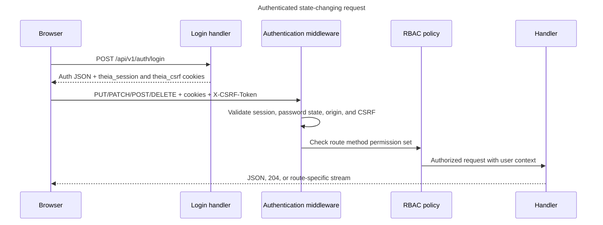

# Theia API Reference

## Purpose and Scope

This document is the maintainer reference for every externally reachable Theia HTTP and WebSocket surface. It records the transport, security, authorization, and central route-registration contracts implemented by the repository. It is not a promise that every endpoint is a stable public third-party compatibility contract; unless a compatibility note says otherwise, the first-party frontend and backend may evolve together.

Use [ARCHITECTURE.md](ARCHITECTURE.md) for component ownership, [README.md](README.md) for the product overview, and [SETUP.md](SETUP.md) for deployment and operator procedures.

## Base URLs and Versioning

All centrally registered application routes use the `/api/v1` prefix.

| Environment | API base URL | Transport model |
| --- | --- | --- |
| Direct development | `http://localhost:8080/api/v1` | The browser or an API client connects directly to the Go backend. The Vite frontend runs at `http://localhost:3000` and can proxy relative API requests. |
| Production | `http://localhost/api/v1` | nginx serves the compiled frontend and proxies same-origin `/api` requests to the internal backend. Prefer relative `/api/v1/...` URLs in browser code. |
| Staging compose | `http://localhost:3001/api/v1` | The staging frontend entry point proxies API traffic to the backend. |

`VITE_API_URL` selects the Vite proxy target at build/development time; it does not introduce another server-side API version. Direct cross-origin REST and WebSocket access must use an exact origin allowed by `THEIA_ALLOWED_ORIGINS`, while same-host proxy traffic is accepted without an extra allowlist entry.

## HTTP Conventions

- The normal protected JSON chain wraps request bodies with a 1 MiB reader limit. Public authentication and connector-launch routes use a 16 KiB wrapper. Endpoints that fully consume those readers through the shared `decodeJSON` helper observe over-limit input as `413`; a handler that stops after one decoded value can leave an oversized suffix unread, as detailed under [Common Request Contracts](#common-request-contracts). Instance restore accepts a streaming multipart body capped at the configured compressed-archive limit plus a 1 MiB multipart envelope; the default compressed limit is 256 MiB. Binary-download profiles do not apply the JSON body wrapper.
- JSON request bodies use `Content-Type: application/json`; JSON clients should send `Accept: application/json`. The JSON middleware sets `application/json` on normal responses, while download and WebSocket handlers set their own content type or upgrade the connection.
- Route placeholders such as `{deviceID}`, `{mapID}`, and `{backupID}` are UUID strings unless the handler names another identifier, such as `{key}`, `{vendorID}`, `{os}`, or `{arch}`. Timestamp strings are emitted in RFC 3339-compatible UTC form; some handlers retain sub-second precision.
- `GET` read policies commonly register `HEAD` with the same permission. The catalog preserves that metadata exactly. See the `HEAD` implementation caveat in [Maintenance Checklist](#maintenance-checklist).
- CORS preflight `OPTIONS` receives `204 No Content`. Allowed browser methods are `GET`, `POST`, `PUT`, `PATCH`, `DELETE`, and `OPTIONS`; credentialed responses echo an allowed exact origin.
- Unsupported methods normally return `405 Method Not Allowed` with the shared error envelope. Unknown route shapes return `404 Not Found` when they reach a route-aware dispatcher.

## Authentication and Session Security

Password login uses `POST /api/v1/auth/login`. A successful login returns an authentication envelope and sets two cookies with path `/`, an expiry, `Max-Age`, and `SameSite=Strict`:

- `theia_session` contains the password-session token and is `HttpOnly`.
- `theia_csrf` contains the matching CSRF token and is intentionally readable by the frontend.
- Both cookies are marked `Secure` when the backend sees TLS or `X-Forwarded-Proto: https`.

The frontend reads `theia_csrf` and sends it as `X-CSRF-Token` on JSON requests made through its mutating transport helper. Authenticated `POST`, `PUT`, `PATCH`, and `DELETE` requests require that header, except login. Session-aware logout and password change validate it inside the authentication handler. Logout expires both cookies and returns `204`; invalid-session detection also clears both cookies.

The authentication envelope is `{"authenticated":<boolean>,"user":<safe-user>}`. The safe user includes ID, username, email, display name, status, `must_change_password`, role IDs, and permission keys, but no password or credential secret. An unauthenticated `GET /api/v1/auth/me` is a successful anonymous envelope rather than a `401`.

On first login, `must_change_password=true` restricts normal protected HTTP and WebSocket use. Protected requests receive `403` with code `password_change_required` until the current user completes `POST /api/v1/auth/password/change`; session inspection and logout remain available. The password-change response refreshes the safe user in the existing session.

An administrator can issue a one-time reset token through the protected administration route. The token is redeemed without a session at `POST /api/v1/auth/password/reset` using `token` and `new_password`; success returns `204`. Invalid, expired, reused-password, and password-policy failures retain distinct status/code semantics.

Public auth routes bypass global RBAC middleware but are not all anonymous operations. The catalog therefore distinguishes `Public` from `Session-aware public`. The connector-launch route is also public to password-session middleware, but authenticates a bridge credential through `Authorization: Bridge <secret>` and applies a per-client rate limit.



## Authorization and RBAC

The central registry assigns one of four effective access modes:

- `Public`: no password-session or RBAC requirement; route-specific credentials or limits may still apply.
- `Session-aware public`: bypasses global RBAC, but the authentication handler optionally or mandatorily resolves the session and may validate CSRF.
- `Protected`: requires a valid `theia_session`, an acceptable origin, CSRF on mutations, and at least one permission listed for the concrete method.
- `WebSocket upgrade`: authenticates the password session and `topology:read` permission before preserving the unwrapped response writer for the HTTP upgrade.

Multiple permissions on one method are alternatives at the central middleware boundary: possession of any listed permission passes that check. Handlers may narrow access further. For example, administration handlers recheck their operation-specific permission, and setting a user to a non-active status additionally requires `users:disable`.

REST origin validation permits requests with no `Origin`, an origin whose host exactly matches the request host, or an exact configured origin. Other browser origins receive `403`. WebSocket requests pass the same session and RBAC checks, then the WebSocket handler independently validates the same-host/configured origin before upgrading. Wildcard origins are not used.

## Common Request Contracts

- Shared-decoder mutating JSON: endpoints that call `decodeJSON` require exactly one JSON value with no trailing second value. Send `Content-Type: application/json`; authenticated requests include both session cookie and `X-CSRF-Token`.
- Read-only JSON: normally no body; query parameters and conditional headers are route-specific.
- Restore: `multipart/form-data` with a streaming `file` part whose filename ends in `.tar.gz`; `dry_run=true` validates without staging a restart.
- Binary downloads: no request body. Platform downloads use `{os}` in `windows`, `linux`, or `darwin` and `{arch}` in `amd64` or `arm64`.
- WebSocket: an HTTP `GET` upgrade carrying the session cookie. Optional runtime-resume query data and subsequent control frames belong to the WebSocket protocol rather than a JSON HTTP body.

For endpoints using `decodeJSON`, malformed JSON, an empty required body, a trailing JSON value, or an invalid field encoding returns `400` with `{"error":"invalid request body"}`. When that helper encounters `http.MaxBytesReader` overflow, it returns `413` with `{"error":"request body too large"}`. Restore and selection limits retain their route-specific `413` messages.

Two current mutations use a single `json.Decoder.Decode` instead of `decodeJSON`: `PATCH /api/v1/settings/me` in [`user_settings_handler.go`](internal/api/user_settings_handler.go) and `POST /api/v1/canvas/maps/{mapID}/devices/{deviceID}` in [`canvas_map_handler.go`](internal/api/canvas_map_handler.go). They do not perform the shared second decode, so a trailing JSON value or an oversized suffix that the first decode does not consume can be ignored. If their one decode does encounter an error, including `http.MaxBytesError`, they map it to `400 invalid request body` rather than `413`. Canvas-map device addition also treats an empty body (`io.EOF`) as valid and applies its default options.

## Common Response and Error Contracts

Successful JSON shapes are handler-owned. Many resource handlers use `{"data":...}`, authentication uses `authenticated`/`user`, and administration uses operation-specific top-level keys. `201`, `202`, and `204` are used where the handler explicitly creates, queues, or completes without a body. Binary and WebSocket responses are not JSON.

The shared non-authentication error boundary is:

```json
{"error":"synthetic explanation"}
```

Authentication, CSRF, password-state, and RBAC failures add a stable machine code:

```json
{"error":"permission denied","code":"permission_denied"}
```

Common semantics are:

| Status | Meaning |
| --- | --- |
| `400` | Malformed JSON, invalid identifier, validation failure, or invalid route input. |
| `401` | Missing/invalid session, invalid login/reset credential, or invalid bridge credential. |
| `403` | Disallowed origin, missing/invalid CSRF, password change required, or insufficient permission. |
| `404` | Route-shaped resource or backing file not found. |
| `405` | The path exists but the dispatcher does not implement that method. |
| `409` | A uniqueness, active-operation, state-transition, or reuse conflict. |
| `413` | A shared-decoder JSON overflow, selection quota, archive quota, or multipart upload limit is detected. Single-decode exceptions can instead return `400` or leave an unread oversized suffix unobserved. |
| `429` | Bridge authentication or bulk-download concurrency rate limit; bulk download also supplies `Retry-After`. |
| `500` | Internal failure. The response hides the internal error as `internal error, ref: <correlation-id>` and logs the real error with that reference. |

The shared frontend transport treats the backend `error` string as the error-message boundary. `requestJSON` sends `Accept: application/json` for reads. `requestJSONWithBody` JSON-encodes the optional body, adds the CSRF header when the cookie exists, and maps `204` to `null`. It maps `400` and `409` to `ValidationError`, sanitizes `500` into `ServerError` while retaining the correlation ID, and represents other non-success statuses as a generic `Error`. The backend auth `code` remains available to direct clients, but the shared `ErrorPayload` currently guarantees only the optional `error` string.

## Route Catalog

This catalog contains exactly one row for each entry in [`apiRouteSpecs`](internal/api/routes.go). Permission strings are the runtime RBAC keys. `GET` and `HEAD` are shown together only when both are present in the metadata; method-specific permissions remain separate. Request and response cells deliberately name stable handler-level boundaries rather than duplicating field-by-field domain schemas.

### Authentication and Session

| Route | Path | Methods and permission(s) | Auth | Request | Response | Handler |
| --- | --- | --- | --- | --- | --- | --- |
| Login | `/api/v1/auth/login` | `POST` — none | Public | `LoginPayload` JSON | `AuthSession` JSON; sets session and CSRF cookies | [`AuthHandler.handleLogin`](internal/api/session_handler.go) |
| Logout | `/api/v1/auth/logout` | `POST`, `DELETE` — none | Session-aware public | Empty body; session cookie and CSRF when a session exists | Empty `204`; clears auth cookies | [`AuthHandler.handleLogout`](internal/api/session_handler.go) |
| Current session | `/api/v1/auth/me` | `GET` — none | Session-aware public | No body | `AuthSession` JSON, including anonymous state | [`AuthHandler.handleMe`](internal/api/session_handler.go) |
| Legacy current session | `/api/v1/me` | `GET` — none | Session-aware public | No body | `AuthSession` JSON; restricted legacy alias | [`AuthHandler.handleMe`](internal/api/session_handler.go) |
| Change current password | `/api/v1/auth/password/change` | `POST` — none | Session-aware public | `ChangePasswordPayload` JSON plus CSRF | Updated `AuthSession` JSON | [`AuthHandler.handlePasswordChange`](internal/api/session_handler.go) |
| Redeem password reset | `/api/v1/auth/password/reset` | `POST` — none | Public | `ResetPasswordPayload` JSON | Empty `204` | [`AuthHandler.handlePasswordReset`](internal/api/session_handler.go) |
| Legacy session | `/api/v1/session` | `GET`, `DELETE`, `POST` — none | Session-aware public | `GET`/`DELETE`: no body; `DELETE` uses CSRF when session exists | `GET`: `AuthSession`; `DELETE`: `204`; deprecated `POST`: `410 Gone` | [`AuthHandler.handleLegacySession`](internal/api/session_handler.go) |

### Account and Bridge Settings

| Route | Path | Methods and permission(s) | Auth | Request | Response | Handler |
| --- | --- | --- | --- | --- | --- | --- |
| Current-user settings | `/api/v1/settings/me` | `GET`, `HEAD` — `account:manage`<br>`PATCH` — `account:manage` | Protected | Reads: no body; `PATCH`: single-decode `UpdateUserSettingsInput` JSON; trailing/unread overflow may be ignored and decode errors map to `400` | `UserSettingsResult` JSON | [`UserSettingsHandler.HandleMe`](internal/api/user_settings_handler.go) |
| Current-user bridge settings | `/api/v1/settings/bridge` | `GET`, `HEAD` — `account:manage` | Protected | No body | Bridge settings JSON | [`UserSettingsHandler.HandleBridge`](internal/api/user_settings_handler.go) |
| Generate bridge secret | `/api/v1/settings/bridge/secret` | `POST` — `account:manage` | Protected | Empty body | `BridgeSecretResult` JSON, `201` | [`UserSettingsHandler.HandleBridgeSecret`](internal/api/user_settings_handler.go) |
| Rotate bridge secret | `/api/v1/settings/bridge/secret/rotate` | `POST` — `account:manage` | Protected | Reason JSON | `BridgeSecretResult` JSON, `201` | [`UserSettingsHandler.HandleBridgeSecret`](internal/api/user_settings_handler.go) |
| Revoke bridge secret | `/api/v1/settings/bridge/secret/revoke` | `POST` — `account:manage` | Protected | Reason JSON | `BridgeCredentialMetadata` JSON | [`UserSettingsHandler.HandleBridgeSecretRevoke`](internal/api/user_settings_handler.go) |
| Bridge connector config | `/api/v1/settings/bridge/connector/config` | `GET`, `HEAD` — `account:manage` | Protected | No body | Connector config and available downloads JSON | [`UserSettingsHandler.HandleConnectorConfig`](internal/api/user_settings_handler.go) |
| User bridge connector download | `/api/v1/settings/bridge/connector/download/{os}/{arch}` | `GET`, `HEAD` — `account:manage` | Protected | No body; platform path parameters | Binary executable stream | [`UserSettingsHandler.HandleConnectorDownload`](internal/api/user_settings_handler.go) |
| Settings collection | `/api/v1/settings` | `GET`, `HEAD` — `settings:read` | Protected | No body | `settingsResponse` JSON with secret metadata/redaction | [`SettingsHandler.HandleGetAll`](internal/api/settings_handler.go) |
| Setting item | `/api/v1/settings/{key}` | `GET`, `HEAD` — `settings:read`<br>`PUT` — `settings:update` | Protected | Reads: no body; `PUT`: value JSON | `settingsResponse` JSON | [`SettingsHandler.HandleGet / HandleUpdate`](internal/api/settings_handler.go) |

### Runtime and Topology

| Route | Path | Methods and permission(s) | Auth | Request | Response | Handler |
| --- | --- | --- | --- | --- | --- | --- |
| Runtime overview | `/api/v1/runtime/overview` | `GET`, `HEAD` — `topology:read` | Protected | No body | `runtimeOverviewResponse`; `HEAD` returns headers only; `Cache-Control: no-store` | [`RuntimeOverviewHandler.Handle`](internal/api/runtime_overview_handler.go) |
| Structural topology canvas | `/api/v1/topology/canvas` | `GET`, `HEAD` — `topology:read` | Protected | No body; optional `If-None-Match` | `canvasTopologyResponse` JSON with ETag, or `304` | [`CanvasTopologyHandler.HandleGet`](internal/api/canvas_topology_handler.go) |
| Canvas bootstrap | `/api/v1/canvas` | `GET`, `HEAD` — `topology:read` | Protected | No body | Structural and runtime `canvasTopologyResponse`; no-store | [`CanvasTopologyHandler.HandleGetCanvas`](internal/api/canvas_topology_handler.go) |

### Canvas Maps and Areas

| Route | Path | Methods and permission(s) | Auth | Request | Response | Handler |
| --- | --- | --- | --- | --- | --- | --- |
| Canvas maps | `/api/v1/canvas/maps` | `GET`, `HEAD` — `topology:read`<br>`POST` — `topology:update` | Protected | Reads: no body; `POST`: `canvasMapCreateRequest` JSON | Map list or created `canvasMapResponse` JSON | [`CanvasMapHandler.HandleList / HandleCreate`](internal/api/canvas_map_handler.go) |
| Canvas map | `/api/v1/canvas/maps/{mapID}` | `GET`, `HEAD` — `topology:read`<br>`PATCH`, `DELETE` — `topology:update` | Protected | `GET`: no body; `PATCH`: `canvasMapPatchRequest`; `DELETE`: empty body | Map JSON or empty `204` | [`CanvasMapHandler.HandleGet / HandlePatch / HandleDelete`](internal/api/canvas_map_handler.go) |
| Duplicate canvas map | `/api/v1/canvas/maps/{mapID}/duplicate` | `POST` — `topology:update` | Protected | `canvasMapDuplicateRequest` JSON | Created map JSON, `201` | [`CanvasMapHandler.HandleDuplicate`](internal/api/canvas_map_handler.go) |
| Set primary canvas map | `/api/v1/canvas/maps/{mapID}/primary` | `POST` — `topology:update` | Protected | Empty body | Updated map JSON | [`CanvasMapHandler.HandleSetPrimary`](internal/api/canvas_map_handler.go) |
| Canvas map topology | `/api/v1/canvas/maps/{mapID}/topology` | `GET`, `HEAD` — `topology:read` | Protected | No body; optional `If-None-Match` | Map-scoped topology JSON with ETag, or `304` | [`CanvasMapHandler.HandleTopology`](internal/api/canvas_map_handler.go) |
| Canvas map bootstrap | `/api/v1/canvas/maps/{mapID}/bootstrap` | `GET`, `HEAD` — `topology:read` | Protected | No body | Map topology plus optional runtime bootstrap JSON; no-store | [`CanvasMapHandler.HandleBootstrap`](internal/api/canvas_map_handler.go) |
| Canvas map positions | `/api/v1/canvas/maps/{mapID}/positions` | `GET`, `HEAD` — `topology:read`<br>`PUT` — `topology:update` | Protected | Reads: no body; `PUT`: `bulkPositionsRequest` JSON | Position list or save result JSON | [`CanvasMapHandler.HandleListPositions / HandleSavePositions`](internal/api/canvas_map_handler.go) |
| Canvas map device-area assignments | `/api/v1/canvas/maps/{mapID}/device-areas` | `PUT` — `topology:update` | Protected | `canvasMapUpdateDeviceAreasRequest` JSON | Updated map JSON | [`CanvasMapHandler.HandleUpdateDeviceAreas`](internal/api/canvas_map_handler.go) |
| Canvas map areas | `/api/v1/canvas/maps/{mapID}/areas` | `GET`, `HEAD` — `topology:read`<br>`POST` — `topology:update` | Protected | Reads: no body; `POST`: `areaRequest` JSON | Area list or created area JSON | [`CanvasMapHandler.HandleListAreas / HandleCreateArea`](internal/api/canvas_map_handler.go) |
| Canvas map area | `/api/v1/canvas/maps/{mapID}/areas/{areaID}` | `PUT`, `DELETE` — `topology:update` | Protected | `PUT`: `areaRequest`; `DELETE`: empty body | Updated area JSON or empty `204` | [`CanvasMapHandler.HandleUpdateArea / HandleDeleteArea`](internal/api/canvas_map_handler.go) |
| Canvas map device | `/api/v1/canvas/maps/{mapID}/devices/{deviceID}` | `POST`, `PATCH`, `DELETE` — `topology:update` | Protected | `POST`: optional single-decode add options (empty allowed; trailing/unread overflow may be ignored; decode errors map to `400`); `PATCH`: shared-decoder visual-color patch; `DELETE`: empty body | Updated map JSON or empty `204` | [`CanvasMapHandler.HandleAddDevice / HandlePatchDevice / HandleRemoveDevice`](internal/api/canvas_map_handler.go) |
| Areas | `/api/v1/areas` | `GET`, `HEAD` — `topology:read`<br>`POST` — `topology:update` | Protected | Reads: no body; `POST`: `areaRequest` JSON | Area list or created area JSON | [`AreaHandler.HandleList / HandleCreate`](internal/api/area_handler.go) |
| Area | `/api/v1/areas/{areaID}` | `GET`, `HEAD` — `topology:read`<br>`PUT`, `DELETE` — `topology:update` | Protected | `GET`: no body; `PUT`: `areaRequest`; `DELETE`: empty body | `areaResponse` JSON or empty `204` | [`AreaHandler.HandleGet / HandleUpdate / HandleDelete`](internal/api/area_handler.go) |

### Devices, Links, and Positions

| Route | Path | Methods and permission(s) | Auth | Request | Response | Handler |
| --- | --- | --- | --- | --- | --- | --- |
| Devices | `/api/v1/devices` | `GET`, `HEAD` — `devices:read`<br>`POST` — `devices:create` or `devices:update` | Protected | Reads: no body; `POST`: `createDeviceRequest` JSON | JSON:API device list or created device, `201` | [`DeviceHandler.HandleList / HandleCreate`](internal/api/device_handler.go) |
| Batch add devices | `/api/v1/devices/batch` | `POST` — `devices:create` or `devices:update` | Protected | `batchAddRequest` JSON | `batchAddResponse` JSON | [`DeviceHandler.HandleBatchAdd`](internal/api/device_handler.go) |
| Orphan devices | `/api/v1/devices/orphans` | `GET`, `HEAD` — `devices:read` | Protected | No body | JSON:API device list | [`DeviceHandler.HandleListOrphans`](internal/api/device_handler.go) |
| Reveal WinBox credentials | `/api/v1/devices/{deviceID}/winbox-credentials/reveal` | `POST` — `credentials:reveal` | Protected | Required reason JSON | No-store plaintext credential JSON | [`DeviceCredentialProfileHandler.HandleRevealWinboxCredentials`](internal/api/device_credential_profile_handler.go) |
| Unassign device credential profile | `/api/v1/devices/{deviceID}/credential-profiles/{profileID}` | `DELETE` — `credentials:update` | Protected | Empty body | Empty `204` | [`DeviceCredentialProfileHandler.HandleUnassign`](internal/api/device_credential_profile_handler.go) |
| Device credential profiles | `/api/v1/devices/{deviceID}/credential-profiles` | `GET`, `HEAD` — `credentials:read`<br>`POST` — `credentials:update` | Protected | Reads: no body; `POST`: profile ID JSON | Assigned-profile list or assignment JSON | [`DeviceCredentialProfileHandler.HandleListAssignments / HandleAssign`](internal/api/device_credential_profile_handler.go) |
| Device WinBox profile | `/api/v1/devices/{deviceID}/winbox-profile` | `PUT`, `DELETE` — `credentials:update` | Protected | `PUT`: profile ID JSON; `DELETE`: empty body | Assignment JSON or empty `204` | [`DeviceCredentialProfileHandler.HandleSetWinbox / HandleClearWinbox`](internal/api/device_credential_profile_handler.go) |
| Legacy WinBox credentials read | `/api/v1/devices/{deviceID}/winbox-credentials` | `GET`, `HEAD` — `credentials:read` | Protected | No body | Deprecated plaintext read returns `410 Gone` | [`DeviceCredentialProfileHandler.HandleGetWinboxCredentials`](internal/api/device_credential_profile_handler.go) |
| Latest device backup | `/api/v1/devices/{deviceID}/backups/latest` | `GET`, `HEAD` — `backups:read` | Protected | No body | Latest successful backup-job JSON | [`BackupHandler.HandleGetLatestBackup`](internal/api/backup_handler.go) |
| Device backups | `/api/v1/devices/{deviceID}/backups` | `GET`, `HEAD` — `backups:read`<br>`POST` — `backups:update` | Protected | Empty body | Backup-job list or accepted job JSON, `202` | [`BackupHandler.HandleListBackups / HandleTriggerBackup`](internal/api/backup_handler.go) |
| Device interfaces | `/api/v1/devices/{deviceID}/interfaces` | `GET`, `HEAD` — `topology:read` | Protected | No body | Filtered `interfaceResponse` list JSON | [`LinkHandler.HandleGetInterfaces`](internal/api/link_handler.go) |
| Probe device | `/api/v1/devices/{deviceID}/probe` | `POST` — `devices:update` | Protected | Empty body | Probe status JSON | [`DeviceHandler.HandleProbe`](internal/api/device_handler.go) |
| Test device SNMP | `/api/v1/devices/{deviceID}/snmp-test` | `POST` — `devices:update` | Protected | Empty body | SNMP test result JSON | [`DeviceHandler.HandleTestSNMP`](internal/api/device_handler.go) |
| Run topology discovery | `/api/v1/devices/{deviceID}/topology-discovery` | `POST` — `topology:update` | Protected | Empty body | Start status JSON | [`DeviceHandler.HandleRunTopologyDiscovery`](internal/api/device_handler.go) |
| Check address reachability | `/api/v1/devices/{deviceID}/addresses/reachability` | `POST` — `devices:update` | Protected | Empty body | Reachability result list JSON | [`DeviceHandler.HandleAddressReachability`](internal/api/device_handler.go) |
| Test device SSH credentials | `/api/v1/devices/{deviceID}/ssh-credentials/test` | `POST` — `devices:create` or `devices:update` | Protected | Empty body | Success/error test JSON | [`BackupHandler.HandleTestSSH`](internal/api/backup_handler.go) |
| Reset device SSH host key | `/api/v1/devices/{deviceID}/ssh-host-key/reset` | `POST` — `backups:update` | Protected | Empty body | Host-key removal result JSON | [`BackupHandler.HandleResetSSHHostKey`](internal/api/backup_handler.go) |
| Device | `/api/v1/devices/{deviceID}` | `GET`, `HEAD` — `devices:read`<br>`PUT` — `devices:update`<br>`DELETE` — `devices:delete` | Protected | `GET`: no body; `PUT`: `updateDeviceRequest`; `DELETE`: empty body | JSON:API device or empty `204` | [`DeviceHandler.HandleGet / HandleUpdate / HandleDelete`](internal/api/device_handler.go) |
| Links | `/api/v1/links` | `GET`, `HEAD` — `topology:read`<br>`POST` — `topology:update` | Protected | Reads: no body; `POST`: `createLinkRequest` JSON | Enriched link list or link JSON | [`LinkHandler.HandleList / HandleCreate`](internal/api/link_handler.go) |
| Link | `/api/v1/links/{linkID}` | `PUT`, `DELETE` — `topology:update` | Protected | `PUT`: `updateLinkRequest`; `DELETE`: empty body | Link JSON or empty `204` | [`LinkHandler.HandleUpdate / HandleDelete`](internal/api/link_handler.go) |
| Positions | `/api/v1/positions` | `GET`, `HEAD` — `topology:read`<br>`PUT` — `topology:update` | Protected | Reads: no body; `PUT`: `bulkPositionsRequest` JSON | Position list or save status JSON | [`PositionHandler.HandleList / HandleSaveAll`](internal/api/position_handler.go) |

### Monitoring and Credential Profiles

| Route | Path | Methods and permission(s) | Auth | Request | Response | Handler |
| --- | --- | --- | --- | --- | --- | --- |
| Grafana dashboard profiles | `/api/v1/grafana/dashboard-profiles` | `GET`, `HEAD` — `settings:read`<br>`POST` — `settings:update` | Protected | Reads: no body; `POST`: `grafanaDashboardProfileRequest` | Grafana config JSON, `201` on create | [`GrafanaDashboardHandler.HandleProfiles`](internal/api/grafana_dashboard_handler.go) |
| Grafana dashboard profile | `/api/v1/grafana/dashboard-profiles/{profileID}` | `PUT`, `DELETE` — `settings:update` | Protected | `PUT`: `grafanaDashboardProfileRequest`; `DELETE`: empty body | Grafana config JSON or empty `204` | [`GrafanaDashboardHandler.HandleProfile`](internal/api/grafana_dashboard_handler.go) |
| Grafana device override | `/api/v1/grafana/device-overrides/{deviceID}` | `PUT` — `settings:update` | Protected | `grafanaDeviceOverrideRequest` JSON | Grafana config JSON | [`GrafanaDashboardHandler.HandleDeviceOverride`](internal/api/grafana_dashboard_handler.go) |
| Reveal SNMP profile | `/api/v1/snmp-profiles/{profileID}/reveal` | `POST` — `credentials:reveal` | Protected | Required reason JSON | No-store profile JSON including secrets | [`SNMPProfileHandler.HandleReveal`](internal/api/snmp_profile_handler.go) |
| SNMP profiles | `/api/v1/snmp-profiles` | `GET`, `HEAD` — `credentials:read`<br>`POST` — `credentials:update` | Protected | Reads: no body; `POST`: `snmpProfileRequest` | Redacted profile list or created profile JSON | [`SNMPProfileHandler.HandleList / HandleCreate`](internal/api/snmp_profile_handler.go) |
| SNMP profile | `/api/v1/snmp-profiles/{profileID}` | `GET`, `HEAD` — `credentials:read`<br>`PUT`, `DELETE` — `credentials:update` | Protected | `GET`: no body; `PUT`: `snmpProfileRequest`; `DELETE`: empty body | Redacted profile JSON or empty `204` | [`SNMPProfileHandler.HandleGet / HandleUpdate / HandleDelete`](internal/api/snmp_profile_handler.go) |
| Test credential profile | `/api/v1/credential-profiles/{profileID}/test` | `POST` — `credentials:update` | Protected | Target IP JSON | Success/error test JSON | [`CredentialProfileHandler.HandleTest`](internal/api/credential_profile_handler.go) |
| Credential profiles | `/api/v1/credential-profiles` | `GET`, `HEAD` — `credentials:read`<br>`POST` — `credentials:update` | Protected | Reads: no body; `POST`: `credentialProfileRequest` | Redacted profile list or created profile JSON | [`CredentialProfileHandler.HandleList / HandleCreate`](internal/api/credential_profile_handler.go) |
| Credential profile | `/api/v1/credential-profiles/{profileID}` | `GET`, `HEAD` — `credentials:read`<br>`PUT`, `DELETE` — `credentials:update` | Protected | `GET`: no body; `PUT`: `credentialProfileRequest`; `DELETE`: empty body | Redacted profile JSON or empty `204` | [`CredentialProfileHandler.HandleGet / HandleUpdate / HandleDelete`](internal/api/credential_profile_handler.go) |
| Vendors | `/api/v1/vendors` | `GET`, `HEAD` — `settings:read` | Protected | No body | Vendor configuration list JSON | [`VendorHandler.HandleListVendors`](internal/api/vendor_handler.go) |
| Vendor | `/api/v1/vendors/{vendorID}` | `GET`, `HEAD` — `settings:read`<br>`PUT` — `settings:update` | Protected | `GET`: no body; `PUT`: raw vendor config JSON | Vendor configuration JSON | [`VendorHandler.HandleGetVendor / HandleUpdateVendor`](internal/api/vendor_handler.go) |

### Backups and Restore

| Route | Path | Methods and permission(s) | Auth | Request | Response | Handler |
| --- | --- | --- | --- | --- | --- | --- |
| Bulk backup capability status | `/api/v1/backups/bulk/status` | `GET`, `HEAD` — `backups:read` | Protected | No body | Bulk limits and capabilities JSON | [`BackupHandler.HandleGetBulkOperationStatus`](internal/api/backup_handler.go) |
| Latest bulk backup run | `/api/v1/backups/bulk-runs/latest` | `GET`, `HEAD` — `backups:read` | Protected | No body | Latest bulk-run JSON, possibly null data | [`BackupHandler.HandleGetLatestBulkBackupRun`](internal/api/backup_handler.go) |
| Start bulk backup run | `/api/v1/backups/bulk-runs` | `POST` — `backups:update` | Protected | Optional device-ID list JSON | Accepted bulk-run JSON, `202` | [`BackupHandler.HandleStartBulkBackupRun`](internal/api/backup_handler.go) |
| Pause bulk backup run | `/api/v1/backups/bulk-runs/{runID}/pause` | `POST` — `backups:update` | Protected | Empty body | Accepted bulk-run JSON, `202` | [`BackupHandler.HandlePauseBulkBackupRun`](internal/api/backup_handler.go) |
| Resume bulk backup run | `/api/v1/backups/bulk-runs/{runID}/resume` | `POST` — `backups:update` | Protected | Empty body | Accepted bulk-run JSON, `202` | [`BackupHandler.HandleResumeBulkBackupRun`](internal/api/backup_handler.go) |
| Cancel bulk backup run | `/api/v1/backups/bulk-runs/{runID}/cancel` | `POST` — `backups:update` | Protected | Empty body | Accepted bulk-run JSON, `202` | [`BackupHandler.HandleCancelBulkBackupRun`](internal/api/backup_handler.go) |
| Bulk backup run | `/api/v1/backups/bulk-runs/{runID}` | `GET`, `HEAD` — `backups:read` | Protected | No body | Bulk-run JSON | [`BackupHandler.HandleGetBulkBackupRun`](internal/api/backup_handler.go) |
| Bulk backup download | `/api/v1/backups/bulk-download` | `POST` — `backups:update` | Protected | Device-ID list JSON | Streaming ZIP archive with count/size headers | [`BackupHandler.HandleBulkDownload`](internal/api/backup_handler.go) |
| Backup job | `/api/v1/backup-jobs/{jobID}` | `GET`, `HEAD` — `backups:read`<br>`DELETE` — `backups:update` | Protected | No body | Backup-job JSON or empty `204` | [`BackupHandler.HandleGetBackupJob / HandleDeleteBackupJob`](internal/api/backup_handler.go) |
| Backup file download | `/api/v1/backup-files/{fileID}/download` | `GET`, `HEAD` — `backups:read` | Protected | No body | Binary or text file stream with attachment headers | [`BackupHandler.HandleDownloadBackupFile`](internal/api/backup_handler.go) |
| Backup file content | `/api/v1/backup-files/{fileID}/content` | `GET`, `HEAD` — `backups:read` | Protected | No body | Inline text/metadata JSON; large or binary content remains download-only | [`BackupHandler.HandleGetBackupFileContent`](internal/api/backup_handler.go) |
| Instance backups | `/api/v1/instance-backups` | `GET`, `HEAD` — `backups:read`<br>`POST` — `backups:update` | Protected | Empty body | Backup list or accepted running backup JSON, `202` | [`InstanceBackupHandler.HandleList / HandleCreate`](internal/api/instance_backup_handler.go) |
| Restore operation status | `/api/v1/instance-backups/restore-status` | `GET`, `HEAD` — `backups:read` | Protected | No body | Restore status JSON, possibly null data | [`InstanceBackupHandler.HandleRestoreStatus`](internal/api/instance_backup_handler.go) |
| Restore instance backup | `/api/v1/instance-backups/restore` | `POST` — `backups:update` | Protected | Streaming multipart `.tar.gz` file; optional `dry_run=true` | Restore validation/staging report JSON | [`InstanceBackupHandler.HandleRestore`](internal/api/instance_backup_handler.go) |
| Instance backup download | `/api/v1/instance-backups/{backupID}/download` | `GET`, `HEAD` — `backups:read` | Protected | No body | Streaming gzip archive | [`InstanceBackupHandler.HandleDownload`](internal/api/instance_backup_handler.go) |
| Cancel instance backup | `/api/v1/instance-backups/{backupID}/cancel` | `POST` — `backups:update` | Protected | Empty body | Accepted backup JSON, `202` | [`InstanceBackupHandler.HandleCancel`](internal/api/instance_backup_handler.go) |
| Instance backup | `/api/v1/instance-backups/{backupID}` | `GET`, `HEAD` — `backups:read`<br>`DELETE` — `backups:update` | Protected | No body | Backup JSON or empty `204` | [`InstanceBackupHandler.HandleGet / HandleDelete`](internal/api/instance_backup_handler.go) |

### Bridge Integration

| Route | Path | Methods and permission(s) | Auth | Request | Response | Handler |
| --- | --- | --- | --- | --- | --- | --- |
| Resolve bridge connector launch | `/api/v1/bridge/connector/launch` | `POST` — none | Public | `Authorization: Bridge <secret>` plus launch-token JSON | `BridgeLaunchCredentials` JSON | [`BridgeHandler.HandleConnectorLaunch`](internal/api/bridge_handler.go) |
| Bridge binary download | `/api/v1/bridge/download/{os}/{arch}` | `GET`, `HEAD` — `settings:read` | Protected | No body; platform path parameters | Binary executable stream | [`BridgeHandler.HandleDownload`](internal/api/bridge_handler.go) |
| Create bridge launch request | `/api/v1/bridge/launch-requests/{deviceID}` | `POST` — `bridge:token:create` | Protected | Empty body | `BridgeLaunchRequestResult` JSON | [`BridgeHandler.HandleCreateLaunchRequest`](internal/api/bridge_handler.go) |
| Legacy bridge token | `/api/v1/bridge/token/{deviceID}` | `POST` — `bridge:token:create` | Protected | Empty body | Deprecated endpoint returns `410 Gone` | [`BridgeHandler.HandleBridgeToken`](internal/api/bridge_handler.go) |

### Administration

| Route | Path | Methods and permission(s) | Auth | Request | Response | Handler |
| --- | --- | --- | --- | --- | --- | --- |
| Administration dashboard | `/api/v1/admin/dashboard` | `GET`, `HEAD` — `admin:dashboard:read` | Protected | No body | Dashboard stats and recent audit logs JSON | [`AdminHandler.handleDashboard`](internal/api/admin_handler.go) |
| Administration users | `/api/v1/admin/users` | `GET`, `HEAD` — `users:read`<br>`POST` — `users:create` or `users:update` | Protected | `GET`: optional filters; `POST`: create-user JSON | User list or created safe-user JSON, `201` | [`AdminHandler.handleListUsers / handleCreateUser`](internal/api/admin_handler.go) |
| Set administration user status | `/api/v1/admin/users/{userID}/status` | `PATCH` — `users:update` | Protected | Status JSON; non-active status also requires `users:disable` | Updated safe-user JSON | [`AdminHandler.handleSetStatus`](internal/api/admin_handler.go) |
| Remove administration user role | `/api/v1/admin/users/{userID}/roles/{roleID}` | `DELETE` — `roles:assign` | Protected | Empty body | Updated safe-user JSON | [`AdminHandler.handleRemoveRole`](internal/api/admin_handler.go) |
| Assign administration user role | `/api/v1/admin/users/{userID}/roles` | `POST` — `roles:assign` | Protected | Role-ID JSON | Updated safe-user JSON | [`AdminHandler.handleAssignRole`](internal/api/admin_handler.go) |
| Create user password-reset token | `/api/v1/admin/users/{userID}/password-reset` | `POST` — `users:update` | Protected | Empty body | One-time token and expiry JSON | [`AdminHandler.handlePasswordReset`](internal/api/admin_handler.go) |
| Administration user | `/api/v1/admin/users/{userID}` | `GET`, `HEAD` — `users:read`<br>`PATCH` — `users:update` | Protected | `GET`: no body; `PATCH`: user patch JSON; non-active status also requires `users:disable` | Safe-user JSON | [`AdminHandler.handleGetUser / handleUpdateUser`](internal/api/admin_handler.go) |
| Update role permissions | `/api/v1/admin/roles/{roleID}/permissions` | `PATCH` — `roles:update` | Protected | Permission-key list JSON | Updated role JSON | [`AdminHandler.handleUpdateRolePermissions`](internal/api/admin_handler.go) |
| Administration roles | `/api/v1/admin/roles` | `GET`, `HEAD` — `roles:read` | Protected | No body | Role list JSON | [`AdminHandler.handleListRoles`](internal/api/admin_handler.go) |
| Administration permissions | `/api/v1/admin/permissions` | `GET`, `HEAD` — `roles:read` | Protected | No body | Permission list JSON | [`AdminHandler.handleListPermissions`](internal/api/admin_handler.go) |
| Administration audit logs | `/api/v1/admin/audit-logs` | `GET`, `HEAD` — `audit_logs:read` | Protected | Optional audit filters | Audit-log list JSON | [`AdminHandler.handleListAuditLogs`](internal/api/admin_handler.go) |

### Health and WebSocket

| Route | Path | Methods and permission(s) | Auth | Request | Response | Handler |
| --- | --- | --- | --- | --- | --- | --- |
| Application health | `/api/v1/health` | `GET`, `HEAD` — `settings:read` | Protected | No body | Overall/component/polling health JSON | [`HealthHandler.HandleHealth`](internal/api/health_handler.go) |
| Prometheus integration health | `/api/v1/prometheus/health` | `GET`, `HEAD` — `settings:read` | Protected | No body | `prometheusHealthResponse` JSON | [`PrometheusHandler.HandleHealth`](internal/api/prometheus_handler.go) |
| Runtime WebSocket | `/api/v1/ws` | `GET`, `HEAD` — `topology:read` | WebSocket upgrade | `GET`: HTTP upgrade with session cookie; no JSON body | `101 Switching Protocols` then JSON message stream; current `HEAD` dispatcher response is `405` | [`ws.Handler.ServeHTTP`](internal/ws/handler.go) |

## Domain Contracts

The catalog intentionally stops at stable handler-level request and response names. Field validation, resource attributes, topology DTOs, backup state machines, and administration filters remain authoritative in their linked handlers and domain/service types; expanding those schemas must not change the one-row-per-route catalog format.

Across current handlers, resource collections commonly use a `data` array, resource mutations commonly use a `data` object, and destructive success commonly uses an empty `204`. Authentication and administration are explicit exceptions with their own top-level envelopes.

## Operational Endpoints

Health, Prometheus integration status, runtime recovery, backup bulk status, restore status, and binary downloads are protected API surfaces, not unauthenticated infrastructure probes. Deployments should use an authenticated session with the cataloged permission or a separate process-level health mechanism supplied by the deployment stack.

Download handlers stream directly and may replace the normal JSON content type. Restore and bulk-download endpoints enforce route-specific quotas/concurrency in addition to middleware limits. Runtime overview is explicitly uncached and records an HTTP-fallback recovery observation on every authenticated `GET` or `HEAD` that reaches it.

## WebSocket Protocol

`GET /api/v1/ws` first passes password-session validation, first-login restriction, `topology:read` authorization, and exact-origin validation. A successful response upgrades to a bidirectional JSON message stream used for topology/runtime bootstrap, live updates, recovery, acknowledgement, and detail subscriptions. The HTTP route catalog owns only the upgrade boundary; message schemas and sequencing remain authoritative in [`internal/ws`](internal/ws).

The special WebSocket middleware does not wrap the response writer, because the Gorilla upgrader requires `http.Hijacker`. It also bypasses the normal JSON body limit and request-logger wrapper.

## Examples

The values below are synthetic.

Start a cookie-backed session:

```http
POST /api/v1/auth/login HTTP/1.1
Host: theia.example.test
Content-Type: application/json
Accept: application/json

{"identifier":"maintainer@example.test","password":"synthetic-password"}
```

Use both cookies and the CSRF header for a protected mutation:

```http
PUT /api/v1/positions HTTP/1.1
Host: theia.example.test
Cookie: theia_session=<session>; theia_csrf=<csrf>
X-CSRF-Token: <csrf>
Content-Type: application/json
Accept: application/json

{"positions":[{"device_id":"00000000-0000-4000-8000-000000000001","x":120.5,"y":64,"pinned":true}]}
```

A permission failure uses the coded authentication envelope:

```json
{"error":"permission denied","code":"permission_denied"}
```

## Compatibility and Security Notes

- `/api/v1/me` is a restricted legacy alias for the current-session read. `/api/v1/session` retains `GET` and `DELETE`, but its legacy login `POST` is permanently rejected with `410`; new clients use `/api/v1/auth/*`.
- `/api/v1/bridge/token/{deviceID}` is deprecated and returns `410`; create a user-scoped launch request instead. Plaintext WinBox credentials are not returned by the legacy read route and require the explicit, permission-protected, audited reveal endpoint.
- Credential/profile list responses redact secrets. Explicit reveal responses are no-store, require `credentials:reveal`, and require an audit reason. Bridge secrets are shown only by generation/rotation results.
- SameSite cookies and origin checks complement, but do not replace, CSRF validation. Non-local deployments should use HTTPS so cookies receive `Secure` and bridge credentials are protected in transit.
- Internal-error responses expose only a short correlation reference. Do not replace them with raw service/database errors at the HTTP boundary.
- Route metadata is the authority for central registration and RBAC, but a handler may impose additional validation, permissions, state checks, quotas, or deprecation behavior.

## Maintenance Checklist

- Keep exactly one catalog row for every entry in [`internal/api/routes.go`](internal/api/routes.go), including deprecated aliases and routes that intentionally return `410`.
- Preserve each method-to-permission set from the metadata. When a handler adds a conditional permission, record it without replacing the central policy.
- Reconcile handler labels and relative source links through [`internal/api/router_handlers.go`](internal/api/router_handlers.go) after handler wiring changes.
- Audit middleware profiles when changing body limits, download behavior, restore streaming, public routes, authentication, CSRF, or WebSocket upgrades.
- Treat `HEAD` as an explicit maintenance caveat: [`routes.go`](internal/api/routes.go) registers `HEAD` alongside many read policies and RBAC authorizes it; [`runtime_overview_handler.go`](internal/api/runtime_overview_handler.go) handles `HEAD` explicitly with no body, while the other current GET-only dispatchers in [`router_handlers.go`](internal/api/router_handlers.go) respond `405` to `HEAD`. Preserve the metadata in this catalog until code and metadata are deliberately reconciled; do not document those other dispatchers as successful GET-equivalent `HEAD` implementations.
- Re-run the route-row count and Markdown hygiene checks after every catalog change.

## Authoritative Sources

- Route registration, auth modes, middleware profiles, and method policies: [`internal/api/routes.go`](internal/api/routes.go)
- Handler construction and method dispatch: [`internal/api/router_handlers.go`](internal/api/router_handlers.go)
- Router selection and middleware profiles: [`internal/api/router.go`](internal/api/router.go), [`internal/api/router_middleware.go`](internal/api/router_middleware.go)
- HTTP authentication, RBAC, CORS, origin, CSRF, limits, and errors: [`internal/api/middleware.go`](internal/api/middleware.go), [`internal/api/session_handler.go`](internal/api/session_handler.go), [`internal/security/http.go`](internal/security/http.go)
- Shared `writeError` and `decodeJSON` response/decoder behavior: [`internal/api/device_handler.go`](internal/api/device_handler.go)
- Frontend transport and session boundary: [`frontend/src/api/transport.ts`](frontend/src/api/transport.ts), [`frontend/src/api/errors.ts`](frontend/src/api/errors.ts), [`frontend/src/api/auth.ts`](frontend/src/api/auth.ts), [`frontend/src/contexts/AuthContext.tsx`](frontend/src/contexts/AuthContext.tsx)
- Deployment URLs and proxy model: [`SETUP.md`](SETUP.md)
