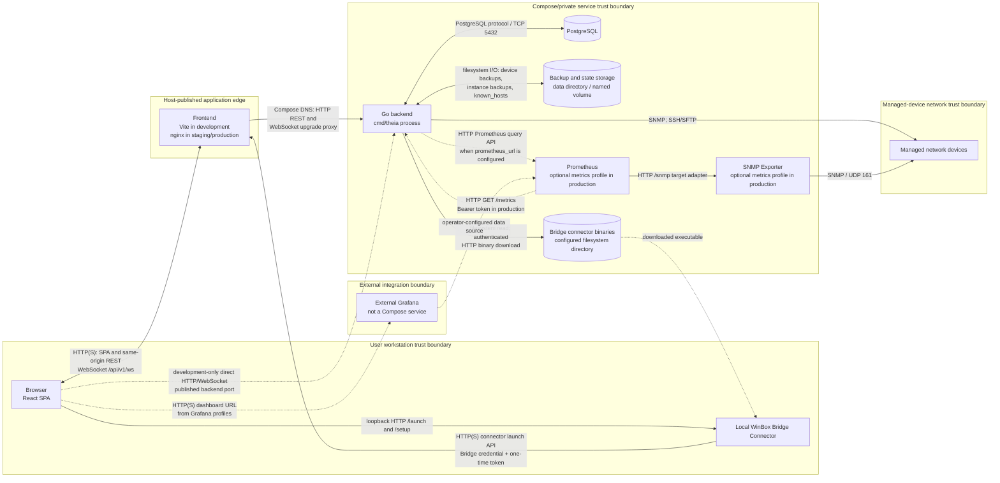
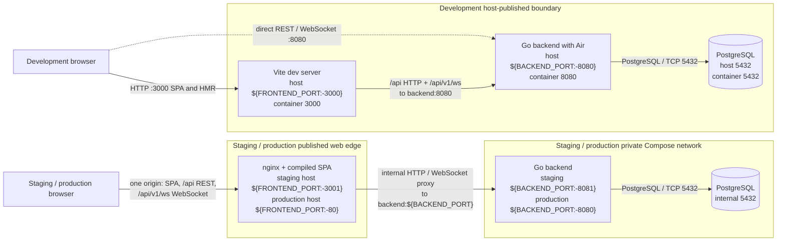
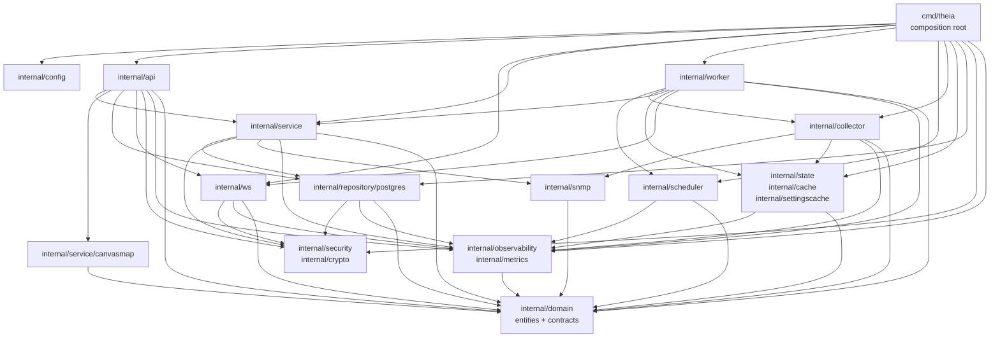
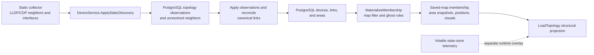

# Theia Architecture

## Purpose and Architectural Goals

This document is the maintainer reference for Theia's component boundaries, deployment topology,
state ownership, and cross-component flows. Use the [API reference](API.md) for HTTP and WebSocket
contracts, the [project overview](README.md) for product capabilities, and the
[setup guide](SETUP.md) for operator procedures.

The architecture aims to:

- keep persisted structural topology and saved-map intent separate from process-local runtime
  observations;
- make the Go backend composition root, external integrations, and storage ownership explicit;
- derive deployment exposure and dependency order from executable Compose definitions;
- preserve same-origin browser access outside development while keeping optional monitoring and
  desktop-connector integrations visible as separate trust boundaries; and
- give maintainers a stable map from behavior to source, verification, and documentation impact.

Terminology used throughout this document:

- **Runtime topology** is the process-owned live view that overlays current device and link
  reachability, health, and metrics on canonical structural topology. It is rebuilt by backend
  workers and is not a persisted canvas layout.
- **Saved map** is a persisted, materialized projection of canonical devices, links, map-local
  areas, and positions. Saved membership remains the projection source until an operation explicitly
  rematerializes it; see the [saved-map API contract](API.md#canvas-topology-and-saved-maps).
- **Runtime stream** is the ordered WebSocket snapshot, delta, and replay lineage identified by a
  `runtime_stream_id` and a monotonically advancing `runtime_version`. A client cursor permits
  bounded recovery without reloading structural topology; see the
  [WebSocket protocol](API.md#websocket-protocol).
- **Bootstrap configuration** is process-start configuration loaded from local `config.yaml` and
  `THEIA_*` environment variables before dependencies are constructed. It includes the deployment
  environment, listen address, database DSN, filesystem paths, encryption/session material, metrics
  token, and allowed origins. It is distinct from PostgreSQL-backed runtime settings such as polling
  controls and Prometheus or Grafana URLs, which are mutable independently of bootstrap
  configuration. Consumers observe those settings on source-defined read or refresh boundaries;
  values captured while constructing a component still require a restart for that aspect.

## System Context

The Go process owns the application API and runtime workers. Frontend servers provide the browser
entry point, PostgreSQL owns durable application records, and the backend data directory owns file
state. Monitoring and desktop connector paths are integrations rather than part of every runtime.
Dashed arrows below are development-only, optional, or operator-configured paths.



The browser-to-connector hop is deliberately loopback-local, while the connector-to-Theia hop uses
the configured application URL. Bridge binaries are served by the backend only when the configured
directory contains the requested platform build. Grafana remains an external dashboard integration;
none of the checked development, staging, or production Compose files defines a Grafana service.

## Deployment Architecture

Executable Compose definitions are authoritative for the tables below. Image `EXPOSE` declarations
describe intended container ports but do not publish them; only Compose `ports` entries create host
bindings. “Internal” therefore names the port used inside the Compose network even when a service
has no `expose` entry.

> **Maintenance caveat:** [SETUP.md](SETUP.md) currently differs from executable Compose in two
> places. Development Compose publishes PostgreSQL as `5432:5432`, not as a loopback-only binding,
> and production Compose publishes no host port for SNMP Exporter, not `localhost:9116`. Treat the
> Compose-derived values here as authoritative until the setup prose is reconciled.

### Development

The development stack is selected with profiles. `--profile dev` starts the full development set,
including Prometheus and SNMP Exporter; `test` and `postgres` select smaller subsets. Vite proxies
relative `/api` and `/api/v1/ws` traffic to `backend:8080`, while Compose separately publishes the
backend on `${BACKEND_PORT:-8080}` for direct API access.

| Service | Image or build target | Published host -> internal port | Health check | Dependency order | Persistent state or mount | Profile / optional status | Proxy and hot reload |
| --- | --- | --- | --- | --- | --- | --- | --- |
| `backend` | `Dockerfile` target `dev` (`golang:1.26.4-bookworm`, Air) | `${BACKEND_PORT:-8080} -> 8080` | `curl -sf http://localhost:8080/api/v1/auth/me` | Starts after `postgres` is healthy | Repository bind-mounted at `/app`; `theia-data:/app/data` | `dev`, `test`; no default-profile start | Air reloads the Go process from the repository mount; reachable directly and through Vite |
| `postgres` | `postgres:18-bookworm` | `5432 -> 5432` with no host-address restriction | `pg_isready -U theia -d theia` | None | `theia-postgres18-data:/var/lib/postgresql` | `dev`, `test`, `postgres`; no default-profile start | No application proxy or hot reload |
| `frontend` | `Dockerfile.frontend` target `dev` (`node:26-alpine`, Vite) | `${FRONTEND_PORT:-3000} -> 3000` | None in Compose | Starts after `backend` is started; it does not wait for backend health | `frontend/src` and `frontend/index.html` bind mounts | `dev`; no default-profile start | Vite HMR; `/api` -> `http://backend:8080`, with WebSocket proxying for `/api/v1/ws` |
| `snmp-exporter` | `prom/snmp-exporter:latest` | `${SNMP_EXPORTER_PORT:-9116} -> 9116` | `wget` against `http://localhost:9116/metrics` | None | Read-only bind mount for `docker/prometheus/snmp.yml` | `dev`; included whenever the full `dev` profile is selected | Not proxied; no source hot reload |
| `prometheus` | `prom/prometheus:latest` | `${PROMETHEUS_PORT:-9090} -> 9090` | `wget` against `http://localhost:9090/-/healthy` | Starts after `snmp-exporter` is healthy | Read-only Prometheus and alert-rule bind mounts; no development TSDB volume | `dev`; included whenever the full `dev` profile is selected | Not proxied; no application hot reload |

### Staging

Staging pulls pre-built application images and defines no service profiles. The frontend is the only
published application HTTP entry point; nginx expands `BACKEND_PORT` into its configuration and
proxies same-origin API and WebSocket traffic to the internal backend.

| Service | Image or build target | Published host -> internal port | Health check | Dependency order | Persistent state or mount | Profile / optional status | Proxy and hot reload |
| --- | --- | --- | --- | --- | --- | --- | --- |
| `backend` | `ghcr.io/lollinoo/theia-backend:${IMAGE_TAG:-master}` | None -> `${BACKEND_PORT:-8081}` | `curl -sf http://localhost:${BACKEND_PORT:-8081}/api/v1/auth/me` | Starts after `postgres` is healthy | `theia-staging-data:/data`, including default backup/state and bridge-binary paths | Default service | Internal nginx target; compiled binary, no source mount or hot reload |
| `postgres` | `postgres:18-bookworm` | `${POSTGRES_BIND_ADDR:-127.0.0.1}:${POSTGRES_HOST_PORT:-5433} -> 5432` | `pg_isready` with configured database and user | None | `theia-staging-postgres18-data:/var/lib/postgresql` | Default service | No application proxy or hot reload |
| `frontend` | `ghcr.io/lollinoo/theia-frontend:${IMAGE_TAG:-master}` | `${FRONTEND_PORT:-3001} -> 80` | None in Compose | Starts after `backend` is healthy | Compiled SPA in the image; no runtime state mount | Default service | nginx serves the SPA and proxies `/api/` plus `/api/v1/ws` to `backend:${BACKEND_PORT:-8081}`; no hot reload |

The checked staging stack contains no Prometheus or SNMP Exporter service. Staging can still point
the backend at separately operated Prometheus through the database-backed `prometheus_url`; any
SNMP Exporter then belongs to that external monitoring deployment.

### Production

Production normally pulls release images. `docker-compose.prod-build.yml` is a local-build override:
it substitutes `Dockerfile` target `production` and `Dockerfile.frontend` target `production` for the
backend and frontend images without changing the production runtime topology.

| Service | Image or build target | Published host -> internal port | Health check | Dependency order | Persistent state or mount | Profile / optional status | Proxy and hot reload |
| --- | --- | --- | --- | --- | --- | --- | --- |
| `backend` | Default: `ghcr.io/lollinoo/theia-backend:${IMAGE_TAG:-latest}`; local override: `Dockerfile` target `production` | None -> `${BACKEND_PORT:-8080}` | `curl -sf http://localhost:${BACKEND_PORT:-8080}/api/v1/auth/me` | Starts after `postgres` is healthy | `theia-data:/data`, including default backup/state and bridge-binary paths | Default service | Internal nginx target; compiled binary, no source mount or hot reload |
| `postgres` | `postgres:18-bookworm` | `${POSTGRES_BIND_ADDR:-127.0.0.1}:${POSTGRES_HOST_PORT:-5432} -> 5432` | `pg_isready` with configured database and user | None | `theia-prod-postgres18-data:/var/lib/postgresql` | Default service | No application proxy or hot reload |
| `frontend` | Default: `ghcr.io/lollinoo/theia-frontend:${IMAGE_TAG:-latest}`; local override: `Dockerfile.frontend` target `production` | `${FRONTEND_PORT:-80} -> 80` | None in Compose | Starts after `backend` is healthy | Compiled SPA in the image; no runtime state mount | Default service | nginx serves the SPA and proxies `/api/` plus `/api/v1/ws` to `backend:${BACKEND_PORT:-8080}`; no hot reload |
| `snmp-exporter` | `prom/snmp-exporter:latest` | **No host-published port** -> `9116` on the Compose network | `wget` against `http://localhost:9116/metrics` | None | Read-only bind mount for `docker/prometheus/snmp.yml` | Optional `metrics` profile only | Internal Prometheus target; not exposed through nginx and no hot reload |
| `prometheus` | `prom/prometheus:latest` | `${PROMETHEUS_BIND_ADDR:-127.0.0.1}:${PROMETHEUS_PORT:-9090} -> 9090` | `wget` against `http://localhost:9090/-/healthy` | Starts after `snmp-exporter` is healthy | Read-only Prometheus/alert-rule mounts; `prometheus-data:/prometheus`; metrics-token secret | Optional `metrics` profile only | Scrapes the backend and SNMP Exporter; not exposed through nginx and no application hot reload |

The optional production monitoring services start only with `--profile metrics`; they are not part of
the default production service set. Prometheus is loopback-bound by default, while SNMP Exporter is
internal-only and has no Compose host mapping.

The deployment access paths differ as follows:



## Backend Architecture

### Bootstrap and Shutdown

[`cmd/theia`](cmd/theia) is the composition root. `runMain` selects `config.yaml` from the command
line, `THEIA_CONFIG`, or the default path, and `runtimeBootstrap.Run` then constructs every concrete
adapter and long-running component. Startup fails closed: a missing required database DSN, invalid
deployment secrets, an unusable runtime path, an unavailable PostgreSQL connection, a keyring
error, a migration error, or failed auth bootstrap prevents workers and the HTTP listener from
starting.

```mermaid
sequenceDiagram
    autonumber
    actor Supervisor as Process / supervisor
    participant Boot as cmd/theia<br/>runtimeBootstrap
    participant ConfigFS as config + runtime paths
    participant Restore as restore coordinator
    participant DB as PostgreSQL + repositories
    participant Security as keyring + auth
    participant Runtime as hub + state + scheduler<br/>collectors + pipeline
    participant Backups as bulk processor +<br/>backup schedulers
    participant HTTP as router + HTTP server

    Supervisor->>Boot: run with config path
    Boot->>ConfigFS: load defaults, YAML, then THEIA_* overrides
    ConfigFS-->>Boot: normalized and quota-validated Config
    Boot->>ConfigFS: configure logging and resolve data paths
    Boot->>Boot: validate deployment secrets and required DB policy
    Boot->>ConfigFS: create private backup and application-data directories
    Boot->>Restore: ApplyPendingRestore(paths, DSN)
    opt pending restore marker exists
        Restore->>DB: restore PostgreSQL dump
        Restore->>Security: load keyring for restored credentials
        Restore->>DB: open, tune, ping, migrate credentials,<br/>and revoke restored sessions
    end
    Restore-->>Boot: continue normal startup
    Boot->>ConfigFS: check known_hosts permissions
    Boot->>DB: OpenPrimaryDB, ConfigureDB, Ping
    DB-->>Boot: tuned live connection
    Boot->>Security: LoadKeyringFromEnv
    Security-->>Boot: active key and readable historical keys
    Boot->>DB: RunMigrations(db, keyring)
    Boot->>Security: construct AuthService and EnsureBootstrapSuperAdmin
    Security->>DB: read or create auth bootstrap records
    Boot->>DB: seed vendor configuration; construct repositories,<br/>device/link cache, and five-second settings cache
    Boot->>Boot: construct device, backup, bridge, and instance-backup services
    Boot->>Backups: ResumeBulkBackupRuns(ctx)
    Boot->>Runtime: start Hub.Run goroutine; construct state store,<br/>saved-map scheduler, collectors, and pipeline
    Boot->>Runtime: Pipeline.Start(ctx)
    Runtime->>Runtime: State.Start; Scheduler.Start;<br/>start task workers, monitor, and broadcaster
    Boot->>Backups: Start instance and device backup schedulers
    Boot->>HTTP: construct WebSocket handler, API router,<br/>metrics wrapper, and http.Server
    Boot->>Boot: subscribe to SIGINT and SIGTERM
    Boot->>HTTP: ListenAndServe
    Supervisor-->>Boot: SIGINT or SIGTERM
    Boot->>Runtime: cancel shared context
    Boot->>Backups: Stop device-backup scheduler
    Boot->>Backups: Stop instance-backup scheduler
    Boot->>Runtime: Pipeline.Stop<br/>(scheduler and state stop internally)
    Boot->>Runtime: DeviceService.Stop
    Boot->>HTTP: Shutdown with 10-second deadline
    HTTP-->>Boot: http.ErrServerClosed treated as normal
    Boot->>DB: deferred Close
    Boot-->>Supervisor: process returns
```

The registered child list is stopped in reverse order, with an independent ten-second bound for
each child: device-backup scheduler, instance-backup scheduler, pipeline, then device service. The
pipeline owns the nested scheduler and state-store lifecycle, so its `Stop` cancels and joins those
components. A successfully staged instance restore invokes the same cancel, reverse-child-stop, and
HTTP-shutdown path so the configured supervisor can restart the process.

`Hub.Run` has no matching `Stop` API and is intentionally not a registered runtime child. WebSocket
connection goroutines end through connection, HTTP-server, and client teardown, while cancellation
and `Pipeline.Stop` first prevent further runtime production. The diagram therefore does not assign
the hub a standalone shutdown lifecycle that the source does not implement.

### Package Boundaries and Dependency Direction

The package boundaries are pragmatic rather than a claim of strict clean architecture. Domain
interfaces are the usual inward-facing contracts, but the API and service layers also contain a few
deliberate concrete PostgreSQL dependencies for credential profiles, bulk-operation leases, and
instance database backup/restore.

| Package group | Responsibility and owned boundary |
| --- | --- |
| [`cmd/theia`](cmd/theia), [`internal/config`](internal/config) | Process entry point and composition root; load and validate bootstrap configuration, resolve runtime paths, open external resources, construct concrete implementations, establish lifecycle order, and expose the HTTP server. |
| [`internal/domain`](internal/domain) | Infrastructure-independent entities, enums, validation rules, errors, events, and repository/service-facing contracts for devices, topology, maps, auth, settings, backups, metrics, and bridge state. |
| [`internal/api`](internal/api) | HTTP transport: route metadata, request/response decoding, handlers, session authentication, RBAC dispatch, origin/CSRF middleware, health endpoints, metrics-aware handlers, and WebSocket route attachment. Detailed wire contracts remain in [API.md](API.md). |
| [`internal/service`](internal/service) | Multi-step business workflows: authentication, device mutation and discovery, bridge operations, device/bulk backups, instance backup/restore, retention, command execution, and coordination across repositories, network protocols, and filesystems. |
| [`internal/service/canvasmap`](internal/service/canvasmap) | Domain-only saved-map planning, topology loading, membership materialization, projection/filtering, area assignment, virtual-device isolation, and visual/default-position decisions. |
| [`internal/repository/postgres`](internal/repository/postgres) | PostgreSQL adapters for domain repositories, SQL dialect binding and pool tuning, embedded migrations, transactional leases, change notifications, settings persistence, and encryption/rewrap of stored credential fields. |
| [`internal/scheduler`](internal/scheduler) | Bounded, priority-aware polling task ownership: saved-map membership input, due-time heap, jitter, lane and isolation budgets, dispatch/completion accounting, refresh, and cancellation. It schedules work but does not perform device I/O. |
| [`internal/collector`](internal/collector), [`internal/snmp`](internal/snmp) | Stateless essential, performance, operational, static, and Prometheus-enrichment collection; SNMP client construction, polling primitives, vendor-aware OID handling, and topology discovery. Collectors return observations rather than owning orchestration or persistence. |
| [`internal/worker`](internal/worker) | Long-running orchestration: consume scheduled tasks, invoke collectors, normalize and persist results, update runtime state, build/replay snapshots, publish WebSocket changes, monitor Prometheus, and run instance/device backup schedules. |
| [`internal/ws`](internal/ws) | Realtime protocol DTOs, upgrade handler, client read/write pumps, bounded mailboxes, hub registration and fan-out, subscriptions, runtime bootstrap/replay delivery, ACK tracking, and resync/backpressure behavior. |
| [`internal/state`](internal/state), [`internal/cache`](internal/cache), [`internal/settingscache`](internal/settingscache) | Process-local bounded state: live device/link observations and health, invalidation-driven structural device/link snapshots, and a short-lived PostgreSQL settings snapshot. These packages do not replace durable repositories. |
| [`internal/security`](internal/security), [`internal/crypto`](internal/crypto) | HTTP origin and sensitive-response controls, password and bridge-secret hashing, token helpers, and the environment-loaded AES-GCM credential keyring with key-ID envelopes and legacy rewrap support. |
| [`internal/observability`](internal/observability), [`internal/metrics`](internal/metrics) | Prometheus instrumentation/registry and `/metrics` handler; Prometheus query-client integration, health/enrichment parsing, label policy, and telemetry emitted by API, persistence, scheduling, workers, state, and WebSocket delivery. |

Arrows in the following diagram mean “constructs, imports, or calls” from the package at the tail to
the dependency at the head. They are not event or data-flow arrows.



### HTTP and WebSocket Boundary

The outer `runtimeHTTPHandler` in
[`runtime_bootstrap.go`](cmd/theia/runtime_bootstrap.go) intercepts `/metrics` and
`/debug/pprof[/...]` before application routing and applies the configured metrics bearer-token
check. All other requests enter [`api.NewRouter`](internal/api/router.go). Route metadata selects
the public, special-profile, or normal middleware chain and the required permission; handlers own
HTTP parsing and status mapping, while authentication, RBAC, allowed-origin, and request-safety
policy remain middleware concerns. See [HTTP conventions](API.md#http-conventions),
[session security](API.md#authentication-and-session-security), [RBAC](API.md#authorization-and-rbac),
and the [route catalog](API.md#route-catalog) for the executable wire contract rather than
duplicating it here.

The WebSocket endpoint is an API route, but after upgrade
[`ws.Handler`](internal/ws/handler.go) owns connection-local behavior. It checks the configured
browser-origin policy, creates bounded client mailboxes, starts the read pump, obtains bootstrap
state from the pipeline, and starts the write pump only after bootstrap delivery is ordered. The
[`ws.Hub`](internal/ws/hub.go) owns the active-client set and broadcast/unicast fan-out; the worker
pipeline owns snapshot construction, runtime journals, cursor synchronization, and ACK observation
passed into the handler by `cmd/theia`. This keeps transport delivery separate from production of
runtime state. Message schemas, negotiation, replay/resync, deadlines, backpressure, and close
behavior are authoritative in the [WebSocket protocol](API.md#websocket-protocol).

The hub is not a persistence boundary and has no standalone process stop method. On shutdown,
context cancellation stops pipeline producers and `http.Server.Shutdown` drains ordinary HTTP
handling; it does not create a separate hub teardown. WebSocket client pumps end when their peer or
connection owner closes the connection, with process teardown ending any connection still present.
Durable state must therefore be committed by repositories or workflow services before transport
delivery; a hub broadcast is not a durable acknowledgement.

### Services and Domain Workflows

[`internal/domain`](internal/domain) defines the shared vocabulary and repository contracts. A
PostgreSQL adapter can change its SQL without changing callers that consume those interfaces, and
process-local state can use the same domain entities without becoming the canonical store. Domain
validation and invariants belong here; HTTP status codes, SQL rows, goroutine ownership, and device
protocol sessions do not.

[`internal/api`](internal/api) calls repositories directly for bounded CRUD/read models and calls
[`internal/service`](internal/service) when an operation spans multiple owners. Examples include
device discovery and mutation with rescheduling, auth/session and bootstrap-admin workflows,
bridge credential and launch coordination, SSH device/bulk backups, and PostgreSQL instance
backup/restore. Services own transaction/workflow ordering and translate repository, network,
command, and filesystem outcomes into domain errors; handlers translate those outcomes into the
wire behavior documented under [domain contracts](API.md#domain-contracts).

Saved-map transformations are kept in
[`internal/service/canvasmap`](internal/service/canvasmap): handlers supply repository-loaded domain
objects, and the package plans membership changes or materializes/projections without importing an
HTTP or PostgreSQL adapter. Conversely, instance backup/restore and a few bulk workflows in the
main service package intentionally use `database/sql` or concrete PostgreSQL helpers because the
database dump, restore, and lease are themselves part of those workflows. These concrete edges are
shown in the dependency graph rather than hidden behind an idealized layering claim.

The credential keyring protects the specific SNMP and credential-profile fields handled by the
PostgreSQL adapters, and instance-backup manifests record the key IDs required to read credential
ciphertext after restore. That does not make every backup archive an encrypted container: the
current instance archive writer creates a permission-restricted `.tar.gz` containing a manifest,
database dump, selected device backups, and optional `known_hosts`. Archive-level encryption must
not be inferred unless a workflow explicitly adds it.

### Workers, Scheduler, and Collectors

The runtime pipeline has distinct owners:

- [`internal/scheduler`](internal/scheduler) selects only devices belonging to at least one saved
  map, maintains due tasks in a heap, applies essential/background lanes and bounded dispatch
  budgets, and records completion before rescheduling. It owns timing and admission, not polling.
- [`internal/collector`](internal/collector) performs one essential, performance, operational,
  static, or Prometheus-enrichment collection when called. [`internal/snmp`](internal/snmp) owns the
  protocol client and vendor-aware discovery/polling primitives. Neither package starts an
  application lifecycle of its own.
- [`worker.PipelineOrchestrator`](internal/worker/pipeline.go) starts the state store and scheduler,
  creates the task-worker pool, consumes scheduler tasks, invokes collectors, returns completions,
  persists static discovery through `DeviceService`, updates live state, monitors Prometheus, and
  coalesces snapshots/deltas into the WebSocket hub. It owns and joins these child goroutines.
- [`worker.BackupScheduler`](internal/worker/backup_scheduler.go) and
  [`worker.DeviceBackupScheduler`](internal/worker/device_backup_scheduler.go) are independent
  context-bound loops. Each wakes hourly, reads its current database-backed interval and retention
  settings, invokes the relevant service, and runs bounded cleanup. Resumed persistent bulk device
  backup work is started through `BackupService` before the polling pipeline begins.

Cancellation is shared from the composition root, but explicit `Stop` calls still provide joining
and ordering. Pipeline stop prevents new runtime callbacks, cancels its derived context, stops the
scheduler and state store, waits for task workers, the Prometheus monitor, and broadcaster, and
clears recovery tracking. The two backup schedulers are stopped before the pipeline; `DeviceService`
is stopped after it. Queue capacity, WebSocket recovery, and detailed runtime messages are covered
by the [protocol and concurrency invariants](API.md#protocol-and-concurrency-invariants).

## Frontend Architecture

Task 4 defines only the frontend's deployment and integration boundary in
[System Context](#system-context) and [Deployment Architecture](#deployment-architecture). Detailed
application composition, client-state ownership, REST/bootstrap access, realtime reconciliation,
and rendering boundaries belong to Task 5 and are intentionally not specified in this tranche.

## Data Architecture

PostgreSQL is the durable application authority. Filesystem artifacts have independent lifecycles,
while caches, live telemetry, replay state, and client queues exist only for the current process.
The ownership split below is intentional: reconstructible state must not be treated as durable data.

### PostgreSQL and Migrations

[`RunMigrations`](internal/repository/postgres/migrations.go) applies the embedded
[`migrations`](internal/repository/postgres/migrations/) set during startup. The migrations are
grouped by capability rather than repeated as SQL:

| Capability | Migrations | Durable model introduced or evolved |
| --- | --- | --- |
| Foundational inventory and settings | [`000001`](internal/repository/postgres/migrations/000001_initial_schema.up.sql) and [`000003`](internal/repository/postgres/migrations/000003_device_notes.up.sql) | Devices, interfaces, canonical links, settings, positions, SNMP/vendor/area/credential profiles, device-backup metadata, instance-backup metadata, and device notes. |
| Polling classification and topology observations | [`000002`](internal/repository/postgres/migrations/000002_device_poll_classification.up.sql), [`000004`](internal/repository/postgres/migrations/000004_topology_observations.up.sql), [`000005`](internal/repository/postgres/migrations/000005_scale_lookup_indexes.up.sql), and [`000006`](internal/repository/postgres/migrations/000006_unresolved_neighbors_active_lookup.up.sql) | Poll class and interval override, resolved and unresolved discovery observations, and their ingest/resolution lookup indexes. |
| OS, discovery, and polling controls | [`000007`](internal/repository/postgres/migrations/000007_device_topology_discovery.up.sql)–[`000009`](internal/repository/postgres/migrations/000009_device_polling_enabled.up.sql) | Per-device discovery mode/bootstrap result, OS version, and polling enablement. |
| Saved-map structure and presentation | [`000010`](internal/repository/postgres/migrations/000010_canvas_maps.up.sql)–[`000013`](internal/repository/postgres/migrations/000013_canvas_map_device_areas.up.sql) and [`000015`](internal/repository/postgres/migrations/000015_canvas_map_device_visual_color.up.sql) | Map definitions and positions, explicit device/link/area membership, the materialized-membership flag, map-local area snapshots, and per-device visual color. |
| RBAC and per-user bridge data | [`000016`](internal/repository/postgres/migrations/000016_auth_rbac.up.sql)–[`000018`](internal/repository/postgres/migrations/000018_user_bridge_port_override.up.sql) | Users, roles, permissions, sessions, reset tokens, audit logs, user settings, bridge credentials and launch/download records, and a per-user bridge-port override. |
| Durable bulk device-backup orchestration | [`000019`](internal/repository/postgres/migrations/000019_bulk_backup_runs.up.sql)–[`000022`](internal/repository/postgres/migrations/000022_bulk_backup_run_processor_lease.up.sql) | Bulk runs and items, pause/cancel and active-item states, and the processor owner/expiry lease used for restart-safe single processing. The base device and instance backup rows originate in `000001`. |
| Address conflict and probe evolution | [`000014`](internal/repository/postgres/migrations/000014_virtual_device_duplicate_ips.up.sql), [`000023`](internal/repository/postgres/migrations/000023_device_ip_conflict_constraints.up.sql), [`000024`](internal/repository/postgres/migrations/000024_device_addresses.up.sql), and [`000025`](internal/repository/postgres/migrations/000025_probe_ports.up.sql) | Virtual-device duplicate-IP policy, physical/virtual conflict constraints, ordered multi-address records with one primary address, and device/address-specific probe ports. |

Repository ownership follows these boundaries: inventory and topology use
[`DeviceRepo`](internal/repository/postgres/device_repo.go),
[`LinkRepo`](internal/repository/postgres/link_repo.go), and
[`TopologyObservationRepo`](internal/repository/postgres/topology_observation_repo.go); saved maps use
the [`canvas-map repositories`](internal/repository/postgres/canvas_map_repo.go); authentication and
bridge state use [`AuthRepo`](internal/repository/postgres/auth_repo.go) and
[`BridgeRepo`](internal/repository/postgres/bridge_repo.go); backup control state uses the
[`backup job`](internal/repository/postgres/backup_job_repo.go),
[`bulk run`](internal/repository/postgres/bulk_backup_run_repo.go), and
[`instance backup`](internal/repository/postgres/instance_backup_repo.go) repositories.

### Filesystem State and Backups

[`resolveRuntimePaths`](cmd/theia/runtime_paths.go) derives the application data directory, device
backup root, instance-backup root, and `known_hosts` path. The two backup roots may be overridden
independently. Runtime bootstrap creates private directories before services start.

| Owner / store | Contents and lifetime | Authority and recovery boundary |
| --- | --- | --- |
| PostgreSQL | Inventory, topology observations and links, settings, credentials, auth/RBAC, saved maps, backup metadata, bulk leases, and instance-backup records. Durable across process restarts. | Authoritative application record store; repository transactions and migrations own mutations. |
| Frontend-independent persisted map data | Map definitions, membership, positions, map-local area snapshots, and visual colors. | PostgreSQL remains authoritative even when no frontend is connected; [`LoadTopology`](internal/service/canvasmap/topology_load.go) reconstructs the saved structural projection. |
| Runtime data directory | Restore staging, pending marker, operation-status JSON, and the pre-restore PostgreSQL dump, plus the default locations of other runtime files. | Local durable control plane for a restart handoff, not a substitute for repository rows. [`RestoreCoordinator`](internal/service/restore_coordinator.go) owns cleanup after successful activation. |
| Device-backup root | Per-device text and binary configuration artifacts written with private permissions. | File bytes live here; `backup_jobs` and `backup_files` own status, path, hash, and size metadata. [`backup_executor.go`](internal/service/backup_executor.go) writes through a temporary file and rename, and removes an artifact if its metadata insert fails. |
| Instance-backup root | One private directory per backup containing a `.tar.gz` archive and SHA-256 sidecar. Archives contain a PostgreSQL dump, selected device backups, optional `known_hosts`, and a manifest. | `instance_backups` owns lifecycle metadata. The archive is gzip-compressed tar, not whole-archive encryption; manifest key IDs/hashes describe keys required by encrypted credential values inside the database dump. |
| SSH `known_hosts` | Remembered host keys used by device backup SSH connections. | Filesystem trust state owned by [`KnownHostsStore`](internal/ssh/known_hosts.go); it is included in instance backups and replaced only through validated restore staging. |
| Vendor definitions and overrides | Embedded YAML or `THEIA_VENDORS_DIR` supplies bootstrap defaults; `vendor_configs` stores merged durable records. | Startup seeds missing defaults, then builds the runtime registry from PostgreSQL, falling back to YAML only when database records are empty or invalid; see [`vendor_registry_bootstrap.go`](cmd/theia/vendor_registry_bootstrap.go). |
| Bridge binaries | Deployment-provided executables under the configured bridge-binary directory. | Read by the API boundary but not application-owned mutable data and not collected into instance archives. |
| Settings cache | A process-local whole-table snapshot. | PostgreSQL is authoritative. The cache has a five-second lazy TTL; `Set` and `Update` write through and update an already-loaded entry, while external writes appear after expiry. |
| Device/link cache | Process-local DB-backed inventory indexes. | No TTL. Repository change subscriptions apply incremental updates; startup, invalidation, or a repair signal forces a full PostgreSQL reload. |
| State store | Live metrics, link rates, health, reachability, failure counts, and staleness. | Volatile process memory only; it is rebuilt by polling and must not be confused with saved-map membership or database inventory. |
| Overview replay journal | Runtime deltas for the current stream, bounded to 512 entries and 16 MiB. | Pipeline-owned and transient. Discontinuity, oversize data, or stream replacement resets it; missing history requires a snapshot. |
| WebSocket client mailboxes | Per-connection general and overview payload queues, bounded to 16 and 32 messages respectively. | Hub-owned and transient. Overflow clears the overview mailbox and schedules replay/snapshot recovery; disconnect removes the client and closes both queues. |

Filesystem and database state are therefore coordinated, not interchangeable. Deleting a database
row does not implicitly make an arbitrary path safe to delete, and an archive on disk is not a
successful backup until its metadata transition completes. Device- and instance-backup deletion
validate that targets remain under their configured roots. Instance backup startup reconciliation
can repair a stale `running` row when its expected archive exists; otherwise it records an
interrupted failure.

Restore never mutates the live repositories in place from an HTTP request. Validation extracts to a
temporary directory, then copies only validated artifacts into private staging and atomically writes
a pending marker and status file. The API initiates orderly shutdown; the next process applies the
marker before opening the normal database connection, then normal startup recreates repositories,
caches, schedulers, and runtime state.

### Caches, Journals, and Client Mailboxes

[`settingscache.Cache`](internal/settingscache/cache.go) refreshes the complete settings snapshot on
the first read after its TTL. [`DeviceLinkCache`](internal/cache/cache.go) instead drains bounded
repository event subscriptions and falls back to a full reload if an event source reports repair;
the one-slot legacy invalidation channel merely marks that reload as necessary. Neither cache is a
second durable owner.

[`state.Store`](internal/state/store.go) is a separate volatile telemetry engine. Its 32-slot change
channel coalesces device IDs when possible and sets a sticky overflow marker when updates are
dropped. The broadcaster then rebuilds authoritative runtime snapshots from the current store and
DB-backed inventory rather than assuming every notification survived.

The [`overview journal`](internal/worker/overview_journal.go) and
[`Client` mailboxes](internal/ws/hub.go) bound recovery memory. A contiguous journal range can be
compacted into replay; otherwise the pipeline installs a full snapshot. A slow client's overview
mailbox is cleared and marked for recovery instead of blocking producers or growing without bound.
All of this state disappears on restart; PostgreSQL and validated filesystem artifacts remain the
durable authorities.

## Core Data Flows

### Polling and Realtime Delivery

The scheduler reads only eligible saved-map devices through
[`NewSavedMapDeviceSource`](internal/scheduler/map_membership_source.go), maintains its timed heap,
and dispatches through a 128-slot task channel subject to polling budgets. Pipeline workers invoke
the appropriate collector with the pipeline context, update the volatile state store, and always
report completion to release scheduler admission. Static results may additionally persist inventory
and discovery data; ordinary runtime telemetry does not.

```mermaid
flowchart LR
    DB["PostgreSQL inventory and saved-map membership"] --> Cache["Device/link cache"]
    Cache --> Scheduler["Scheduler<br/>timed heap and 128-slot task channel"]
    Scheduler --> Worker["Pipeline worker"]
    Worker --> Collector["Essential, performance,<br/>operational, or static collector"]
    Collector --> Store["State store<br/>volatile telemetry"]
    Store --> Changes["32-slot change stream"]
    Changes --> Broadcaster["Snapshot broadcaster<br/>coalesced deltas"]
    Broadcaster --> Journal["Replay journal<br/>512 entries or 16 MiB"]
    Broadcaster --> Hub["WebSocket hub broadcast"]
    Hub --> Mailbox["Per-client overview mailbox<br/>32 messages"]
    Mailbox -. "overflow" .-> Recovery["Replay when contiguous;<br/>otherwise snapshot resync"]
    Recovery --> Mailbox
```



Pipeline stop cancels the derived context, stops scheduler and state-store background work, and
waits for task workers and the broadcaster. Queue overflow is explicit degradation: state changes
force a rebuilt snapshot, while a client mailbox overflow triggers client-specific recovery.

### Discovery, Canonical Topology, and Saved Maps

Static discovery is durable structural input, not live telemetry. The device service upserts
observations and unresolved neighbors, prunes safely reconciled observations, and materializes
canonical links from resolved observations. Saved maps then snapshot a filtered structural
projection into their own membership, area, position, and visual rows. Loading a saved map hydrates
only those persisted members and links; current metrics remain a separate runtime overlay.



[`ReplaceMaterializedMembership`](internal/service/canvasmap/materialization.go) performs the
current-topology snapshot, while [`projection.go`](internal/service/canvasmap/projection.go) defines
filtering and ghost-device rules. Subsequent discovery can change canonical topology without
silently redefining already-materialized saved-map membership.

### Device and Bulk Backup Runs

A durable bulk run admits at most one active run. Its processor acquires a two-minute database
lease, refreshes the lease while processing, claims items, and selects batches of at most ten.
Eligibility checks device status, credential profile, vendor support, and reachability before a
pending job is created. An unbuffered worker channel feeds at most four workers, and a per-device
lock serializes remote filenames and job transitions.

```mermaid
flowchart LR
    Trigger["Manual request or hourly scheduler"] --> Run["Create durable bulk run and items"]
    Run --> Lease["Acquire and refresh<br/>two-minute processor lease"]
    Lease --> Batch["Claim next batch<br/>at most 10 items"]
    Batch --> Check["Device, credential, vendor,<br/>and SSH reachability checks"]
    Check --> Queue["Unbuffered job channel"]
    Queue --> Workers["Up to 4 backup workers<br/>per-device lock"]
    Workers --> Secret["Decrypt credential envelope<br/>with configured keyring"]
    Secret --> SSH["SSH commands and SFTP transfer<br/>known-host verification"]
    SSH --> Files["Private temp files, atomic rename,<br/>SHA-256 and size"]
    Files --> Status["backup_files and backup_jobs;<br/>bulk item and run counters"]
    Cancel["Pause or cancel request"] --> Run
    Run -. "pending items cancel;<br/>active jobs drain" .-> Status
```



Pause and cancel are durable run transitions. Cancellation marks work that has not become active;
already-active device jobs finish and the processor waits for their terminal states. On restart,
resumable runs reset interrupted nonterminal items and mark their old jobs failed before acquiring a
new lease. The device-backup scheduler evaluates per-device successful-retention counts in batches
of 100. Its [`runRetention`](internal/worker/device_backup_scheduler.go) context is checked between
batches against a 60-second budget; repository reads and deletions inside the current batch do not
use that context, so one batch and the overall sweep can exceed 60 seconds. Failed job records older
than seven days are still removed after batch processing; artifact deletion passes path validation.

### Instance Backup, Staged Restore, and Restart Reconciliation

Instance backup serializes admission, creates a `running` row, streams a PostgreSQL custom-format
dump, collects device artifacts and `known_hosts` within configured quotas, and writes a private
`.tar.gz` plus SHA-256 sidecar before marking success. Cancellation is context-driven for the active
operation and removes partial output. The manifest records the database checksum, migration
version, and credential key IDs/hashes needed after restore. It does **not** encrypt the complete
archive.

```mermaid
flowchart LR
    Create["Create instance backup"] --> Dump["pg_dump custom-format database"]
    Dump --> Archive["Collect allowed files and manifest;<br/>quota checks, tar.gz, SHA-256 sidecar"]
    Archive --> Record["instance_backups success metadata"]
    Record --> Validate["Restore validation:<br/>safe extraction, manifest/key IDs,<br/>DB hash, pg_restore list, schema version"]
    Validate --> Stage["Private .restore-staging plus<br/>pending marker and status"]
    Stage --> Shutdown["Orderly shutdown;<br/>supervisor restart boundary"]
    Shutdown --> Startup["Startup validates marker targets<br/>before normal DB bootstrap"]
    Startup --> Apply["Pre-restore dump, pg_restore,<br/>migrations and credential rewrap"]
    Apply --> Backups["Revoke restored sessions;<br/>individually replace optional<br/>device-backup directory"]
    Backups --> KnownHosts["Then individually replace<br/>optional known_hosts file"]
    KnownHosts --> Cleanup["Remove marker/staging;<br/>continue normal startup and reconcile rows"]
    KnownHosts -. "failure after backup activation" .-> Retry["Backup directory may already be live;<br/>keep marker/staging and refresh<br/>the staged DB for retry"]
```



Restore validation is deliberately broader than filename inspection: it bounds compressed,
expanded, per-entry, and file-count sizes; rejects traversal, links, special files, and non-allowlisted
entries; requires a supported PostgreSQL dump; verifies the manifest database hash and migration
compatibility; and verifies that all credential key IDs are configured. It does not claim a
whole-archive authentication or encryption guarantee.

After staging, the API does not hold open repositories while applying the dump. On restart,
[`ApplyPendingRestore`](internal/service/restore_coordinator.go) validates marker paths, preserves a
pre-restore dump, replaces the PostgreSQL public schema, runs migrations/credential rewrap, revokes
restored sessions, then
[`activateOptionalRestoreArtifacts`](internal/service/restore_optional_artifacts.go) activates the
optional device-backup directory followed by `known_hosts`. Each target uses its own temporary path
and rename-based replacement with target-local recovery, but the two activations are not one atomic
operation and have no cross-artifact rollback. If `known_hosts` activation fails, the restored
device-backup directory may already be live. The coordinator records a retryable failure, retains
the marker and staging state, and refreshes the staged database from the restored database for the
next startup attempt; only success for both optional targets removes pending state. A missing
credential key instead becomes an operator-action-required status. Normal bootstrap then rebuilds
caches and volatile telemetry, reconciles stale instance-backup rows, and resumes durable bulk runs.

## Security Architecture

Task 4 records only the trust, credential-storage, and process boundaries needed to interpret the
[system context](#system-context), [backend dependency map](#package-boundaries-and-dependency-direction),
and [backup flows](#device-and-bulk-backup-runs). The end-to-end session, CSRF, RBAC, origin,
connector, metrics, and reverse-proxy controls remain Task 5 scope; their current wire contract is
in [API.md](API.md).

## Observability Architecture

Task 4 establishes the external Prometheus/Grafana topology and the backend packages that emit or
consume telemetry; see [System Context](#system-context), [Deployment Architecture](#deployment-architecture),
and [Package Boundaries and Dependency Direction](#package-boundaries-and-dependency-direction).
The detailed log, health, metric, alert, and recovery-signal model belongs to Task 5.

## Configuration Ownership

Backend configuration has two authorities and no automatic promotion path between them. Bootstrap
configuration belongs to the composition root; mutable operational settings belong to PostgreSQL.
Adding the same key to both sources would create ambiguous precedence and should be avoided.

| Owner and source | Representative values | Read and validation path | Change / reload expectation |
| --- | --- | --- | --- |
| Composition-root YAML and environment | Listen address, required PostgreSQL DSN, data directory, log level, bridge-binary directory, deployment environment, session secret and TTLs, metrics token, allowed origins, restore/instance-archive quotas, and bulk-operation limits. | [`config.Load`](internal/config/config.go) applies defaults, optional YAML, then environment overrides and validates normalized environment and limits. [`config.example.yaml`](config.example.yaml) is the operator-facing template. | Read once before dependency construction; there is no file or environment watcher. Change the file/environment and restart the process. |
| Composition-root path and keyring environment | `THEIA_CONFIG`, `THEIA_BACKUP_DIR`, `THEIA_INSTANCE_BACKUP_DIR`, `THEIA_ENCRYPTION_KEY_ID`, `THEIA_ENCRYPTION_KEYS`, and the legacy key fallback. | [`runMain`](cmd/theia/main.go) selects the config path; [`resolveRuntimePaths`](cmd/theia/runtime_paths.go) fixes filesystem locations; [`crypto.LoadKeyringFromEnv`](internal/crypto/keyring.go) loads active and historical keys before migrations. | Read during startup. Path changes and key changes require restart; key rotation is completed by startup migration/rewrap and old keys must remain available while older ciphertext or backups require them. |
| PostgreSQL `settings` rows | Prometheus/Grafana integration, polling cadence and admission limits, SNMP timeouts/retries, topology defaults, timezone, probe ports, bridge port, and instance/device backup interval and retention. | Domain keys/defaults live in [`domain/settings.go`](internal/domain/settings.go); [`postgres.SettingsRepo`](internal/repository/postgres/settings_repo.go) persists them; authenticated settings handlers validate an allowlist and write the repository. | Mutable without changing bootstrap configuration. Effect is consumer-specific rather than a global atomic reload: Prometheus is checked every five seconds, backup settings on hourly scheduler cycles, and polling/SNMP values on scheduler refresh, dispatch, or task reads. |
| Process-local settings snapshot | The current key/value snapshot used by services, schedulers, and workers. | [`settingscache.Cache`](internal/settingscache/cache.go) wraps the PostgreSQL repository with a five-second, lazy, whole-snapshot TTL. API `Set`/`Update` writes through and updates an already-loaded local entry. | In-process API writes are immediately visible through the cache; an out-of-process database write becomes visible on the first read after TTL expiry. There is no background refresh goroutine. |
| Construction/start-time projections of database settings | Pipeline worker goroutine count and WebSocket coalescing window are derived when the pipeline is constructed or started. | [`worker.NewPipelineOrchestrator`](internal/worker/pipeline.go) captures the coalescing window, and `Start` calls the settings-derived worker-count function before launching a fixed set of goroutines. | Updating the PostgreSQL row remains durable, but these already-constructed aspects change only after process restart. Other consumers that reread the same settings may adapt earlier. |

Bootstrap secret values are not copied into the runtime settings table. Session signing material,
the metrics bearer token, database credentials, and encryption-key secrets remain deployment-owned;
the database stores only the application records or protected/hash-derived values defined by their
repositories. Conversely, editing `config.yaml` does not mutate runtime settings rows.

Frontend build-time and runtime configuration ownership is outside this backend tranche and will be
added in Task 5 without changing the bootstrap/PostgreSQL split above.

## Failure Modes and Recovery

Task 4 establishes the backend lifecycle and recovery boundaries in
[Bootstrap and Shutdown](#bootstrap-and-shutdown),
[Caches, Journals, and Client Mailboxes](#caches-journals-and-client-mailboxes), and
[Core Data Flows](#core-data-flows). Task 5 owns the consolidated cross-layer failure matrix and
operator-facing degradation behavior; no broader recovery guarantee should be inferred here.

## Testing and Delivery

Task 4 identifies source-adjacent verification seams in the source map below. Task 5 owns the
complete test-layer, image-publication, Compose-deployment, and release-check model.

## Maintainer Source Map

Use this map to start an architecture-impact review. The linked files are the primary Task 4
authorities, not an exhaustive inventory of every helper or test.

| Concern | Primary implementation authority | Focused verification and adjacent contract |
| --- | --- | --- |
| Deployment, ingress, and process images | [`docker-compose.yml`](docker-compose.yml), [`docker-compose.staging.yml`](docker-compose.staging.yml), [`docker-compose.prod.yml`](docker-compose.prod.yml), [`docker-compose.prod-build.yml`](docker-compose.prod-build.yml), [`Dockerfile`](Dockerfile), [`Dockerfile.frontend`](Dockerfile.frontend), and frontend [`nginx`](frontend/nginx.conf.template)/[`Vite`](frontend/vite.config.ts) proxy configuration | Resolve the selected Compose model and compare published ports, health checks, profiles, dependency conditions, mounts, and same-origin proxy routes with [Deployment Architecture](#deployment-architecture); operator-facing consequences also affect [SETUP.md](SETUP.md). |
| Composition root, startup, and shutdown | [`cmd/theia/main.go`](cmd/theia/main.go), [`runtime_bootstrap.go`](cmd/theia/runtime_bootstrap.go), [`runtime_paths.go`](cmd/theia/runtime_paths.go), and [`vendor_registry_bootstrap.go`](cmd/theia/vendor_registry_bootstrap.go) | [`runtime_bootstrap_test.go`](cmd/theia/runtime_bootstrap_test.go), [`main_test.go`](cmd/theia/main_test.go), and [`runtime_paths_test.go`](cmd/theia/runtime_paths_test.go) cover construction, lifecycle, and path seams. |
| HTTP routes and runtime wiring | [`internal/api/routes.go`](internal/api/routes.go), [`router.go`](internal/api/router.go), [`router_dependencies.go`](internal/api/router_dependencies.go), [`router_handlers.go`](internal/api/router_handlers.go), [`router_middleware.go`](internal/api/router_middleware.go), and the composition-root wiring in [`runtime_bootstrap.go`](cmd/theia/runtime_bootstrap.go) | [`routes_metadata_test.go`](internal/api/routes_metadata_test.go), router/middleware tests under [`internal/api`](internal/api), and [API.md](API.md) own route metadata, authorization dispatch, and public wire impact. |
| Domain contracts and service workflows | [`internal/domain`](internal/domain), [`internal/service`](internal/service), and [`internal/service/canvasmap`](internal/service/canvasmap) | Package tests beside each workflow verify invariants; externally visible outcomes also require an [API.md](API.md) review and a matching data-flow update here. |
| PostgreSQL repositories and migrations | [`internal/repository/postgres`](internal/repository/postgres), [`migrations.go`](internal/repository/postgres/migrations.go), and the embedded [`migrations`](internal/repository/postgres/migrations/) | Repository tests and [`migrations_test.go`](internal/repository/postgres/migrations_test.go) protect SQL behavior and migration ordering; archive/restore compatibility must be reviewed for schema changes. |
| Polling, collection, and runtime state | [`internal/scheduler`](internal/scheduler), [`internal/collector`](internal/collector), [`internal/snmp`](internal/snmp), [`internal/worker/pipeline.go`](internal/worker/pipeline.go), [`internal/state`](internal/state), and [`internal/cache`](internal/cache) | Focused scheduler, collector, pipeline, state, and cache tests cover admission, cancellation, queue bounds, persistence side effects, and snapshot production. |
| WebSocket delivery and replay | [`internal/ws/handler.go`](internal/ws/handler.go), [`internal/ws/hub.go`](internal/ws/hub.go), [`internal/worker/overview_journal.go`](internal/worker/overview_journal.go), and [`pipeline_snapshot_broadcaster.go`](internal/worker/pipeline_snapshot_broadcaster.go) | WebSocket/hub tests, [`overview_journal_test.go`](internal/worker/overview_journal_test.go), broadcaster tests, and the [WebSocket protocol](API.md#websocket-protocol) own ordering, replay, resync, and backpressure impact. |
| Device backups and durable bulk runs | [`internal/service/backup_service.go`](internal/service/backup_service.go), [`backup_executor.go`](internal/service/backup_executor.go), [`bulk_backup_run.go`](internal/service/bulk_backup_run.go), [`internal/worker/device_backup_scheduler.go`](internal/worker/device_backup_scheduler.go), and the PostgreSQL [`backup-job`](internal/repository/postgres/backup_job_repo.go)/[`bulk-run`](internal/repository/postgres/bulk_backup_run_repo.go) repositories | Service, worker, and repository tests cover leases, cancellation, retention, path safety, artifact/metadata transitions, and restart resumption. |
| Instance backup and staged restore | [`instance_backup_service.go`](internal/service/instance_backup_service.go), [`instance_backup_create.go`](internal/service/instance_backup_create.go), [`restore_staging_validation.go`](internal/service/restore_staging_validation.go), [`restore_coordinator.go`](internal/service/restore_coordinator.go), and [`cmd/theia/runtime_paths.go`](cmd/theia/runtime_paths.go) | Instance-backup and restore tests under [`internal/service`](internal/service) plus bootstrap tests cover quotas, archive validation, key compatibility, staging, restart activation, reconciliation, and cleanup. |
| Bootstrap and runtime configuration | [`internal/config/config.go`](internal/config/config.go), [`config.example.yaml`](config.example.yaml), [`internal/domain/settings.go`](internal/domain/settings.go), [`settings_repo.go`](internal/repository/postgres/settings_repo.go), and [`internal/settingscache/cache.go`](internal/settingscache/cache.go) | Config, repository, settings-cache, scheduler, and worker settings tests distinguish startup-only values from consumer-specific runtime refresh behavior; Compose files own deployed environment values. |

## Change-Impact Checklist

For a Task 4 architecture change, check every applicable item before merging:

- [ ] **Deployment:** update the relevant Compose file, image target, nginx/Vite proxy, health check,
  profile, dependency condition, mount, or port together; resolve the effective Compose model and
  reconcile [SETUP.md](SETUP.md), the deployment tables, and both context diagrams.
- [ ] **Composition root and lifecycle:** preserve construction prerequisites, context ownership,
  registered-child order, bounded stop behavior, HTTP shutdown, and restore-triggered restart;
  extend `cmd/theia` lifecycle tests and the bootstrap sequence when any of these change.
- [ ] **Routes and wiring:** update route metadata, dependencies, handlers, middleware, and
  composition-root injection as one change; update route tests and [API.md](API.md) for every public
  path, permission, request/response, or WebSocket contract change.
- [ ] **Services and domain:** keep validation and shared contracts in `internal/domain`, keep
  multi-owner workflow ordering in `internal/service`, and update focused tests plus the affected
  package-boundary or data-flow description.
- [ ] **Repositories and migrations:** add compatible up/down migration behavior, repository tests,
  and indexes/constraints with the owning workflow; update the migration capability table and
  review instance-backup/restore compatibility before changing durable rows.
- [ ] **Workers, scheduler, and collectors:** account for queue/batch bounds, admission completion,
  settings refresh, cancellation, goroutine joins, persistence side effects, and transient-state
  rebuilds; update focused worker/scheduler/collector tests and the polling flow.
- [ ] **WebSocket and replay:** keep hub delivery separate from pipeline snapshot/replay ownership;
  test mailbox overflow, journal discontinuity, snapshot fallback, ACK/cursor behavior, and shutdown,
  then update the [WebSocket protocol](API.md#websocket-protocol) and realtime flow.
- [ ] **Backups and restore:** review lease ownership, cancellation, retention, path containment,
  quotas, manifest/key compatibility, artifact-to-row transitions, staged activation, supervisor
  restart, and retry cleanup; update service/repository/bootstrap tests and both backup diagrams.
- [ ] **Configuration:** assign each new key to exactly one authority, document precedence and
  validation, update `config.example.yaml` or PostgreSQL settings metadata as appropriate, and state
  whether consumers reload, refresh on a boundary, or require restart.
- [ ] **Durability and security wording:** identify the durable owner and recovery boundary for new
  state; never describe caches, journals, state-store data, or client mailboxes as durable, and never
  imply whole-archive encryption from credential key metadata.

## Authoritative Sources

This document is derived guidance. When prose and executable definitions disagree, use the
executable source that owns the behavior: Compose for service exposure and dependency order, the Go
composition root for runtime lifecycle, route registration and handlers for dispatch, migrations
and repositories for durable state, and workers/services for concurrency and recovery. [API.md](API.md)
is the maintained public protocol contract; [README.md](README.md) and [SETUP.md](SETUP.md) are
product and operator guidance and must be reconciled when executable behavior changes.

- **Deployment:** [`docker-compose.yml`](docker-compose.yml),
  [`docker-compose.staging.yml`](docker-compose.staging.yml),
  [`docker-compose.prod.yml`](docker-compose.prod.yml),
  [`docker-compose.prod-build.yml`](docker-compose.prod-build.yml), [`Dockerfile`](Dockerfile),
  [`Dockerfile.frontend`](Dockerfile.frontend), [`frontend/nginx.conf`](frontend/nginx.conf),
  [`frontend/nginx.conf.template`](frontend/nginx.conf.template), and
  [`frontend/vite.config.ts`](frontend/vite.config.ts).
- **Composition root and configuration:** [`cmd/theia/main.go`](cmd/theia/main.go),
  [`cmd/theia/runtime_bootstrap.go`](cmd/theia/runtime_bootstrap.go),
  [`cmd/theia/runtime_paths.go`](cmd/theia/runtime_paths.go),
  [`internal/config/config.go`](internal/config/config.go), [`config.example.yaml`](config.example.yaml),
  [`internal/domain/settings.go`](internal/domain/settings.go),
  [`internal/repository/postgres/settings_repo.go`](internal/repository/postgres/settings_repo.go),
  and [`internal/settingscache/cache.go`](internal/settingscache/cache.go).
- **HTTP, WebSocket, and public contracts:** [`internal/api/routes.go`](internal/api/routes.go),
  [`internal/api/router.go`](internal/api/router.go), [`internal/api`](internal/api),
  [`internal/ws/handler.go`](internal/ws/handler.go), [`internal/ws/hub.go`](internal/ws/hub.go),
  [`internal/worker/overview_journal.go`](internal/worker/overview_journal.go),
  [`internal/worker/pipeline_snapshot_broadcaster.go`](internal/worker/pipeline_snapshot_broadcaster.go),
  and [API.md](API.md).
- **Domain, services, and saved maps:** [`internal/domain`](internal/domain),
  [`internal/service`](internal/service), and
  [`internal/service/canvasmap`](internal/service/canvasmap).
- **Persistence and transient ownership:** [`internal/repository/postgres`](internal/repository/postgres),
  [`internal/repository/postgres/migrations`](internal/repository/postgres/migrations/),
  [`internal/state`](internal/state), [`internal/cache`](internal/cache), and
  [`internal/settingscache`](internal/settingscache).
- **Polling and background processing:** [`internal/scheduler`](internal/scheduler),
  [`internal/collector`](internal/collector), [`internal/snmp`](internal/snmp), and
  [`internal/worker`](internal/worker).
- **Backups and restore:** [`internal/service/backup_service.go`](internal/service/backup_service.go),
  [`internal/service/bulk_backup_run.go`](internal/service/bulk_backup_run.go),
  [`internal/service/instance_backup_service.go`](internal/service/instance_backup_service.go),
  [`internal/service/restore_staging_validation.go`](internal/service/restore_staging_validation.go),
  [`internal/service/restore_coordinator.go`](internal/service/restore_coordinator.go),
  [`internal/worker/device_backup_scheduler.go`](internal/worker/device_backup_scheduler.go), and the
  backup repositories under [`internal/repository/postgres`](internal/repository/postgres).
