# Theia Architecture

## Purpose and Architectural Goals

This document is the maintainer reference for Theia's component boundaries, deployment topology,
state ownership, and cross-component flows. Use the [API reference](API.md) for HTTP and WebSocket
contracts, the [project overview](README.md) for product capabilities, and the
[setup guide](SETUP.md) for operator procedures.

The architecture aims to:

- keep persisted structural topology and saved-map intent separate from process-local runtime
  observations;
- make the Go backend composition root, external integrations, and storage ownership explicit;
- derive deployment exposure and dependency order from executable Compose definitions;
- preserve same-origin browser access outside development while keeping optional monitoring and
  desktop-connector integrations visible as separate trust boundaries; and
- give maintainers a stable map from behavior to source, verification, and documentation impact.

Terminology used throughout this document:

- **Runtime topology** is the process-owned live view that overlays current device and link
  reachability, health, and metrics on canonical structural topology. It is rebuilt by backend
  workers and is not a persisted canvas layout.
- **Saved map** is a persisted, materialized projection of canonical devices, links, map-local
  areas, and positions. Saved membership remains the projection source until an operation explicitly
  rematerializes it; see the [saved-map API contract](API.md#canvas-topology-and-saved-maps).
- **Runtime stream** is the ordered WebSocket snapshot, delta, and replay lineage identified by a
  `runtime_stream_id` and a monotonically advancing `runtime_version`. A client cursor permits
  bounded recovery without reloading structural topology; see the
  [WebSocket protocol](API.md#websocket-protocol).
- **Bootstrap configuration** is process-start configuration loaded from local `config.yaml` and
  `THEIA_*` environment variables before dependencies are constructed. It includes the deployment
  environment, listen address, database DSN, filesystem paths, encryption/session material, metrics
  token, and allowed origins. It is distinct from PostgreSQL-backed runtime settings such as polling
  controls and Prometheus or Grafana URLs, which are mutable independently of bootstrap
  configuration. Consumers observe those settings on source-defined read or refresh boundaries;
  values captured while constructing a component still require a restart for that aspect.

## System Context

The Go process owns the application API and runtime workers. Frontend servers provide the browser
entry point, PostgreSQL owns durable application records, and the backend data directory owns file
state. Monitoring and desktop connector paths are integrations rather than part of every runtime.
Dashed arrows below are development-only, optional, or operator-configured paths.

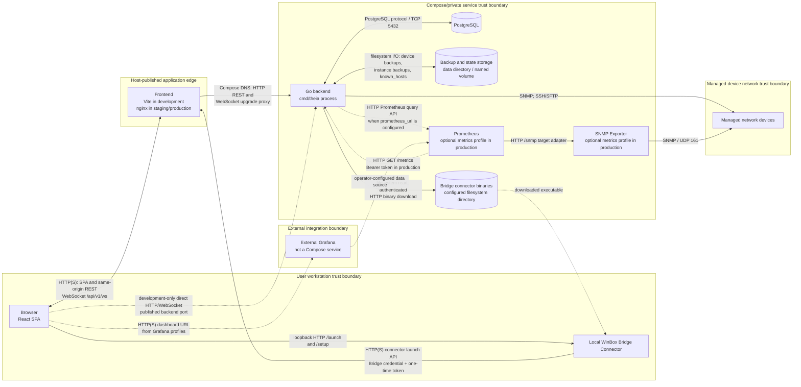

The browser-to-connector hop is deliberately loopback-local, while the connector-to-Theia hop uses
the configured application URL. Bridge binaries are served by the backend only when the configured
directory contains the requested platform build. Grafana remains an external dashboard integration;
none of the checked development, staging, or production Compose files defines a Grafana service.

## Deployment Architecture

Executable Compose definitions are authoritative for the tables below. Image `EXPOSE` declarations
describe intended container ports but do not publish them; only Compose `ports` entries create host
bindings. “Internal” therefore names the port used inside the Compose network even when a service
has no `expose` entry.

> **Maintenance caveat:** [SETUP.md](SETUP.md) currently differs from executable Compose in two
> places. Development Compose publishes PostgreSQL as `5432:5432`, not as a loopback-only binding,
> and production Compose publishes no host port for SNMP Exporter, not `localhost:9116`. Treat the
> Compose-derived values here as authoritative until the setup prose is reconciled.

### Development

The development stack is selected with profiles. `--profile dev` starts the full development set,
including Prometheus and SNMP Exporter; `test` and `postgres` select smaller subsets. Vite proxies
relative `/api` and `/api/v1/ws` traffic to `backend:8080`, while Compose separately publishes the
backend on `${BACKEND_PORT:-8080}` for direct API access.

| Service | Image or build target | Published host -> internal port | Health check | Dependency order | Persistent state or mount | Profile / optional status | Proxy and hot reload |
| --- | --- | --- | --- | --- | --- | --- | --- |
| `backend` | `Dockerfile` target `dev` (`golang:1.26.4-bookworm`, Air) | `${BACKEND_PORT:-8080} -> 8080` | `curl -sf http://localhost:8080/api/v1/auth/me` | Starts after `postgres` is healthy | Repository bind-mounted at `/app`; `theia-data:/app/data` | `dev`, `test`; no default-profile start | Air reloads the Go process from the repository mount; reachable directly and through Vite |
| `postgres` | `postgres:18-bookworm` | `5432 -> 5432` with no host-address restriction | `pg_isready -U theia -d theia` | None | `theia-postgres18-data:/var/lib/postgresql` | `dev`, `test`, `postgres`; no default-profile start | No application proxy or hot reload |
| `frontend` | `Dockerfile.frontend` target `dev` (`node:26-alpine`, Vite) | `${FRONTEND_PORT:-3000} -> 3000` | None in Compose | Starts after `backend` is started; it does not wait for backend health | `frontend/src` and `frontend/index.html` bind mounts | `dev`; no default-profile start | Vite HMR; `/api` -> `http://backend:8080`, with WebSocket proxying for `/api/v1/ws` |
| `snmp-exporter` | `prom/snmp-exporter:latest` | `${SNMP_EXPORTER_PORT:-9116} -> 9116` | `wget` against `http://localhost:9116/metrics` | None | Read-only bind mount for `docker/prometheus/snmp.yml` | `dev`; included whenever the full `dev` profile is selected | Not proxied; no source hot reload |
| `prometheus` | `prom/prometheus:latest` | `${PROMETHEUS_PORT:-9090} -> 9090` | `wget` against `http://localhost:9090/-/healthy` | Starts after `snmp-exporter` is healthy | Read-only Prometheus and alert-rule bind mounts; no development TSDB volume | `dev`; included whenever the full `dev` profile is selected | Not proxied; no application hot reload |

### Staging

Staging pulls pre-built application images and defines no service profiles. The frontend is the only
published application HTTP entry point; nginx expands `BACKEND_PORT` into its configuration and
proxies same-origin API and WebSocket traffic to the internal backend.

| Service | Image or build target | Published host -> internal port | Health check | Dependency order | Persistent state or mount | Profile / optional status | Proxy and hot reload |
| --- | --- | --- | --- | --- | --- | --- | --- |
| `backend` | `ghcr.io/lollinoo/theia-backend:${IMAGE_TAG:-master}` | None -> `${BACKEND_PORT:-8081}` | `curl -sf http://localhost:${BACKEND_PORT:-8081}/api/v1/auth/me` | Starts after `postgres` is healthy | `theia-staging-data:/data`, including default backup/state and bridge-binary paths | Default service | Internal nginx target; compiled binary, no source mount or hot reload |
| `postgres` | `postgres:18-bookworm` | `${POSTGRES_BIND_ADDR:-127.0.0.1}:${POSTGRES_HOST_PORT:-5433} -> 5432` | `pg_isready` with configured database and user | None | `theia-staging-postgres18-data:/var/lib/postgresql` | Default service | No application proxy or hot reload |
| `frontend` | `ghcr.io/lollinoo/theia-frontend:${IMAGE_TAG:-master}` | `${FRONTEND_PORT:-3001} -> 80` | None in Compose | Starts after `backend` is healthy | Compiled SPA in the image; no runtime state mount | Default service | nginx serves the SPA and proxies `/api/` plus `/api/v1/ws` to `backend:${BACKEND_PORT:-8081}`; no hot reload |

The checked staging stack contains no Prometheus or SNMP Exporter service. Staging can still point
the backend at separately operated Prometheus through the database-backed `prometheus_url`; any
SNMP Exporter then belongs to that external monitoring deployment.

### Production

Production normally pulls release images. `docker-compose.prod-build.yml` is a local-build override:
it substitutes `Dockerfile` target `production` and `Dockerfile.frontend` target `production` for the
backend and frontend images without changing the production runtime topology.

| Service | Image or build target | Published host -> internal port | Health check | Dependency order | Persistent state or mount | Profile / optional status | Proxy and hot reload |
| --- | --- | --- | --- | --- | --- | --- | --- |
| `backend` | Default: `ghcr.io/lollinoo/theia-backend:${IMAGE_TAG:-latest}`; local override: `Dockerfile` target `production` | None -> `${BACKEND_PORT:-8080}` | `curl -sf http://localhost:${BACKEND_PORT:-8080}/api/v1/auth/me` | Starts after `postgres` is healthy | `theia-data:/data`, including default backup/state and bridge-binary paths | Default service | Internal nginx target; compiled binary, no source mount or hot reload |
| `postgres` | `postgres:18-bookworm` | `${POSTGRES_BIND_ADDR:-127.0.0.1}:${POSTGRES_HOST_PORT:-5432} -> 5432` | `pg_isready` with configured database and user | None | `theia-prod-postgres18-data:/var/lib/postgresql` | Default service | No application proxy or hot reload |
| `frontend` | Default: `ghcr.io/lollinoo/theia-frontend:${IMAGE_TAG:-latest}`; local override: `Dockerfile.frontend` target `production` | `${FRONTEND_PORT:-80} -> 80` | None in Compose | Starts after `backend` is healthy | Compiled SPA in the image; no runtime state mount | Default service | nginx serves the SPA and proxies `/api/` plus `/api/v1/ws` to `backend:${BACKEND_PORT:-8080}`; no hot reload |
| `snmp-exporter` | `prom/snmp-exporter:latest` | **No host-published port** -> `9116` on the Compose network | `wget` against `http://localhost:9116/metrics` | None | Read-only bind mount for `docker/prometheus/snmp.yml` | Optional `metrics` profile only | Internal Prometheus target; not exposed through nginx and no hot reload |
| `prometheus` | `prom/prometheus:latest` | `${PROMETHEUS_BIND_ADDR:-127.0.0.1}:${PROMETHEUS_PORT:-9090} -> 9090` | `wget` against `http://localhost:9090/-/healthy` | Starts after `snmp-exporter` is healthy | Read-only Prometheus/alert-rule mounts; `prometheus-data:/prometheus`; metrics-token secret | Optional `metrics` profile only | Scrapes the backend and SNMP Exporter; not exposed through nginx and no application hot reload |

The optional production monitoring services start only with `--profile metrics`; they are not part of
the default production service set. Prometheus is loopback-bound by default, while SNMP Exporter is
internal-only and has no Compose host mapping.

The deployment access paths differ as follows:

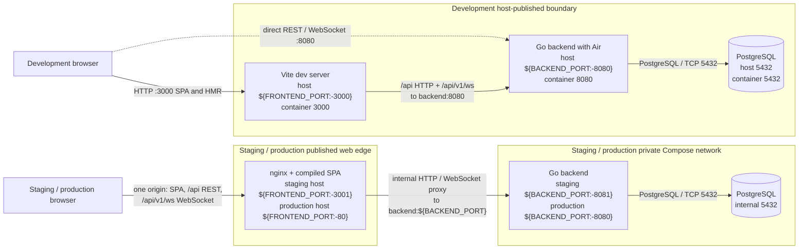

## Backend Architecture

### Bootstrap and Shutdown

[`cmd/theia`](cmd/theia) is the composition root. `runMain` selects `config.yaml` from the command
line, `THEIA_CONFIG`, or the default path, and `runtimeBootstrap.Run` then constructs every concrete
adapter and long-running component. Startup fails closed: a missing required database DSN, invalid
deployment secrets, an unusable runtime path, an unavailable PostgreSQL connection, a keyring
error, a migration error, or failed auth bootstrap prevents workers and the HTTP listener from
starting.

```mermaid
sequenceDiagram
    autonumber
    actor Supervisor as Process / supervisor
    participant Boot as cmd/theia<br/>runtimeBootstrap
    participant ConfigFS as config + runtime paths
    participant Restore as restore coordinator
    participant DB as PostgreSQL + repositories
    participant Security as keyring + auth
    participant Runtime as hub + state + scheduler<br/>collectors + pipeline
    participant Backups as bulk processor +<br/>backup schedulers
    participant HTTP as router + HTTP server

    Supervisor->>Boot: run with config path
    Boot->>ConfigFS: load defaults, YAML, then THEIA_* overrides
    ConfigFS-->>Boot: normalized and quota-validated Config
    Boot->>ConfigFS: configure logging and resolve data paths
    Boot->>Boot: validate deployment secrets and required DB policy
    Boot->>ConfigFS: create private backup and application-data directories
    Boot->>Restore: ApplyPendingRestore(paths, DSN)
    opt pending restore marker exists
        Restore->>DB: restore PostgreSQL dump
        Restore->>Security: load keyring for restored credentials
        Restore->>DB: open, tune, ping, migrate credentials,<br/>and revoke restored sessions
    end
    Restore-->>Boot: continue normal startup
    Boot->>ConfigFS: check known_hosts permissions
    Boot->>DB: OpenPrimaryDB, ConfigureDB, Ping
    DB-->>Boot: tuned live connection
    Boot->>Security: LoadKeyringFromEnv
    Security-->>Boot: active key and readable historical keys
    Boot->>DB: RunMigrations(db, keyring)
    Boot->>Security: construct AuthService and EnsureBootstrapSuperAdmin
    Security->>DB: read or create auth bootstrap records
    Boot->>DB: seed vendor configuration; construct repositories,<br/>device/link cache, and five-second settings cache
    Boot->>Boot: construct device, backup, bridge, and instance-backup services
    Boot->>Backups: ResumeBulkBackupRuns(ctx)
    Boot->>Runtime: start Hub.Run goroutine; construct state store,<br/>saved-map scheduler, collectors, and pipeline
    Boot->>Runtime: Pipeline.Start(ctx)
    Runtime->>Runtime: State.Start; Scheduler.Start;<br/>start task workers, monitor, and broadcaster
    Boot->>Backups: Start instance and device backup schedulers
    Boot->>HTTP: construct WebSocket handler, API router,<br/>metrics wrapper, and http.Server
    Boot->>Boot: subscribe to SIGINT and SIGTERM
    Boot->>HTTP: ListenAndServe
    Supervisor-->>Boot: SIGINT or SIGTERM
    Boot->>Runtime: cancel shared context
    Boot->>Backups: Stop device-backup scheduler
    Boot->>Backups: Stop instance-backup scheduler
    Boot->>Runtime: Pipeline.Stop<br/>(scheduler and state stop internally)
    Boot->>Runtime: DeviceService.Stop
    Boot->>HTTP: Shutdown with 10-second deadline
    HTTP-->>Boot: http.ErrServerClosed treated as normal
    Boot->>DB: deferred Close
    Boot-->>Supervisor: process returns
```

The registered child list is stopped in reverse order, with an independent ten-second bound for
each child: device-backup scheduler, instance-backup scheduler, pipeline, then device service. The
pipeline owns the nested scheduler and state-store lifecycle, so its `Stop` cancels and joins those
components. A successfully staged instance restore invokes the same cancel, reverse-child-stop, and
HTTP-shutdown path so the configured supervisor can restart the process.

`Hub.Run` has no matching `Stop` API and is intentionally not a registered runtime child. WebSocket
connection goroutines end through connection, HTTP-server, and client teardown, while cancellation
and `Pipeline.Stop` first prevent further runtime production. The diagram therefore does not assign
the hub a standalone shutdown lifecycle that the source does not implement.

### Package Boundaries and Dependency Direction

The package boundaries are pragmatic rather than a claim of strict clean architecture. Domain
interfaces are the usual inward-facing contracts, but the API and service layers also contain a few
deliberate concrete PostgreSQL dependencies for credential profiles, bulk-operation leases, and
instance database backup/restore.

| Package group | Responsibility and owned boundary |
| --- | --- |
| [`cmd/theia`](cmd/theia), [`internal/config`](internal/config) | Process entry point and composition root; load and validate bootstrap configuration, resolve runtime paths, open external resources, construct concrete implementations, establish lifecycle order, and expose the HTTP server. |
| [`internal/domain`](internal/domain) | Infrastructure-independent entities, enums, validation rules, errors, events, and repository/service-facing contracts for devices, topology, maps, auth, settings, backups, metrics, and bridge state. |
| [`internal/api`](internal/api) | HTTP transport: route metadata, request/response decoding, handlers, session authentication, RBAC dispatch, origin/CSRF middleware, health endpoints, metrics-aware handlers, and WebSocket route attachment. Detailed wire contracts remain in [API.md](API.md). |
| [`internal/service`](internal/service) | Multi-step business workflows: authentication, device mutation and discovery, bridge operations, device/bulk backups, instance backup/restore, retention, command execution, and coordination across repositories, network protocols, and filesystems. |
| [`internal/service/canvasmap`](internal/service/canvasmap) | Domain-only saved-map planning, topology loading, membership materialization, projection/filtering, area assignment, virtual-device isolation, and visual/default-position decisions. |
| [`internal/repository/postgres`](internal/repository/postgres) | PostgreSQL adapters for domain repositories, SQL dialect binding and pool tuning, embedded migrations, transactional leases, change notifications, settings persistence, and encryption/rewrap of stored credential fields. |
| [`internal/scheduler`](internal/scheduler) | Bounded, priority-aware polling task ownership: saved-map membership input, due-time heap, jitter, lane and isolation budgets, dispatch/completion accounting, refresh, and cancellation. It schedules work but does not perform device I/O. |
| [`internal/collector`](internal/collector), [`internal/snmp`](internal/snmp) | Stateless essential, performance, operational, static, and Prometheus-enrichment collection; SNMP client construction, polling primitives, vendor-aware OID handling, and topology discovery. Collectors return observations rather than owning orchestration or persistence. |
| [`internal/worker`](internal/worker) | Long-running orchestration: consume scheduled tasks, invoke collectors, normalize and persist results, update runtime state, build/replay snapshots, publish WebSocket changes, monitor Prometheus, and run instance/device backup schedules. |
| [`internal/ws`](internal/ws) | Realtime protocol DTOs, upgrade handler, client read/write pumps, bounded mailboxes, hub registration and fan-out, subscriptions, runtime bootstrap/replay delivery, ACK tracking, and resync/backpressure behavior. |
| [`internal/state`](internal/state), [`internal/cache`](internal/cache), [`internal/settingscache`](internal/settingscache) | Process-local bounded state: live device/link observations and health, invalidation-driven structural device/link snapshots, and a short-lived PostgreSQL settings snapshot. These packages do not replace durable repositories. |
| [`internal/security`](internal/security), [`internal/crypto`](internal/crypto) | HTTP origin and sensitive-response controls, password and bridge-secret hashing, token helpers, and the environment-loaded AES-GCM credential keyring with key-ID envelopes and legacy rewrap support. |
| [`internal/observability`](internal/observability), [`internal/metrics`](internal/metrics) | Prometheus instrumentation/registry and `/metrics` handler; Prometheus query-client integration, health/enrichment parsing, label policy, and telemetry emitted by API, persistence, scheduling, workers, state, and WebSocket delivery. |

Arrows in the following diagram mean “constructs, imports, or calls” from the package at the tail to
the dependency at the head. They are not event or data-flow arrows.

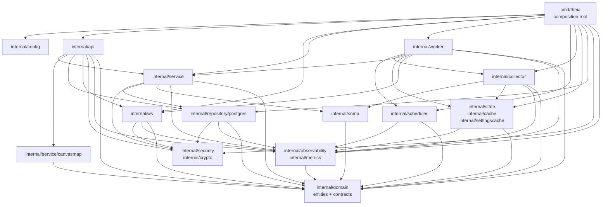

### HTTP and WebSocket Boundary

The outer `runtimeHTTPHandler` in
[`runtime_bootstrap.go`](cmd/theia/runtime_bootstrap.go) intercepts `/metrics` and
`/debug/pprof[/...]` before application routing and applies the configured metrics bearer-token
check. All other requests enter [`api.NewRouter`](internal/api/router.go). Route metadata selects
the public, special-profile, or normal middleware chain and the required permission; handlers own
HTTP parsing and status mapping, while authentication, RBAC, allowed-origin, and request-safety
policy remain middleware concerns. See [HTTP conventions](API.md#http-conventions),
[session security](API.md#authentication-and-session-security), [RBAC](API.md#authorization-and-rbac),
and the [route catalog](API.md#route-catalog) for the executable wire contract rather than
duplicating it here.

The WebSocket endpoint is an API route, but after upgrade
[`ws.Handler`](internal/ws/handler.go) owns connection-local behavior. It checks the configured
browser-origin policy, creates bounded client mailboxes, starts the read pump, obtains bootstrap
state from the pipeline, and starts the write pump only after bootstrap delivery is ordered. The
[`ws.Hub`](internal/ws/hub.go) owns the active-client set and broadcast/unicast fan-out; the worker
pipeline owns snapshot construction, runtime journals, cursor synchronization, and ACK observation
passed into the handler by `cmd/theia`. This keeps transport delivery separate from production of
runtime state. Message schemas, negotiation, replay/resync, deadlines, backpressure, and close
behavior are authoritative in the [WebSocket protocol](API.md#websocket-protocol).

The hub is not a persistence boundary and has no standalone process stop method. On shutdown,
context cancellation stops pipeline producers and `http.Server.Shutdown` drains ordinary HTTP
handling; it does not create a separate hub teardown. WebSocket client pumps end when their peer or
connection owner closes the connection, with process teardown ending any connection still present.
Durable state must therefore be committed by repositories or workflow services before transport
delivery; a hub broadcast is not a durable acknowledgement.

### Services and Domain Workflows

[`internal/domain`](internal/domain) defines the shared vocabulary and repository contracts. A
PostgreSQL adapter can change its SQL without changing callers that consume those interfaces, and
process-local state can use the same domain entities without becoming the canonical store. Domain
validation and invariants belong here; HTTP status codes, SQL rows, goroutine ownership, and device
protocol sessions do not.

[`internal/api`](internal/api) calls repositories directly for bounded CRUD/read models and calls
[`internal/service`](internal/service) when an operation spans multiple owners. Examples include
device discovery and mutation with rescheduling, auth/session and bootstrap-admin workflows,
bridge credential and launch coordination, SSH device/bulk backups, and PostgreSQL instance
backup/restore. Services own transaction/workflow ordering and translate repository, network,
command, and filesystem outcomes into domain errors; handlers translate those outcomes into the
wire behavior documented under [domain contracts](API.md#domain-contracts).

Saved-map transformations are kept in
[`internal/service/canvasmap`](internal/service/canvasmap): handlers supply repository-loaded domain
objects, and the package plans membership changes or materializes/projections without importing an
HTTP or PostgreSQL adapter. Conversely, instance backup/restore and a few bulk workflows in the
main service package intentionally use `database/sql` or concrete PostgreSQL helpers because the
database dump, restore, and lease are themselves part of those workflows. These concrete edges are
shown in the dependency graph rather than hidden behind an idealized layering claim.

The credential keyring protects the specific SNMP and credential-profile fields handled by the
PostgreSQL adapters, and instance-backup manifests record the key IDs required to read credential
ciphertext after restore. That does not make every backup archive an encrypted container: the
current instance archive writer creates a permission-restricted `.tar.gz` containing a manifest,
database dump, selected device backups, and optional `known_hosts`. Archive-level encryption must
not be inferred unless a workflow explicitly adds it.

### Workers, Scheduler, and Collectors

The runtime pipeline has distinct owners:

- [`internal/scheduler`](internal/scheduler) selects only devices belonging to at least one saved
  map, maintains due tasks in a heap, applies essential/background lanes and bounded dispatch
  budgets, and records completion before rescheduling. It owns timing and admission, not polling.
- [`internal/collector`](internal/collector) performs one essential, performance, operational,
  static, or Prometheus-enrichment collection when called. [`internal/snmp`](internal/snmp) owns the
  protocol client and vendor-aware discovery/polling primitives. Neither package starts an
  application lifecycle of its own.
- [`worker.PipelineOrchestrator`](internal/worker/pipeline.go) starts the state store and scheduler,
  creates the task-worker pool, consumes scheduler tasks, invokes collectors, returns completions,
  persists static discovery through `DeviceService`, updates live state, monitors Prometheus, and
  coalesces snapshots/deltas into the WebSocket hub. It owns and joins these child goroutines.
- [`worker.BackupScheduler`](internal/worker/backup_scheduler.go) and
  [`worker.DeviceBackupScheduler`](internal/worker/device_backup_scheduler.go) are independent
  context-bound loops. Each wakes hourly, reads its current database-backed interval and retention
  settings, invokes the relevant service, and runs bounded cleanup. Resumed persistent bulk device
  backup work is started through `BackupService` before the polling pipeline begins.

Cancellation is shared from the composition root, but explicit `Stop` calls still provide joining
and ordering. Pipeline stop prevents new runtime callbacks, cancels its derived context, stops the
scheduler and state store, waits for task workers, the Prometheus monitor, and broadcaster, and
clears recovery tracking. The two backup schedulers are stopped before the pipeline; `DeviceService`
is stopped after it. Queue capacity, WebSocket recovery, and detailed runtime messages are covered
by the [protocol and concurrency invariants](API.md#protocol-and-concurrency-invariants).

## Frontend Architecture

[`main.tsx`](frontend/src/main.tsx) creates the React root under `StrictMode`, then composes
`AuthProvider -> AuthGate -> App`. [`AuthProvider`](frontend/src/contexts/AuthContext.tsx) owns the
browser's current projection of the password session, login/logout/password-change actions, and
permission lookup. `AuthGate` prevents the application tree from rendering until that session check
has selected the authenticated or unauthenticated surface. [`App`](frontend/src/App.tsx) installs
[`ThemeProvider`](frontend/src/contexts/ThemeContext.tsx) inside the authenticated application; the
theme provider resolves the browser-local `dark`, `light`, or `system` preference and applies it to
the document root.

`App` implements route-like view state without making the URL router the owner. It owns the active
`hub`, `canvas`, `dashboard`, `admin`, or `settings` layer; selected saved-map ID and name; selected
area and detail device; map-dialog state; permission-derived navigation; and the device, link, area,
loading, and fit-view projections shared by top-level consumers. Selecting another saved map clears
map-local area state before the canvas loads that map. The default saved map is selected only after
the map list resolves, so the canvas does not bootstrap against an unresolved map context.

All top-level view layers are absolute siblings. An inactive layer becomes transparent,
non-interactive, `aria-hidden`, and inert rather than being removed. Once the saved-map context is
resolved, `ReactFlowProvider` and [`Canvas`](frontend/src/components/Canvas.tsx) therefore remain
mounted across view changes, preserving the WebSocket lifecycle, React Flow nodes/edges, viewport,
selection, and composition caches. `Canvas` reports its current device/link/area projections and
detail/interaction selection back to `App`; `TopologyHub`, `Dashboard`, `AdminDashboard`, and user
settings consume those stable top-level projections rather than creating competing topology or
socket owners.

Canvas interaction pauses only React publication of runtime-heavy state. `Canvas` reports active
drag/selection gestures to `App`, and
[`useRuntimeUpdatePause`](frontend/src/hooks/useRuntimeUpdatePause.ts) retains the pause for 1.5
seconds after the gesture settles. [`useWebSocket`](frontend/src/hooks/useWebSocket.ts) continues to
parse messages, advance the applied runtime cursor, run recovery, and schedule ACKs while paused;
it keeps the newest runtime snapshot and polling-health value in refs and flushes one current React
update when the pause ends. This prevents background telemetry from fighting graph interaction
without suspending transport correctness.

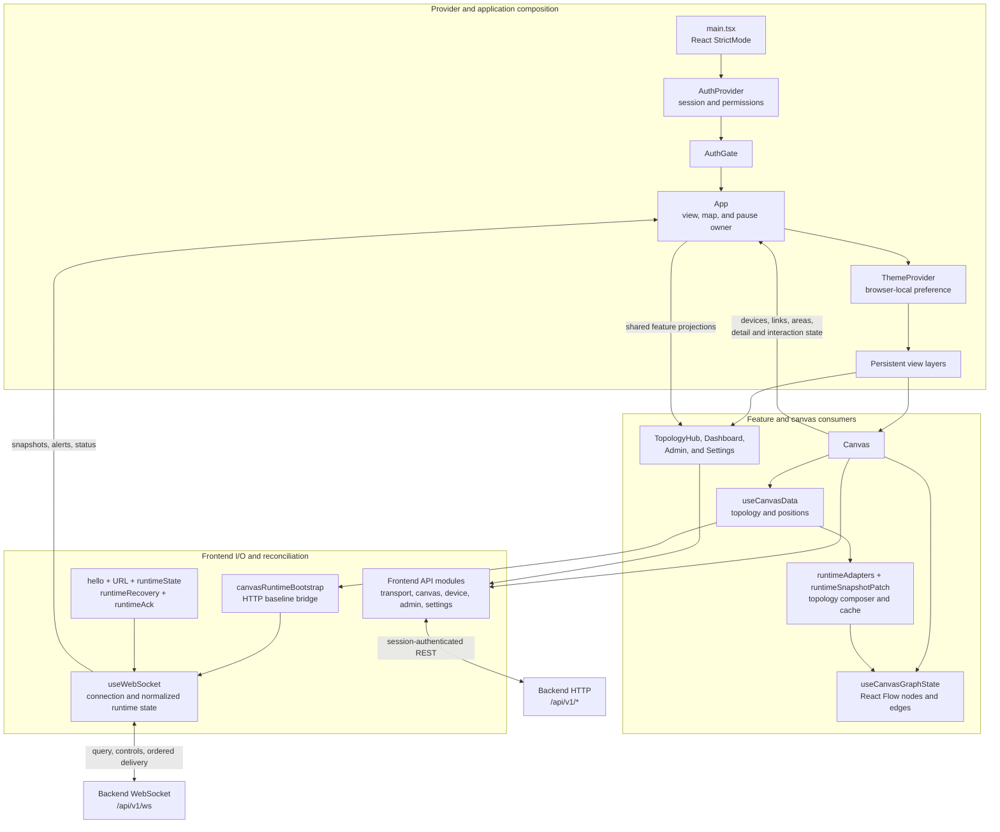

### Frontend state ownership

The state ownership split prevents a convenient frontend copy from becoming an accidental second
authority:

| State class | Concrete owner and examples | Lifetime and rule |
| --- | --- | --- |
| Server authority | PostgreSQL-backed domain records and the process-owned runtime overview in [`internal/worker`](internal/worker), identified by `runtime_stream_id` plus monotonically advancing `runtime_version`. Session/RBAC decisions also remain server-authoritative. | The frontend may retain and render a projection, but mutations and runtime synchronization are accepted only from authenticated HTTP/WebSocket contracts. `runtime_identity` is a snapshot hash for legacy matching and diagnostics, not stream identity. |
| React application state | `AuthProvider` session projection, `ThemeProvider` resolution, `App` view/map/area/dialog state, and `useWebSocket` snapshot/alert/health state. | Exists for the mounted application tree and may be recreated from providers, HTTP, or the retained runtime cursor. It is not durable application data. |
| Generation-safety refs | `socketRef`, `runtimeRecoveryStateRef`, the socket/generation-bound HTTP fallback token and `AbortController` in `useWebSocket`, plus `topologyLoadSequenceRef` and `activeMapKeyRef` in [`useCanvasData`](frontend/src/components/canvas/useCanvasData.ts). | Coordinate asynchronous ownership without causing renders. Cleanup or a new socket/map invalidates the old owner; every delayed callback or completion rechecks its socket, generation, or map sequence before mutating state. |
| Canvas graph state | [`useCanvasGraphState`](frontend/src/components/canvas/useCanvasGraphState.ts) owns React Flow nodes, edges, ID indexes, selection, and presentation positions; `Canvas` owns menus, edit mode, zoom, and viewport-facing interaction. | A render projection of structural topology, saved positions, and runtime overlays. Runtime-only changes patch existing nodes/edges; structural invalidation reloads and recomposes the graph. |
| Composition caches | The two-second in-flight/recent bootstrap reuse in [`api/canvas.ts`](frontend/src/api/canvas.ts), `topologyCompositionCacheRef`, stable signature caches, current position maps, and node/edge indexes. | Process- or mount-local acceleration only. Cache keys include map/topology/runtime/presentation inputs; every value is reconstructible and must be discarded or bypassed when its identity changes. |
| Browser-local preferences | Theme and canvas-chrome visibility in `localStorage`. | Persist only for that browser profile. They do not define users, saved maps, topology, positions, permissions, or runtime cursors. |
| Browser-independent persisted data | Saved-map definitions, materialized membership, map-local areas, positions, visual colors, canonical devices/links, and other PostgreSQL records described in [Data Architecture](#data-architecture). | Survives browsers and frontend mounts because the backend repositories own it. React and React Flow copies are disposable projections, even when a frontend API mutation initiated the write. |

`useWebSocket` deliberately remains in `App`, outside render-heavy canvas components. Its helper
modules build the retained hello/query, classify stream/version/base relationships, apply sparse
runtime patches, own recovery phases and deadlines, and coalesce ACKs. The canvas receives a
normalized snapshot and uses [`runtimeAdapters`](frontend/src/components/canvas/runtimeAdapters.ts)
and [`runtimeSnapshotPatch`](frontend/src/components/canvas/runtimeSnapshotPatch.ts) to update only
affected graph rows. Connection and recovery generations therefore survive graph recomposition and
view changes, and frequent node/edge renders cannot recreate timers, close sockets, or make a stale
closure the runtime authority.

Protocol-v2 runtime application requires the same stream and an exact base-version match. Older
snapshots/deltas are ignored; an ahead, invalid, missing-base, or wrong-stream delta enters recovery,
and live deltas remain ordered behind the recovery `ready` barrier. The frontend retains its
`hello` after also putting the cursor in the upgrade query. The server suppresses exactly one
bootstrap echo only when that first hello has the same protocol and runtime cursor; the token is
consumed even when the hello differs, in which case normal synchronization runs. Recovery bounds,
control validation, message fields, and schemas remain in the
[WebSocket protocol](API.md#websocket-protocol) rather than being duplicated here.

> **Maintenance caveat:** detail subscription controls are wired, but their current
> `snapshot_delta` delivery is not a frontend guarantee.
> [`publishSubscribedDetailDelta`](internal/worker/pipeline_task_runner.go) emits
> `base_version == version`, while
> [`classifyRuntimeDelta`](frontend/src/hooks/websocket/runtimeState.ts) requires every versioned
> delta to advance beyond its base. The protocol-v2 frontend rejects that message and starts
> recovery. Keep this as a compatibility caveat until producer and consumer are changed and tested
> together; see the [API compatibility note](API.md#compatibility-and-security-notes).

## Data Architecture

PostgreSQL is the durable application authority. Filesystem artifacts have independent lifecycles,
while caches, live telemetry, replay state, and client queues exist only for the current process.
The ownership split below is intentional: reconstructible state must not be treated as durable data.

### PostgreSQL and Migrations

[`RunMigrations`](internal/repository/postgres/migrations.go) applies the embedded
[`migrations`](internal/repository/postgres/migrations/) set during startup. The migrations are
grouped by capability rather than repeated as SQL:

| Capability | Migrations | Durable model introduced or evolved |
| --- | --- | --- |
| Foundational inventory and settings | [`000001`](internal/repository/postgres/migrations/000001_initial_schema.up.sql) and [`000003`](internal/repository/postgres/migrations/000003_device_notes.up.sql) | Devices, interfaces, canonical links, settings, positions, SNMP/vendor/area/credential profiles, device-backup metadata, instance-backup metadata, and device notes. |
| Polling classification and topology observations | [`000002`](internal/repository/postgres/migrations/000002_device_poll_classification.up.sql), [`000004`](internal/repository/postgres/migrations/000004_topology_observations.up.sql), [`000005`](internal/repository/postgres/migrations/000005_scale_lookup_indexes.up.sql), and [`000006`](internal/repository/postgres/migrations/000006_unresolved_neighbors_active_lookup.up.sql) | Poll class and interval override, resolved and unresolved discovery observations, and their ingest/resolution lookup indexes. |
| OS, discovery, and polling controls | [`000007`](internal/repository/postgres/migrations/000007_device_topology_discovery.up.sql)–[`000009`](internal/repository/postgres/migrations/000009_device_polling_enabled.up.sql) | Per-device discovery mode/bootstrap result, OS version, and polling enablement. |
| Saved-map structure and presentation | [`000010`](internal/repository/postgres/migrations/000010_canvas_maps.up.sql)–[`000013`](internal/repository/postgres/migrations/000013_canvas_map_device_areas.up.sql) and [`000015`](internal/repository/postgres/migrations/000015_canvas_map_device_visual_color.up.sql) | Map definitions and positions, explicit device/link/area membership, the materialized-membership flag, map-local area snapshots, and per-device visual color. |
| RBAC and per-user bridge data | [`000016`](internal/repository/postgres/migrations/000016_auth_rbac.up.sql)–[`000018`](internal/repository/postgres/migrations/000018_user_bridge_port_override.up.sql) | Users, roles, permissions, sessions, reset tokens, audit logs, user settings, bridge credentials and launch/download records, and a per-user bridge-port override. |
| Durable bulk device-backup orchestration | [`000019`](internal/repository/postgres/migrations/000019_bulk_backup_runs.up.sql)–[`000022`](internal/repository/postgres/migrations/000022_bulk_backup_run_processor_lease.up.sql) | Bulk runs and items, pause/cancel and active-item states, and the processor owner/expiry lease used for restart-safe single processing. The base device and instance backup rows originate in `000001`. |
| Address conflict and probe evolution | [`000014`](internal/repository/postgres/migrations/000014_virtual_device_duplicate_ips.up.sql), [`000023`](internal/repository/postgres/migrations/000023_device_ip_conflict_constraints.up.sql), [`000024`](internal/repository/postgres/migrations/000024_device_addresses.up.sql), and [`000025`](internal/repository/postgres/migrations/000025_probe_ports.up.sql) | Virtual-device duplicate-IP policy, physical/virtual conflict constraints, ordered multi-address records with one primary address, and device/address-specific probe ports. |

Repository ownership follows these boundaries: inventory and topology use
[`DeviceRepo`](internal/repository/postgres/device_repo.go),
[`LinkRepo`](internal/repository/postgres/link_repo.go), and
[`TopologyObservationRepo`](internal/repository/postgres/topology_observation_repo.go); saved maps use
the [`canvas-map repositories`](internal/repository/postgres/canvas_map_repo.go); authentication and
bridge state use [`AuthRepo`](internal/repository/postgres/auth_repo.go) and
[`BridgeRepo`](internal/repository/postgres/bridge_repo.go); backup control state uses the
[`backup job`](internal/repository/postgres/backup_job_repo.go),
[`bulk run`](internal/repository/postgres/bulk_backup_run_repo.go), and
[`instance backup`](internal/repository/postgres/instance_backup_repo.go) repositories.

### Filesystem State and Backups

[`resolveRuntimePaths`](cmd/theia/runtime_paths.go) derives the application data directory, device
backup root, instance-backup root, and `known_hosts` path. The two backup roots may be overridden
independently. Runtime bootstrap creates private directories before services start.

| Owner / store | Contents and lifetime | Authority and recovery boundary |
| --- | --- | --- |
| PostgreSQL | Inventory, topology observations and links, settings, credentials, auth/RBAC, saved maps, backup metadata, bulk leases, and instance-backup records. Durable across process restarts. | Authoritative application record store; repository transactions and migrations own mutations. |
| Frontend-independent persisted map data | Map definitions, membership, positions, map-local area snapshots, and visual colors. | PostgreSQL remains authoritative even when no frontend is connected; [`LoadTopology`](internal/service/canvasmap/topology_load.go) reconstructs the saved structural projection. |
| Runtime data directory | Restore staging, pending marker, operation-status JSON, and the pre-restore PostgreSQL dump, plus the default locations of other runtime files. | Local durable control plane for a restart handoff, not a substitute for repository rows. [`RestoreCoordinator`](internal/service/restore_coordinator.go) owns cleanup after successful activation. |
| Device-backup root | Per-device text and binary configuration artifacts written with private permissions. | File bytes live here; `backup_jobs` and `backup_files` own status, path, hash, and size metadata. [`backup_executor.go`](internal/service/backup_executor.go) writes through a temporary file and rename, and removes an artifact if its metadata insert fails. |
| Instance-backup root | One private directory per backup containing a `.tar.gz` archive and SHA-256 sidecar. Archives contain a PostgreSQL dump, selected device backups, optional `known_hosts`, and a manifest. | `instance_backups` owns lifecycle metadata. The archive is gzip-compressed tar, not whole-archive encryption; manifest key IDs/hashes describe keys required by encrypted credential values inside the database dump. |
| SSH `known_hosts` | Remembered host keys used by device backup SSH connections. | Filesystem trust state owned by [`KnownHostsStore`](internal/ssh/known_hosts.go); it is included in instance backups and replaced only through validated restore staging. |
| Vendor definitions and overrides | Embedded YAML or `THEIA_VENDORS_DIR` supplies bootstrap defaults; `vendor_configs` stores merged durable records. | Startup seeds missing defaults, then builds the runtime registry from PostgreSQL, falling back to YAML only when database records are empty or invalid; see [`vendor_registry_bootstrap.go`](cmd/theia/vendor_registry_bootstrap.go). |
| Bridge binaries | Deployment-provided executables under the configured bridge-binary directory. | Read by the API boundary but not application-owned mutable data and not collected into instance archives. |
| Settings cache | A process-local whole-table snapshot. | PostgreSQL is authoritative. The cache has a five-second lazy TTL; `Set` and `Update` write through and update an already-loaded entry, while external writes appear after expiry. |
| Device/link cache | Process-local DB-backed inventory indexes. | No TTL. Repository change subscriptions apply incremental updates; startup, invalidation, or a repair signal forces a full PostgreSQL reload. |
| State store | Live metrics, link rates, health, reachability, failure counts, and staleness. | Volatile process memory only; it is rebuilt by polling and must not be confused with saved-map membership or database inventory. |
| Overview replay journal | Runtime deltas for the current stream, bounded to 512 entries and 16 MiB. | Pipeline-owned and transient. Discontinuity, oversize data, or stream replacement resets it; missing history requires a snapshot. |
| WebSocket client mailboxes | Per-connection general and overview payload queues, bounded to 16 and 32 messages respectively. | Hub-owned and transient. Overflow clears the overview mailbox and schedules replay/snapshot recovery; disconnect removes the client and closes both queues. |

Filesystem and database state are therefore coordinated, not interchangeable. Deleting a database
row does not implicitly make an arbitrary path safe to delete, and an archive on disk is not a
successful backup until its metadata transition completes. Device- and instance-backup deletion
validate that targets remain under their configured roots. Instance backup startup reconciliation
can repair a stale `running` row when its expected archive exists; otherwise it records an
interrupted failure.

Restore never mutates the live repositories in place from an HTTP request. Validation extracts to a
temporary directory, then copies only validated artifacts into private staging and atomically writes
a pending marker and status file. The API initiates orderly shutdown; the next process applies the
marker before opening the normal database connection, then normal startup recreates repositories,
caches, schedulers, and runtime state.

### Caches, Journals, and Client Mailboxes

[`settingscache.Cache`](internal/settingscache/cache.go) refreshes the complete settings snapshot on
the first read after its TTL. [`DeviceLinkCache`](internal/cache/cache.go) instead drains bounded
repository event subscriptions and falls back to a full reload if an event source reports repair;
the one-slot legacy invalidation channel merely marks that reload as necessary. Neither cache is a
second durable owner.

[`state.Store`](internal/state/store.go) is a separate volatile telemetry engine. Its 32-slot change
channel coalesces device IDs when possible and sets a sticky overflow marker when updates are
dropped. The broadcaster then rebuilds authoritative runtime snapshots from the current store and
DB-backed inventory rather than assuming every notification survived.

The [`overview journal`](internal/worker/overview_journal.go) and
[`Client` mailboxes](internal/ws/hub.go) bound recovery memory. A contiguous journal range can be
compacted into replay; otherwise the pipeline installs a full snapshot. A slow client's overview
mailbox is cleared and marked for recovery instead of blocking producers or growing without bound.
All of this state disappears on restart; PostgreSQL and validated filesystem artifacts remain the
durable authorities.

## Core Data Flows

### Authenticated HTTP mutation to realtime patch

The normal protocol-v2 path below uses a runtime-visible device update as the concrete HTTP
mutation. Structural-only changes may additionally produce `topology_changed` and a separate canvas
reload. The HTTP response confirms the repository workflow; WebSocket delivery and `runtime_ack`
are asynchronous runtime synchronization, not a second database commit acknowledgement. Request
and response fields, permissions, and error shapes remain authoritative in the
[device routes](API.md#devices-links-positions-and-live-state) and
[WebSocket protocol](API.md#websocket-protocol).

```mermaid
sequenceDiagram
    autonumber
    actor User
    participant Feature as Frontend feature consumer
    participant APIClient as Frontend API transport
    participant Router as Router + auth/RBAC/CSRF middleware
    participant Service as Device handler + mutation service
    participant Repo as PostgreSQL repository
    participant Cache as Device/link cache
    participant Pipeline as Runtime pipeline + journal
    participant WS as WebSocket handler + hub
    participant Hook as useWebSocket
    participant Canvas as Runtime adapters + canvas patch

    User->>Feature: Save a runtime-visible device edit
    Feature->>APIClient: updateDevice(...)
    APIClient->>Router: Authenticated PUT with session cookie and CSRF header
    Router->>Router: Validate session, first-login state, permission, origin, and CSRF
    Router->>Service: Decode and validate; UpdateDevice
    Service->>Repo: Commit normalized device mutation
    Repo->>Repo: PostgreSQL transaction succeeds
    Repo-->>Cache: Bounded device-change event
    Repo-->>Pipeline: Bounded device-change event
    Repo-->>Service: Commit complete
    Service-->>Router: Reload updated resource
    Router-->>APIClient: Successful JSON response
    APIClient-->>Feature: Update mutation-facing React state
    Cache->>Cache: Apply incremental event or repair by full reload
    Pipeline->>Cache: Read current DB-backed inventory projection
    Pipeline->>Pipeline: Coalesce changes; build and journal immutable patch
    Pipeline->>WS: Enqueue runtime_delta(S, base=V, version=V+1)
    WS-->>Hook: Prioritized bounded overview delivery
    Hook->>Hook: Require stream S and exact base V; merge sparse patch
    Hook-->>Canvas: Publish normalized runtime snapshot
    Canvas->>Canvas: Patch affected React Flow nodes and edges
    Hook->>WS: runtime_ack(S:V+1), coalesced
    WS->>Pipeline: Validate offered ceiling; observe applied cursor
```

### Initial canvas HTTP bootstrap and live handoff

The initial canvas load deliberately establishes one structural/runtime HTTP baseline before
opening the required runtime socket. [`useCanvasData`](frontend/src/components/canvas/useCanvasData.ts)
loads the selected saved-map bootstrap (or the default canvas), rejects a response whose map key or
load sequence is stale, composes the graph, and publishes the included runtime baseline through
[`canvasRuntimeBootstrap`](frontend/src/hooks/canvasRuntimeBootstrap.ts). `useWebSocket` was created
by `App`, but `requireRuntimeBootstrap` keeps its connection effect dormant until that publication.

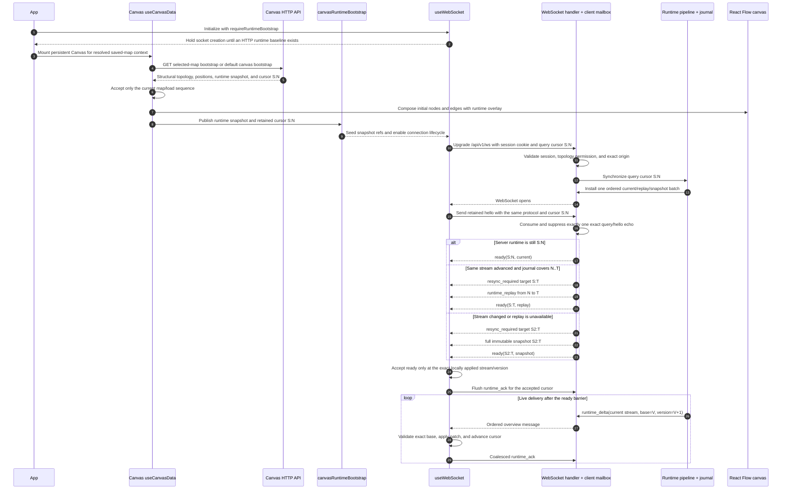

The query cursor and retained hello are both required. Only the first exact echo is suppressed; a
first hello with a changed cursor consumes the one-shot token and performs real synchronization.
If bootstrap synchronization enters stream recovery, that generation owns the same five-second
`ready` deadline used by reconnect recovery. Message payload detail is linked, not restated, in
[protocol-v2 bootstrap and live delivery](API.md#protocol-v2-bootstrap-and-live-delivery).

### Reconnect, bounded recovery, and live handoff

Transport reconnect retains the last fully applied stream/version cursor while replacing every
socket-local owner. The server caps each client's ordinary mailbox at 16 messages, overview mailbox
at 32, and hello channel at one. Overview overflow clears obsolete queued deltas and schedules a
complete recovery; full snapshots and runtime patches are cloned, and a bulk replacement shares
one immutable marshalled batch rather than mutable snapshot aliases. Live deltas are queued behind
the installed recovery `ready` barrier.

```mermaid
sequenceDiagram
    autonumber
    participant Hook as useWebSocket
    participant WS as WebSocket handler + bounded mailboxes
    participant Pipeline as Runtime pipeline + journal
    participant HTTP as GET /api/v1/runtime/overview
    participant Canvas as Runtime adapters + canvas patch

    Hook->>Hook: On close/error retain applied S:N; cancel old ACK/timers and abort fallback
    Hook->>WS: After bounded backoff, upgrade with query cursor S:N
    Hook->>WS: Send retained hello S:N after open
    WS->>WS: Suppress only the one exact query/hello echo
    WS->>Pipeline: Synchronize retained cursor
    Pipeline->>WS: Atomically install an immutable ordered recovery batch
    Note over Pipeline,WS: Later live deltas remain behind this batch's ready barrier
    alt Cursor is current
        WS-->>Hook: ready(S:N, current)
    else Same-stream journal covers N..T
        WS-->>Hook: resync_required + runtime_replay(S:N..T) + ready(S:T)
    else Stream changed or journal has a gap
        WS-->>Hook: resync_required + full snapshot(S2:T) + ready(S2:T)
    end
    Note over Hook: One recovery generation owns a fixed 5-second stream deadline
    alt Exact ready arrives within five seconds
        Hook->>Hook: Verify ready equals the locally applied cursor
        Hook->>WS: Flush runtime_ack(exact cursor)
        WS->>Pipeline: Complete the scheduled recovery accounting outcome
    else Stream ready deadline expires
        Hook->>HTTP: Request uncached runtime-only snapshot with AbortController
        Note over Hook,HTTP: Request phase is bounded to 10 seconds
        HTTP-->>Hook: Atomic runtime snapshot, identity, and cursor
        Hook->>Hook: Recheck owning socket/generation and reject stale or regressing completion
        Hook-->>Canvas: Apply runtime-only HTTP snapshot
        Hook->>WS: Flush runtime_ack(HTTP cursor), then reset ACK scheduler
        Hook->>WS: resume_runtime(HTTP cursor)
        Note over Hook,WS: A new 5-second ready barrier starts with no unowned timer gap
        alt Exact ready confirms the HTTP cursor
            WS-->>Hook: ready at exact applied stream/version
            Hook->>WS: Flush runtime_ack and complete the same generation
            WS->>Pipeline: Complete the scheduled recovery accounting outcome
        else HTTP request or ready barrier fails
            Hook->>Hook: Abort owned request; fail generation; cancel ACK scheduler
            Hook->>WS: Close socket and reconnect with retained cursor
            WS->>Pipeline: Record failed scheduled recovery outcome
        end
    end
    Pipeline->>WS: Release live runtime_delta only after the accepted barrier
    WS-->>Hook: Ordered delta with exact base/version
    Hook-->>Canvas: Apply patch and publish current snapshot
```

Socket cleanup and every fallback callback compare both the owning socket and recovery generation,
so an old request, timer, or message cannot mutate a newer connection. During a running pipeline,
each installed recovery's single `scheduled` accounting event reaches exactly one `completed` or
`failed` terminal outcome; replacement, installation failure, expiry, and bounded-attempt eviction
fail the superseded attempt. See [gap and reconnect recovery](API.md#gap-and-reconnect-recovery) and
[protocol and concurrency invariants](API.md#protocol-and-concurrency-invariants) for the detailed
mode selection, controls, and wire contract.

### Polling and Realtime Delivery

The scheduler reads only eligible saved-map devices through
[`NewSavedMapDeviceSource`](internal/scheduler/map_membership_source.go), maintains its timed heap,
and dispatches through a 128-slot task channel subject to polling budgets. Pipeline workers invoke
the appropriate collector with the pipeline context, update the volatile state store, and always
report completion to release scheduler admission. Static results may additionally persist inventory
and discovery data; ordinary runtime telemetry does not.

```mermaid
flowchart LR
    DB["PostgreSQL inventory and saved-map membership"] --> Cache["Device/link cache"]
    Cache --> Scheduler["Scheduler<br/>timed heap and 128-slot task channel"]
    Scheduler --> Worker["Pipeline worker"]
    Worker --> Collector["Essential, performance,<br/>operational, or static collector"]
    Collector --> Store["State store<br/>volatile telemetry"]
    Store --> Changes["32-slot change stream"]
    Changes --> Broadcaster["Snapshot broadcaster<br/>coalesced deltas"]
    Broadcaster --> Journal["Replay journal<br/>512 entries or 16 MiB"]
    Broadcaster --> Hub["WebSocket hub broadcast"]
    Hub --> Mailbox["Per-client overview mailbox<br/>32 messages"]
    Mailbox -. "overflow" .-> Recovery["Replay when contiguous;<br/>otherwise snapshot resync"]
    Recovery --> Mailbox
```

Pipeline stop cancels the derived context, stops scheduler and state-store background work, and
waits for task workers and the broadcaster. Queue overflow is explicit degradation: state changes
force a rebuilt snapshot, while a client mailbox overflow triggers client-specific recovery.

### Discovery, Canonical Topology, and Saved Maps

Static discovery is durable structural input, not live telemetry. The device service upserts
observations and unresolved neighbors, prunes safely reconciled observations, and materializes
canonical links from resolved observations. Saved maps then snapshot a filtered structural
projection into their own membership, area, position, and visual rows. Loading a saved map hydrates
only those persisted members and links; current metrics remain a separate runtime overlay.

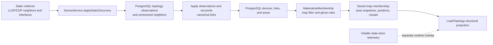

[`ReplaceMaterializedMembership`](internal/service/canvasmap/materialization.go) performs the
current-topology snapshot, while [`projection.go`](internal/service/canvasmap/projection.go) defines
filtering and ghost-device rules. Subsequent discovery can change canonical topology without
silently redefining already-materialized saved-map membership.

### Device and Bulk Backup Runs

A durable bulk run admits at most one active run. Its processor acquires a two-minute database
lease, refreshes the lease while processing, claims items, and selects batches of at most ten.
Eligibility checks device status, credential profile, vendor support, and reachability before a
pending job is created. An unbuffered worker channel feeds at most four workers, and a per-device
lock serializes remote filenames and job transitions.

```mermaid
flowchart LR
    Trigger["Manual request or hourly scheduler"] --> Run["Create durable bulk run and items"]
    Run --> Lease["Acquire and refresh<br/>two-minute processor lease"]
    Lease --> Batch["Claim next batch<br/>at most 10 items"]
    Batch --> Check["Device, credential, vendor,<br/>and SSH reachability checks"]
    Check --> Queue["Unbuffered job channel"]
    Queue --> Workers["Up to 4 backup workers<br/>per-device lock"]
    Workers --> Secret["Decrypt credential envelope<br/>with configured keyring"]
    Secret --> SSH["SSH commands and SFTP transfer<br/>known-host verification"]
    SSH --> Files["Private temp files, atomic rename,<br/>SHA-256 and size"]
    Files --> Status["backup_files and backup_jobs;<br/>bulk item and run counters"]
    Cancel["Pause or cancel request"] --> Run
    Run -. "pending items cancel;<br/>active jobs drain" .-> Status
```

Pause and cancel are durable run transitions. Cancellation marks work that has not become active;
already-active device jobs finish and the processor waits for their terminal states. On restart,
resumable runs reset interrupted nonterminal items and mark their old jobs failed before acquiring a
new lease. The device-backup scheduler evaluates per-device successful-retention counts in batches
of 100. Its [`runRetention`](internal/worker/device_backup_scheduler.go) context is checked between
batches against a 60-second budget; repository reads and deletions inside the current batch do not
use that context, so one batch and the overall sweep can exceed 60 seconds. Failed job records older
than seven days are still removed after batch processing; artifact deletion passes path validation.

### Instance Backup, Staged Restore, and Restart Reconciliation

Instance backup serializes admission, creates a `running` row, streams a PostgreSQL custom-format
dump, collects device artifacts and `known_hosts` within configured quotas, and writes a private
`.tar.gz` plus SHA-256 sidecar before marking success. Cancellation is context-driven for the active
operation and removes partial output. The manifest records the database checksum, migration
version, and credential key IDs/hashes needed after restore. It does **not** encrypt the complete
archive.

```mermaid
flowchart LR
    Create["Create instance backup"] --> Dump["pg_dump custom-format database"]
    Dump --> Archive["Collect allowed files and manifest;<br/>quota checks, tar.gz, SHA-256 sidecar"]
    Archive --> Record["instance_backups success metadata"]
    Record --> Validate["Restore validation:<br/>safe extraction, manifest/key IDs,<br/>DB hash, pg_restore list, schema version"]
    Validate --> Stage["Private .restore-staging plus<br/>pending marker and status"]
    Stage --> Shutdown["Orderly shutdown;<br/>supervisor restart boundary"]
    Shutdown --> Startup["Startup validates marker targets<br/>before normal DB bootstrap"]
    Startup --> Apply["Pre-restore dump, pg_restore,<br/>migrations and credential rewrap"]
    Apply --> Backups["Revoke restored sessions;<br/>individually replace optional<br/>device-backup directory"]
    Backups --> KnownHosts["Then individually replace<br/>optional known_hosts file"]
    KnownHosts --> Cleanup["Remove marker/staging;<br/>continue normal startup and reconcile rows"]
    KnownHosts -. "failure after backup activation" .-> Retry["Backup directory may already be live;<br/>keep marker/staging and refresh<br/>the staged DB for retry"]
```

Restore validation is deliberately broader than filename inspection: it bounds compressed,
expanded, per-entry, and file-count sizes; rejects traversal, links, special files, and non-allowlisted
entries; requires a supported PostgreSQL dump; verifies the manifest database hash and migration
compatibility; and verifies that all credential key IDs are configured. It does not claim a
whole-archive authentication or encryption guarantee.

After staging, the API does not hold open repositories while applying the dump. On restart,
[`ApplyPendingRestore`](internal/service/restore_coordinator.go) validates marker paths, preserves a
pre-restore dump, replaces the PostgreSQL public schema, runs migrations/credential rewrap, revokes
restored sessions, then
[`activateOptionalRestoreArtifacts`](internal/service/restore_optional_artifacts.go) activates the
optional device-backup directory followed by `known_hosts`. Each target uses its own temporary path
and rename-based replacement with target-local recovery, but the two activations are not one atomic
operation and have no cross-artifact rollback. If `known_hosts` activation fails, the restored
device-backup directory may already be live. The coordinator records a retryable failure, retains
the marker and staging state, and refreshes the staged database from the restored database for the
next startup attempt; only success for both optional targets removes pending state. A missing
credential key instead becomes an operator-action-required status. Normal bootstrap then rebuilds
caches and volatile telemetry, reconciles stale instance-backup rows, and resumes durable bulk runs.

## Security Architecture

The browser, reverse proxy, backend process, PostgreSQL, managed filesystem, collector/exporter, and
external monitoring systems are separate trust zones. The backend is the authority for identity,
authorization, secret access, archive validation, and audit decisions; frontend permission checks
only hide unavailable actions and are never an authorization boundary. See [Authentication and
Session Security](API.md#authentication-and-session-security) for the request-level contract and [Deployment
Architecture](#deployment-architecture) for supported exposure.

| Boundary | Protected asset and source of truth | Enforcement and failure behavior | Maintenance consequence |
| --- | --- | --- | --- |
| Passwords | PostgreSQL stores Argon2id encoded hashes produced and verified by [`internal/security/password.go`](internal/security/password.go); raw passwords are request-only values. | The service applies the password policy, constant-time hash comparison, generic invalid-credential responses, delayed repeated failures, and temporary account locking. Hash-generation or repository failures abort the workflow rather than storing plaintext. | Change parameters and parsers together and test legacy-hash handling before deployment; a parameter change is a credential-migration concern, not a UI-only change. |
| Browser sessions | [`AuthService`](internal/service/auth_service.go) generates high-entropy session and CSRF tokens, persists only keyed HMAC-SHA256 token hashes and session metadata, and uses the deployment-owned session secret. | The `theia_session` cookie is `HttpOnly`, `SameSite=Strict`, path `/`, and `Secure` under TLS or forwarded HTTPS; the readable `theia_csrf` cookie has the same path, expiry, SameSite, and Secure policy. Expired, revoked, disabled-user, and locked-user sessions are rejected; logout, password/reset administration, and restore workflows revoke server-side sessions as defined by the owning service. | Session-secret or TTL changes are bootstrap changes and require restart. Losing or changing the secret invalidates token lookup; cookie presence alone never authenticates a request. |
| CSRF and browser origins | [`internal/api/middleware.go`](internal/api/middleware.go), [`internal/security/http.go`](internal/security/http.go), and the route-specific auth handler own browser request policy. | Authenticated `POST`, `PUT`, `PATCH`, and `DELETE` requests require `X-CSRF-Token`, except public login; the token is checked against the active server-side session. HTTP and WebSocket origins must be same-host or an exact normalized configured origin when an `Origin` header is present. Missing/invalid CSRF or disallowed origins fail closed with 403. | Keep proxy `Host`/`X-Forwarded-Proto` forwarding and the configured allowlist aligned. An absent `Origin` is accepted for non-browser clients, so session/RBAC checks remain mandatory. |
| Authentication and RBAC | Route metadata in [`internal/api/routes.go`](internal/api/routes.go), grants in [`internal/domain/auth.go`](internal/domain/auth.go), and [`AuthService`](internal/service/auth_service.go) are authoritative. | Protected HTTP and WebSocket routes load the server-side session, enforce mandatory password change, then require one registered permission. Unknown/empty policies deny access. UI-derived permission state is only a presentation projection. | A route or permission change must update route metadata, backend tests, frontend affordances, and [API.md](API.md); never rely on hidden controls to protect a handler. |
| WebSocket upgrade | The same session repository/RBAC authority protects `/api/v1/ws`; [`internal/ws/handler.go`](internal/ws/handler.go) owns the upgrade-specific origin check. | Upgrade handling bypasses JSON/logger wrappers to retain `http.Hijacker`, but authenticates the session and route permission first. Invalid identity, required password change, denied permission, or disallowed origin prevents upgrade. | Preserve this dedicated middleware profile when changing the WebSocket stack; applying a response wrapper that does not expose hijacking can break upgrades. |
| Stored device credentials and key rotation | Credential repositories persist AES-256-GCM envelopes carrying a key ID; [`internal/crypto/keyring.go`](internal/crypto/keyring.go) loads active and historical secrets from deployment environment. | Startup requires a valid active key and all keys needed by stored envelopes/restores. Startup migration rewraps supported legacy/old-key ciphertext to the active key; missing or incompatible keys stop normal activation or place restore into operator-action-required state. | Add a new active key while retaining required historical keys, restart to rewrap, verify stored/archive compatibility, and remove an old key only after no dependent ciphertext or backup remains. The keyring protects credential fields, not every byte of an instance archive. |
| Explicit credential reveal | The `credentials:reveal` route permission and [`HandleRevealWinboxCredentials`](internal/api/device_credential_profile_handler.go) gate plaintext reveal; ordinary GET is retired. | Reveal requires an authenticated operator and non-empty reason, decrypts only the selected assignment, and emits structured success/failure audit logs without logging the secret. Denied, missing, or undecryptable data returns no plaintext. | Prefer short-lived bridge launch tokens. Treat reveal logs as security records and preserve reason, subject, device, client, and outcome fields without adding secret-bearing metadata. |
| Bridge authentication and launch | Per-user bridge credentials and launch requests are durable domain records; [`internal/security/bridge_secret.go`](internal/security/bridge_secret.go) stores only a safe prefix and constant-time-verifiable hash. | A raw bridge secret is displayed once, then bearer authentication resolves the credential. Launch tokens are hashed, short-lived, bound to a credential/request, and consumed by the bridge workflow; rotation and authentication outcomes are audited. | Never persist or log raw bridge secrets/tokens. Changing their format, TTL, or consumption semantics requires connector compatibility and API-contract review. |
| SSH host identity | The managed `known_hosts` file and [`internal/ssh/known_hosts.go`](internal/ssh/known_hosts.go) are the SSH trust authority. | SSH clients validate host keys against the managed file; restore accepts it only as a validated optional artifact. Activation is an independent rename-based step and can fail after backup-directory activation, as described in [Instance Backup, Staged Restore, and Restart Reconciliation](#instance-backup-staged-restore-and-restart-reconciliation). | Do not replace strict host verification with implicit trust. Treat known-host changes and restore activation as security-sensitive filesystem operations. |
| Instance archives and restore uploads | Archive limits, manifest/key metadata, entry allowlists, path containment, and staged files are owned by [`internal/service/restore_staging_validation.go`](internal/service/restore_staging_validation.go), [`restore_archive_entries.go`](internal/service/restore_archive_entries.go), and related restore code. | Compressed/uncompressed quotas, file counts, entry types, duplicate/path traversal checks, private staging permissions, manifest compatibility, SQL validation, and configured key IDs are validated before restart activation. Invalid archives are rejected and never promoted. | Archive validation is defense in depth, not a claim of whole-archive encryption or authentication. Keep service quotas, upload limits, manifest compatibility, and restore tests synchronized. |
| HTTP body ceilings | Middleware profiles in [`internal/api/router_middleware.go`](internal/api/router_middleware.go) apply 16 KiB to public JSON, 1 MiB to ordinary protected JSON, no body wrapper to binary downloads, and a restore quota plus multipart overhead to restore uploads. | `http.MaxBytesReader` causes shared JSON decoding to return 413 on overflow. Two direct-decoder handlers have the documented trailing-data/status differences; reverse-proxy limits are an additional deployment ceiling. | Review [Common Request Contracts](API.md#common-request-contracts) before changing a handler or proxy limit; do not assume every route uses the shared decoder. |
| Metrics and diagnostics | `/metrics` and `/debug/pprof[/...]` are process endpoints in [`cmd/theia/runtime_bootstrap.go`](cmd/theia/runtime_bootstrap.go), separate from API sessions. | When configured, both require a constant-time-checked bearer token; an empty token leaves direct backend access unauthenticated. Supported staging/production Prometheus scrapes use a mounted secret, while production nginx does not proxy these paths. | Configure a strong token and constrain direct backend reachability. Adding a proxy route materially changes the exposure model and must be documented in [API.md](API.md) and deployment configuration. |

## Observability Architecture

The observability path has two directions. The backend exports its own process and domain signals,
while its runtime pipeline also queries the configured Prometheus HTTP API for device telemetry,
active alerts, and upstream availability. [`internal/observability`](internal/observability) owns
the process-local application registry and text encoder; the Go client library contributes Go and
process collectors. [`internal/metrics`](internal/metrics) is the outbound Prometheus client, not a
second exporter. The pipeline normalizes its results for runtime snapshots and WebSocket health
messages, and the protected health API performs an independent bounded upstream check.

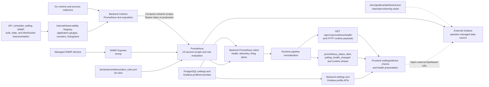

The application registry is mutex-protected and process-local; process restart resets its counters
and histograms. Its label domains are mostly bounded enums such as volatility class, operation,
result, WebSocket scope, recovery mode, reason, and outcome. Two families intentionally carry
entity identity: scoped scheduler backpressure includes `scope_id` and `scope_name`, while
per-device discovery and SNMP-operation families include device IDs and, for SNMP operations,
device name and target. These dimensions are useful for isolation but grow with managed devices or
scopes; dashboard and alert changes must not add unbounded request data as labels. Recovery labels
are explicitly bounded to four modes, eight reasons, and three outcomes, producing 96 initialized
`theia_ws_runtime_recovery_total` series; see [Recovery metric dimensions and accounting](API.md#recovery-metric-dimensions-and-accounting).

`/metrics` is a process endpoint, not part of the password-session API. Development Compose
publishes the backend listener directly. Production Compose keeps the backend internal and its
optional Prometheus service scrapes `backend:<port>/metrics` with the mounted metrics-token secret;
the Prometheus UI is loopback-bound by default. Staging does not define a bundled Prometheus
service. The staging and production frontend nginx configuration proxies `/api/` and the WebSocket
route but not `/metrics`, so publishing the backend or adding a new proxy location changes the
supported exposure boundary. Details and token failure behavior are in
[Operational Endpoints](API.md#operational-endpoints).

Prometheus integration state is surfaced separately from exporter health. Every five seconds, the
runtime monitor rereads `prometheus_url`, collects firing alerts, and emits
`prometheus_status` only on state transitions; runtime snapshots carry normalized alert and device
health projections. `GET /api/v1/prometheus/health` instead creates a client for the current URL and
runs `vector(1)` under a five-second request context. The frontend consumes those API/stream
projections for diagnostic state and node/edge presentation; it does not evaluate Prometheus rules.
Grafana is external to all checked Compose models: the repository supplies
[`dashboard.json`](docs/grafana/dashboard.json), its [dashboard guide](docs/grafana/dashboard.md),
and application-managed dashboard URLs/profiles, but no local Grafana service or provisioning tree.

### Prometheus Alert Reference

Prometheus loads [`alert_rules.yml`](docker/prometheus/alert_rules.yml) and evaluates it at the
configured 15-second interval. The table is the complete 18-rule inventory; the interpretation
column explains the signal without turning this architecture reference into an operational
runbook.

| Group | Alert | Expression / threshold | `for` | Severity | Maintainer interpretation |
| --- | --- | --- | --- | --- | --- |
| Device/link health | `DeviceDown` | `up{job="snmp"} == 0` | `30s` | `critical` | The SNMP scrape target has remained unsuccessful; distinguish device reachability from exporter or scrape-path failure. |
| Device/link health | `HighCPU` | `hrProcessorLoad{job="snmp"} > 85` | `60s` | `warning` | Exported processor load has remained above 85 for the matched SNMP series. |
| Device/link health | `LinkDown` | `ifOperStatus{job="snmp"} == 2` | `30s` | `warning` | An exported interface operational-status series has remained in the down state. |
| Device/link health | `HighLinkUtilization` | `(rate(ifHCInOctets{job="snmp"}[5m]) * 8 / (ifHighSpeed{job="snmp"} * 1000000)) > 0.8` | `60s` | `warning` | Five-minute inbound utilization relative to advertised high speed has remained above 80%. |
| Bulk operations | `BulkOperationRejections` | `sum by (job, instance, operation, reason, source) (increase(theia_bulk_operation_rejections_total[5m])) > 5` | `60s` | `warning` | More than five rejections occurred in five minutes for one operation/reason/source grouping. |
| Bulk operations | `BulkOperationSaturated` | `(theia_bulk_operation_in_flight / on(job, instance, operation, source) group_left(scope) theia_bulk_operation_concurrency_limit{scope="global"}) >= 0.9` | `5m` | `warning` | In-flight work has remained at or above 90% of its matching global concurrency limit. |
| WebSocket/recovery | `WebSocketBackpressure` | `sum by (job, instance, scope, reason) (increase(theia_ws_backpressure_total[5m])) > 25` | `60s` | `warning` | More than 25 bounded-delivery backpressure events occurred in five minutes for a scope/reason grouping. |
| WebSocket/recovery | `WebSocketResyncRequired` | `sum by (job, instance, scope, reason, bootstrap) (increase(theia_ws_client_resync_required_total[5m])) > 10` | `60s` | `warning` | More than ten client resync markers were emitted in five minutes for one scope/reason/bootstrap grouping. |
| WebSocket/recovery | `RuntimeRecoveryFailures` | `sum by (job, instance, mode, reason) (increase(theia_ws_runtime_recovery_total{outcome="failed"}[5m])) > 0` | `10m` | `warning` | At least one failed recovery-accounting outcome occurred in five minutes and the condition persisted for ten minutes. |
| WebSocket/recovery | `RuntimeAckLagHigh` | `histogram_quantile(0.95, sum by (job, instance, le) (rate(theia_ws_runtime_ack_lag_versions_bucket[5m]))) > 32` | `10m` | `warning` | The five-minute p95 valid-ACK cursor lag has remained above 32 runtime versions. |
| Scheduler/polling | `PollingEssentialOverloaded` | `theia_polling_essential_overloaded == 1` | `2m` | `warning` | The essential polling lane has continuously reported overload. |
| Scheduler/polling | `PollingDeadlineMisses` | `increase(theia_polling_deadline_miss_total[5m]) > 0` | `60s` | `warning` | At least one essential polling deadline miss occurred in the preceding five minutes. |
| Scheduler/polling | `PollingFailuresHigh` | `sum by (job, instance, volatility_class) (increase(theia_poll_results_total{outcome="failure"}[5m])) > 5` | `60s` | `warning` | More than five polling failures occurred in five minutes for one volatility class. |
| Scheduler/polling | `SchedulerQueueLagHigh` | `max by (job, instance, volatility_class) (theia_scheduler_queue_lag_seconds) > 30` | `5m` | `warning` | Maximum overdue scheduler lag has remained above 30 seconds for a volatility class. |
| Scheduler/polling | `SchedulerBackpressure` | `sum by (job, instance, volatility_class, reason) (increase(theia_scheduler_backpressure_total[5m])) > 10` | `60s` | `warning` | More than ten scheduler backpressure events occurred in five minutes for a volatility/reason grouping. |
| Scheduler/polling | `SchedulerTaskDurationHigh` | `histogram_quantile(0.95, sum by (job, instance, volatility_class, le) (rate(theia_scheduler_task_duration_seconds_bucket[5m]))) > 30` | `5m` | `warning` | The five-minute p95 scheduled-task duration has remained above 30 seconds for a volatility class. |
| SNMP collection | `SNMPBulkWalkErrors` | `sum by (job, instance, collector, operation, result) (increase(theia_snmp_collector_operations_total{operation=~".*_walk",result=~"timeout\|error"}[5m])) > 3` | `60s` | `warning` | More than three timeout/error walk operations occurred in five minutes for one collector/operation/result grouping. |
| SNMP collection | `SNMPBulkWalkSlow` | `histogram_quantile(0.95, sum by (job, instance, collector, operation, le) (rate(theia_snmp_collector_operation_seconds_bucket{operation=~".*_walk"}[5m]))) > 2` | `5m` | `warning` | The five-minute p95 walk duration has remained above two seconds for a collector/operation grouping. |

## Configuration Ownership

Configuration has explicit owners and no automatic promotion path between them. Backend bootstrap
configuration belongs to the composition root; mutable operational settings belong to PostgreSQL;
proxy, monitoring, and frontend-build values remain deployment-owned. Adding the same semantic key
to multiple authorities creates ambiguous precedence and should be avoided.

| Owner and source | Representative values | Read and validation path | Change / reload expectation |
| --- | --- | --- | --- |
| Composition-root YAML and environment | Listen address, required PostgreSQL DSN, data directory, log level, bridge-binary directory, deployment environment, session secret and TTLs, metrics token, allowed origins, restore/instance-archive quotas, and bulk-operation limits. | [`config.Load`](internal/config/config.go) applies defaults, optional YAML, then environment overrides and validates normalized environment and limits. [`config.example.yaml`](config.example.yaml) is the operator-facing template. | Read once before dependency construction; there is no file or environment watcher. Change the file/environment and restart the process. |
| Composition-root path and keyring environment | `THEIA_CONFIG`, `THEIA_BACKUP_DIR`, `THEIA_INSTANCE_BACKUP_DIR`, `THEIA_ENCRYPTION_KEY_ID`, `THEIA_ENCRYPTION_KEYS`, and the legacy key fallback. | [`runMain`](cmd/theia/main.go) selects the config path; [`resolveRuntimePaths`](cmd/theia/runtime_paths.go) fixes filesystem locations; [`crypto.LoadKeyringFromEnv`](internal/crypto/keyring.go) loads active and historical keys before migrations. | Read during startup. Path changes and key changes require restart; key rotation is completed by startup migration/rewrap and old keys must remain available while older ciphertext or backups require them. |
| PostgreSQL `settings` rows | Prometheus/Grafana integration, polling cadence and admission limits, SNMP timeouts/retries, topology defaults, timezone, probe ports, bridge port, and instance/device backup interval and retention. | Domain keys/defaults live in [`domain/settings.go`](internal/domain/settings.go); [`postgres.SettingsRepo`](internal/repository/postgres/settings_repo.go) persists them; authenticated settings handlers validate an allowlist and write the repository. | Mutable without changing bootstrap configuration. Effect is consumer-specific rather than a global atomic reload: Prometheus is checked every five seconds, backup settings on hourly scheduler cycles, and polling/SNMP values on scheduler refresh, dispatch, or task reads. |
| Process-local settings snapshot | The current key/value snapshot used by services, schedulers, and workers. | [`settingscache.Cache`](internal/settingscache/cache.go) wraps the PostgreSQL repository with a five-second, lazy, whole-snapshot TTL. API `Set`/`Update` writes through and updates an already-loaded local entry. | In-process API writes are immediately visible through the cache; an out-of-process database write becomes visible on the first read after TTL expiry. There is no background refresh goroutine. |
| Construction/start-time projections of database settings | Pipeline worker goroutine count and WebSocket coalescing window are derived when the pipeline is constructed or started. | [`worker.NewPipelineOrchestrator`](internal/worker/pipeline.go) captures the coalescing window, and `Start` calls the settings-derived worker-count function before launching a fixed set of goroutines. | Updating the PostgreSQL row remains durable, but these already-constructed aspects change only after process restart. Other consumers that reread the same settings may adapt earlier. |
| Deployment and reverse-proxy configuration | Compose profiles, ports, networks, mounts, health checks, secrets, resource limits, nginx routing/body limits, and Prometheus scrape/rule files. | [`docker-compose.yml`](docker-compose.yml) and its staging/production overlays define the effective service model; [`frontend/nginx.conf.template`](frontend/nginx.conf.template) and [`docker/prometheus`](docker/prometheus) own proxy and scrape/evaluation behavior. | Compose/env/secret changes require service recreation or restart; nginx template substitution occurs at container startup. Prometheus configuration follows the deployment reload/restart mechanism, not the application settings cache. Resolve the effective Compose model before maintenance. |
| External Prometheus/Grafana integration records | PostgreSQL settings and Grafana dashboard-profile rows store enabled state, URLs, credentials/protected tokens, datasource/dashboard identifiers, and presentation metadata consumed by backend health/dashboard APIs. | Settings/profile handlers and repositories validate and persist application-managed integration data; collectors and workers read it at their own refresh boundaries. Grafana itself is external: this repository has no Grafana Compose service or local provisioning tree. | Database writes can change application integration behavior without rebuilding the frontend, subject to consumer refresh/cache boundaries. External Prometheus/Grafana server configuration remains independently operated. |
| Frontend development/build and container runtime | `VITE_API_URL` selects the Vite development proxy target; frontend code uses same-origin `/api` and `/api/v1/ws`. `BACKEND_PORT` is substituted into the production nginx template when the frontend container starts. | [`frontend/vite.config.ts`](frontend/vite.config.ts), frontend transport/WebSocket helpers, [`frontend/nginx.conf.template`](frontend/nginx.conf.template), and the frontend image entrypoint own these values. | Changing Vite source/build options requires a frontend rebuild; changing development proxy environment requires restarting Vite. Changing container proxy variables/template requires recreating or restarting the frontend container. There is no browser-side runtime configuration watcher. |

Bootstrap secret values are not copied into the runtime settings table. Session-token HMAC material,
the metrics bearer token, database credentials, and encryption-key secrets remain deployment-owned;
the database stores only the application records or protected/hash-derived values defined by their
repositories. Conversely, editing `config.yaml` does not mutate runtime settings rows, and changing
a PostgreSQL setting does not rewrite Compose, nginx, Prometheus, or frontend build configuration.

## Failure Modes and Recovery

Recovery is deliberately scoped to the owner of each failure. PostgreSQL and validated filesystem
artifacts are durable; scheduler queues, caches, runtime telemetry, replay journals, socket
mailboxes, frontend timers, and client cursors are transient. A retry or resync therefore does not
imply exactly-once message or domain-operation delivery. The narrower invariant is that each
*scheduled* runtime recovery installed by a running pipeline records one terminal accounting
outcome, `completed` or `failed`; see
[Reconnect, bounded recovery, and live handoff](#reconnect-bounded-recovery-and-live-handoff) and
[the wire-level invariants](API.md#protocol-and-concurrency-invariants).

| Trigger / failure | Observable behavior | Automatic containment and recovery | Durable / transient consequence | Operator boundary |
| --- | --- | --- | --- | --- |
| Invalid bootstrap configuration, unsafe deployment secrets, unavailable PostgreSQL, path preparation failure, or failed SQL/Go migration | [`runtimeBootstrap.Run`](cmd/theia/runtime_bootstrap.go) returns a contextual startup error before the HTTP listener is activated; the container remains unhealthy and its supervisor policy may restart it. There is no read-only API mode. | Configuration and deployment-secret validation run before database construction; database connectivity, keyring loading, migrations, auth bootstrap, and pipeline start are fail-fast gates. A later process start re-evaluates every gate. | No runtime queues or sockets exist yet. A failed migration can leave already-committed schema/data work and migration-engine state in PostgreSQL; startup does not hide or roll back arbitrary prior migration effects. | Correct the configuration, filesystem, database, or migration condition and restart. Use [SETUP.md](SETUP.md) for deployment procedure and [Bootstrap and Shutdown](#bootstrap-and-shutdown) for ordering; do not bypass the failing gate. |
| Missing active/historical encryption key, malformed keyring, incompatible envelope metadata, or wrong secret | Startup fails at secret-policy/keyring validation or credential rewrap; an already-staged restore reports operator-action-required when a manifest/ciphertext key ID is unavailable. Credential reads and reveals fail without returning plaintext. | AES-GCM envelope validation and key lookup fail closed. Startup does not activate services after a migration/rewrap failure; restore retains its marker/staging for a later start with a compatible keyring. | Ciphertext, key IDs, archive manifest, and pending restore state remain durable; no automatic destructive key substitution occurs. | Restore the exact required key material, retain historical keys until dependent ciphertext/backups are retired, and restart. See [Stored device credentials and key rotation](#security-architecture) and [`internal/crypto/keyring.go`](internal/crypto/keyring.go). |
| PostgreSQL becomes unavailable after startup | Repository-backed HTTP operations return their route-specific errors, background refreshes log failures, and durable writes cannot complete. Scheduler device refresh failures are logged while the existing in-memory schedule continues; there is no offline mutation queue. | `database/sql` retries connectivity on later calls. Scheduler refresh and normal worker/service cycles try their sources again; existing cache/runtime snapshots may remain readable but are not promoted as fresh durable truth. | Failed transactions do not create a successful domain transition. PostgreSQL data remains authoritative; caches, scheduled work, telemetry, and connected-client views may become stale until source access and reconciliation resume. | Restore database/network availability, then verify API health, scheduler refresh, cache/runtime freshness, and any interrupted durable workflow. Restart only when normal pool recovery and reconciliation are insufficient. |
| Direct collector error, device SNMP timeout, Prometheus outage, or SNMP Exporter/scrape-path failure | Poll failures update normalized runtime health/staleness and `theia_poll_results_total`; scheduled completion still releases admission. Prometheus alert collection failure clears the in-memory alert set, marks the integration unavailable, and emits a transition update. An external SNMP scrape failure can also make `DeviceDown` fire. | Each scheduled poll retries on its next cadence. The Prometheus monitor retries every five seconds and the protected health API performs an independent bounded check. Direct Theia SNMP collectors and the external SNMP Exporter are separate paths, so failure of one does not prove failure of the other. | Ordinary telemetry and alert projections are transient. Failed static collection is not materialized as successful discovery; previously persisted inventory/topology remains. | Determine whether the fault is device reachability/credentials, Theia's collector, Prometheus, or the exporter/scrape path. Use the [alert reference](#prometheus-alert-reference) and metric ownership above; operational procedures remain in [SETUP.md](SETUP.md) and [`docs/grafana`](docs/grafana). |
| Scheduler load exceeds worker, lane, device, site, subnet, profile, class, or global admission budgets | Ready depth, queue lag, deadline misses, overload state, scoped backpressure, and task-duration metrics rise; `polling_health_changed` exposes bounded health state to clients. | The timed heap and ready queues retain due work in memory, the 128-slot task channel and fixed worker set bound dispatch, and admission leaves blocked tasks queued rather than creating unbounded goroutines. Every accepted task reports completion to release counters. | Poll freshness can degrade and deadlines can be missed. Scheduler queues are transient and are rebuilt from durable saved-map membership on process start; a restart is not a guarantee that every missed poll is replayed. | Correlate the scheduler/polling alerts with effective worker settings and managed-device load before changing database-backed tuning. Capacity procedures belong in [the Grafana guide](docs/grafana/dashboard.md), not this matrix. |
| Slow WebSocket consumer, full 16-message ordinary mailbox, full 32-message overview mailbox, or blocked network write | Ordinary broadcasts can be dropped with backpressure accounting. Overview overflow clears obsolete queued deltas, marks client recovery pending, and asks the pipeline to install a complete current/replay/snapshot replacement. A write or ping failure closes and unregisters the client. | Bounded queues prevent producer blocking and unbounded memory. Installed overview recovery is immutable and ordered ahead of later live deltas; the client reconnect path resumes from its last accepted cursor. | No PostgreSQL state changes. Mailbox contents, pending recovery metadata, subscriptions, and connection state are per-client/transient; a dropped non-overview message is not an exactly-once delivery. | Investigate repeated `WebSocketBackpressure`, resync, ACK-lag, and recovery-failure signals. Increasing queue sizes changes an anti-OOM boundary and requires load/race/E2E validation. |
| Runtime delta base gap, stream/identity mismatch, invalid replay range, stale snapshot, or `ready` cursor mismatch | [`useWebSocket`](frontend/src/hooks/useWebSocket.ts) rejects the incompatible payload without advancing its applied cursor and schedules stream recovery. The UI continues from its last accepted snapshot while recovery is in progress. | The server selects current state, a contiguous same-stream journal replay, or a full snapshot under an ordered `ready` barrier. Generation and socket ownership prevent stale callbacks from mutating a replacement connection. | Client runtime state and the 512-entry/16 MiB journal are transient; PostgreSQL inventory and saved-map state are untouched. A full snapshot may establish a new stream identity. | Repeated mismatches indicate protocol, proxy, deployment, or capacity trouble. Inspect [Initial canvas HTTP bootstrap and live handoff](#initial-canvas-http-bootstrap-and-live-handoff) and [Gap and reconnect recovery](API.md#gap-and-reconnect-recovery) before changing timeout or replay limits. |
| Five-second stream recovery deadline expires; the ten-second runtime HTTP fallback fails; or its new five-second `ready` barrier fails | The frontend records a failed recovery generation, cancels its ACK scheduler and owned request/timers, closes the socket, and enters reconnect. The server records the scheduled recovery's terminal failure through disconnect/expiry handling. | A stream timeout transitions once to uncached `GET /api/v1/runtime/overview`; an accepted HTTP cursor is resumed on the same socket and must receive exact `ready`. Failure after either bounded phase hands control to a new socket generation. | HTTP response, socket generation, timers, cursors, and accounting attempt are transient. The exact-one guarantee concerns terminal accounting for that scheduled recovery, not delivery or mutation execution. | Validate both `/api/v1/ws` and the authenticated runtime-overview route, then correlate recovery mode/reason metrics. Avoid extending only one deadline because the ownership handoff is a coupled protocol contract. |
| Overlapping instance/bulk backup, quota or concurrency saturation, dump/archive/disk/SSH failure, cancellation, or process interruption | A second instance backup or durable bulk run is rejected with `409`; bounded bulk-download concurrency can return `429`. Running instance work reports progress and finishes `success`, `failed`, or `cancelled`; device jobs/items record their individual terminal results. | Admission serializes instance backup and permits only one active durable bulk run. Instance failure/cancellation removes its working directory and persists a terminal row; startup reconciles stale `running` instance rows from archive presence and resumes/reset durable bulk-run work under a two-minute lease. | Successful archives, hashes, job/run rows, and device files are durable. In-memory worker channels and per-device locks are transient; partial instance files are removed where cleanup succeeds, while durable failed/cancelled records remain for status/retention. | Resolve capacity, quota, storage, database, SSH/host-key, or credential cause using the recorded run/item/error state. Do not delete active jobs or assume an accepted asynchronous request already produced an archive. |
| Validated restore is staged and requests restart; database restore, migration/rewrap, session revocation, or optional-artifact activation then fails | The API writes private staging plus a pending marker, triggers orderly process shutdown, and relies on the configured supervisor to restart. Startup applies the pending restore before normal bootstrap; failure prevents ordinary service activation and persists a retryable or operator-action-required phase. | The coordinator keeps a pre-restore dump and pending state, revalidates paths, reapplies PostgreSQL, runs migrations/credential rewrap, and revokes restored sessions. Optional backup-directory activation runs before `known_hosts`; each target is rename-based and target-local, but there is no cross-artifact transaction or rollback. On later-stage failure it retains marker/staging and refreshes the staged DB for retry. | PostgreSQL may already contain the restored database, and the device-backup directory may already be live when `known_hosts` activation fails. This partial filesystem activation is durable across retries; only full success removes pending state. | Restore the missing key or filesystem/database prerequisite and restart under the same supervisor boundary. Review [Instance Backup, Staged Restore, and Restart Reconciliation](#instance-backup-staged-restore-and-restart-reconciliation); do not manually infer atomic rollback across optional artifacts. |
| Browser network loss, backend restart, socket error/close, or failed runtime recovery forces frontend reconnect | The hook marks the socket disconnected, clears the alert baseline, cancels socket-owned ACK/recovery work, emits a session-check event, and shows reconnecting state while retaining the last applied runtime snapshot/cursor. | Reconnect uses exponential delay from one second capped at 30 seconds. Each new socket carries the retained cursor in its query and retained `hello`; on open it re-establishes detail subscription and accepts live delivery only after synchronization. | Browser memory only; no server-side durable state is changed. Page unmount clears the retained snapshot/cursor, while a transport reconnect within the mounted hook preserves them. | Persistent reconnect loops require checking session validity, origin/proxy upgrade handling, backend health, and recovery metrics. The frontend must not bypass the retained `hello` or exact `ready` barrier to hide the symptom. |

## Testing and Delivery

Verification is layered by the behavior being changed. Focused tests provide the shortest feedback
loop, the fast gates combine the repository's language-level quality checks, and browser E2E covers
contracts that only become visible across the backend, proxy, browser, and PostgreSQL boundary. A
documentation-only change does not automatically require every command below; select the smallest
set that exercises the affected implementation and contract, then use the matching fast gate before
merging executable changes.

Run these commands from the repository root:

```bash
go test ./... -count=1
go test -race ./internal/ws ./internal/worker -count=1
make backend-fast
npm --prefix frontend run test
npm --prefix frontend run check
npm --prefix frontend run typecheck
make frontend-fast
make browser-e2e
```

| Verification layer | Responsibility and major checks | Use when |
| --- | --- | --- |
| Focused Go package tests | Run the nearest package with `go test <packages> -count=1` to protect domain invariants, repository behavior, handler contracts, scheduler admission, worker lifecycle, or WebSocket ordering. `go test ./... -count=1` is the broad backend unit/package sweep. | Any backend behavior or shared Go contract changes; add the PostgreSQL test DSN only for tests that explicitly require the integration database. |
| Race-sensitive realtime tests | `go test -race ./internal/ws ./internal/worker -count=1` exercises the hub, replay journal, pipeline, recovery installation, snapshot publication, cancellation, and shutdown under Go's race detector. | Mailbox, cursor, replay/snapshot, pipeline state, recovery accounting, goroutine ownership, or cancellation changes. |
| Backend fast gate | [`make backend-fast`](Makefile) runs `go vet ./...`, builds `./cmd/theia/`, runs `govulncheck ./...`, executes all Go tests with atomic coverage, and enforces the repository's 45% coverage floor through the platform-specific coverage script. | Backend, shared configuration, migrations, build, or dependency changes before merge. `govulncheck` must be installed locally. |
| Frontend unit and static checks | `npm --prefix frontend run test` runs Vitest in jsdom; `check` runs Biome; `typecheck` runs the TypeScript project build without the Vite bundle. Tests that trigger React state updates must wrap those updates in `act(...)` before asserting the rendered behavior. | Component, hook, state-machine, DTO/parser, styling-contract, or TypeScript changes. |
| Frontend fast gate | [`make frontend-fast`](Makefile) performs a clean `npm ci`, Biome check, Vitest coverage, TypeScript typecheck, and production Vite build. [`vitest.config.ts`](frontend/vitest.config.ts) enforces 60% line/statement, 50% function, and 55% branch coverage. | Frontend implementation, dependencies, build configuration, or browser-delivered contract changes before merge. |
| Browser E2E | [`make browser-e2e`](Makefile) performs a clean install, installs Playwright Chromium, and runs the Playwright suite. [`playwright.config.ts`](frontend/playwright.config.ts) starts an isolated backend and Vite server against PostgreSQL; the suite covers authentication bootstrap, routing, saved maps, canvas behavior, and realtime recovery. | Changes spanning backend and frontend, auth/routing, saved maps/canvas, WebSocket recovery, proxy behavior, or browser-only lifecycle. |
| CI and security analysis | [CI](.github/workflows/ci.yml) detects affected backend/frontend/E2E areas, runs the corresponding fast gates, includes PostgreSQL concurrency regressions, and uploads Playwright failure artifacts. [CodeQL](.github/workflows/codeql.yml) analyzes Go and JavaScript/TypeScript on the public repository for `master` pushes/PRs, weekly schedule, and manual dispatch. | The workflow definitions are the authority for remote triggers, path filtering, service versions, and conditional jobs; local commands do not reproduce every CI-only regression or event condition. |

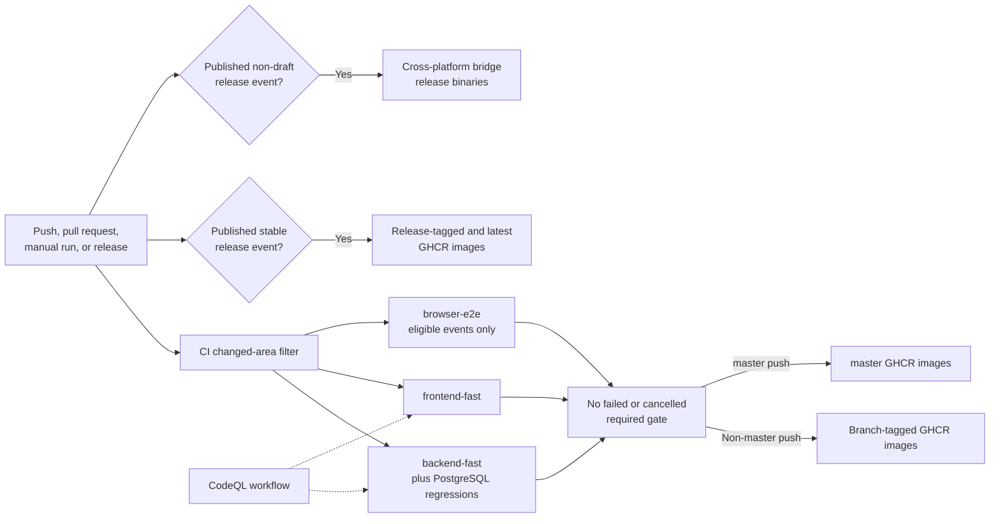

Image publication and release assets are delivery outputs, not deployment automation. The CI
workflow publishes backend/frontend images to GHCR for branch, `master`, and eligible release
events, and uploads cross-platform bridge binaries to a published release. The Compose files and
operator-managed environment remain the deployment authority. Notably, image jobs are selected by
their event conditions after required jobs have not failed or been cancelled; they are not a claim
that every fast gate ran for a documentation-only push. No additional release or rollout procedure
should be inferred beyond the workflow definitions.

## Maintainer Source Map

Use this map to start an architecture-impact review. The linked files are primary authorities, not
an exhaustive inventory of every helper or test. Each row pairs implementation ownership with the
focused verification seam and the documentation section that owns externally visible behavior.

| Concern | Primary implementation authority | Focused verification and adjacent contract |
| --- | --- | --- |
| Deployment, ingress, and process images | [`docker-compose.yml`](docker-compose.yml), [`docker-compose.staging.yml`](docker-compose.staging.yml), [`docker-compose.prod.yml`](docker-compose.prod.yml), [`docker-compose.prod-build.yml`](docker-compose.prod-build.yml), [`Dockerfile`](Dockerfile), [`Dockerfile.frontend`](Dockerfile.frontend), and frontend [`nginx`](frontend/nginx.conf.template)/[`Vite`](frontend/vite.config.ts) proxy configuration | Resolve the selected Compose model and compare published ports, health checks, profiles, dependency conditions, mounts, and same-origin proxy routes with [Deployment Architecture](#deployment-architecture); operator-facing consequences also affect [SETUP.md](SETUP.md). |
| Composition root, startup, and shutdown | [`cmd/theia/main.go`](cmd/theia/main.go), [`runtime_bootstrap.go`](cmd/theia/runtime_bootstrap.go), [`runtime_paths.go`](cmd/theia/runtime_paths.go), and [`vendor_registry_bootstrap.go`](cmd/theia/vendor_registry_bootstrap.go) | [`runtime_bootstrap_test.go`](cmd/theia/runtime_bootstrap_test.go), [`main_test.go`](cmd/theia/main_test.go), and [`runtime_paths_test.go`](cmd/theia/runtime_paths_test.go) cover construction, lifecycle, and path seams. Update [Bootstrap and Shutdown](#bootstrap-and-shutdown) when lifecycle order or ownership changes. |
| HTTP routes and runtime wiring | [`internal/api/routes.go`](internal/api/routes.go), [`router.go`](internal/api/router.go), [`router_dependencies.go`](internal/api/router_dependencies.go), [`router_handlers.go`](internal/api/router_handlers.go), [`router_middleware.go`](internal/api/router_middleware.go), and the composition-root wiring in [`runtime_bootstrap.go`](cmd/theia/runtime_bootstrap.go) | [`routes_metadata_test.go`](internal/api/routes_metadata_test.go), router/middleware tests under [`internal/api`](internal/api), and [API.md](API.md) own route metadata, authorization dispatch, and public wire impact. |
| Domain contracts and service workflows | [`internal/domain`](internal/domain), [`internal/service`](internal/service), and [`internal/service/canvasmap`](internal/service/canvasmap) | Package tests beside each workflow verify invariants; externally visible outcomes require the affected [Domain Contracts](API.md#domain-contracts) and [Core Data Flows](#core-data-flows) to change with the implementation. |
| PostgreSQL repositories and migrations | [`internal/repository/postgres`](internal/repository/postgres), [`migrations.go`](internal/repository/postgres/migrations.go), and the embedded [`migrations`](internal/repository/postgres/migrations/) | Repository tests and [`migrations_test.go`](internal/repository/postgres/migrations_test.go) protect SQL behavior and migration ordering; archive/restore compatibility must be reviewed for schema changes. Update [PostgreSQL and Migrations](#postgresql-and-migrations) and any affected [Domain Contracts](API.md#domain-contracts). |
| Polling, collection, and runtime state | [`internal/scheduler`](internal/scheduler), [`internal/collector`](internal/collector), [`internal/snmp`](internal/snmp), [`internal/worker/pipeline.go`](internal/worker/pipeline.go), [`internal/state`](internal/state), and [`internal/cache`](internal/cache) | Focused scheduler, collector, pipeline, state, and cache tests cover admission, cancellation, queue bounds, persistence side effects, and snapshot production. Update [Workers, Scheduler, and Collectors](#workers-scheduler-and-collectors) and [Polling and Realtime Delivery](#polling-and-realtime-delivery). |
| WebSocket delivery and replay | [`internal/ws/handler.go`](internal/ws/handler.go), [`internal/ws/hub.go`](internal/ws/hub.go), [`internal/worker/overview_journal.go`](internal/worker/overview_journal.go), and [`pipeline_snapshot_broadcaster.go`](internal/worker/pipeline_snapshot_broadcaster.go) | WebSocket/hub tests, [`overview_journal_test.go`](internal/worker/overview_journal_test.go), broadcaster tests, and the [WebSocket protocol](API.md#websocket-protocol) own ordering, replay, resync, and backpressure impact. |
| Device backups and durable bulk runs | [`internal/service/backup_service.go`](internal/service/backup_service.go), [`backup_executor.go`](internal/service/backup_executor.go), [`bulk_backup_run.go`](internal/service/bulk_backup_run.go), [`internal/worker/device_backup_scheduler.go`](internal/worker/device_backup_scheduler.go), and the PostgreSQL [`backup-job`](internal/repository/postgres/backup_job_repo.go)/[`bulk-run`](internal/repository/postgres/bulk_backup_run_repo.go) repositories | Service, worker, and repository tests cover leases, cancellation, retention, path safety, artifact/metadata transitions, and restart resumption. Update [Device and Bulk Backup Runs](#device-and-bulk-backup-runs) and [Device, bulk, and instance backups](API.md#device-bulk-and-instance-backups). |
| Instance backup and staged restore | [`instance_backup_service.go`](internal/service/instance_backup_service.go), [`instance_backup_create.go`](internal/service/instance_backup_create.go), [`restore_staging_validation.go`](internal/service/restore_staging_validation.go), [`restore_coordinator.go`](internal/service/restore_coordinator.go), and [`cmd/theia/runtime_paths.go`](cmd/theia/runtime_paths.go) | Instance-backup and restore tests under [`internal/service`](internal/service) plus bootstrap tests cover quotas, archive validation, key compatibility, staging, restart activation, reconciliation, and cleanup. Update [Instance Backup, Staged Restore, and Restart Reconciliation](#instance-backup-staged-restore-and-restart-reconciliation) and [Backups and Restore](API.md#backups-and-restore). |
| Bootstrap and runtime configuration | [`internal/config/config.go`](internal/config/config.go), [`config.example.yaml`](config.example.yaml), [`internal/domain/settings.go`](internal/domain/settings.go), [`settings_repo.go`](internal/repository/postgres/settings_repo.go), and [`internal/settingscache/cache.go`](internal/settingscache/cache.go) | Config, repository, settings-cache, scheduler, and worker settings tests distinguish startup-only values from consumer-specific runtime refresh behavior; Compose files own deployed environment values. Update [Configuration Ownership](#configuration-ownership) and the affected API settings contract. |
| Frontend composition, routing, and providers | [`frontend/src/main.tsx`](frontend/src/main.tsx), [`App.tsx`](frontend/src/App.tsx), [`AuthContext.tsx`](frontend/src/contexts/AuthContext.tsx), [`ThemeContext.tsx`](frontend/src/contexts/ThemeContext.tsx), and [`AuthGate.tsx`](frontend/src/components/AuthGate.tsx) | [`App.test.tsx`](frontend/src/App.test.tsx), context/AuthGate tests, and `npm --prefix frontend run test` cover provider and view transitions. Update [Frontend Architecture](#frontend-architecture) when ownership, persistent views, or routing changes. |
| Frontend API and DTO transport contracts | [`frontend/src/api/client.ts`](frontend/src/api/client.ts), [`transport.ts`](frontend/src/api/transport.ts), endpoint modules and parsers under [`frontend/src/api`](frontend/src/api), and [`frontend/src/types/api.ts`](frontend/src/types/api.ts) | API/parser/transport tests and [`api.test.ts`](frontend/src/types/api.test.ts) protect request construction and runtime validation. Public changes belong in [HTTP Conventions](API.md#http-conventions), the affected [Domain Contracts](API.md#domain-contracts), and [Frontend Architecture](#frontend-architecture). |
| Saved-map/canvas state and runtime bootstrap | [`canvasMapState.ts`](frontend/src/components/topology-hub/canvasMapState.ts), [`Canvas.tsx`](frontend/src/components/Canvas.tsx), canvas state/projection modules under [`frontend/src/components/canvas`](frontend/src/components/canvas), and [`canvasRuntimeBootstrap.ts`](frontend/src/hooks/canvasRuntimeBootstrap.ts) | Saved-map/canvas/bootstrap unit tests plus [`saved-maps.spec.ts`](frontend/e2e/saved-maps.spec.ts) and [`topology-hub.spec.ts`](frontend/e2e/topology-hub.spec.ts) protect map identity, persistent canvas ownership, and HTTP bootstrap. Update [Frontend state ownership](#frontend-state-ownership), [Initial canvas HTTP bootstrap and live handoff](#initial-canvas-http-bootstrap-and-live-handoff), and [Canvas topology and saved maps](API.md#canvas-topology-and-saved-maps). |
| Frontend WebSocket and recovery state machines | [`useWebSocket.ts`](frontend/src/hooks/useWebSocket.ts), [`hello.ts`](frontend/src/hooks/websocket/hello.ts), [`runtimeState.ts`](frontend/src/hooks/websocket/runtimeState.ts), [`runtimeRecovery.ts`](frontend/src/hooks/websocket/runtimeRecovery.ts), and [`runtimeAck.ts`](frontend/src/hooks/websocket/runtimeAck.ts) | Hook/helper tests and [`realtime.spec.ts`](frontend/e2e/realtime.spec.ts), together with backend WebSocket/worker tests, cover generation cancellation, retained hello, exact-ready barriers, ACKs, replay/snapshot, and HTTP fallback. Update [Reconnect, bounded recovery, and live handoff](#reconnect-bounded-recovery-and-live-handoff) and the [WebSocket Protocol](API.md#websocket-protocol). |
| Authentication, sessions, CSRF, and RBAC | [`internal/domain/auth.go`](internal/domain/auth.go), [`auth_service.go`](internal/service/auth_service.go), [`auth_admin_service.go`](internal/service/auth_admin_service.go), [`auth_repo.go`](internal/repository/postgres/auth_repo.go), [`session_handler.go`](internal/api/session_handler.go), [`router_middleware.go`](internal/api/router_middleware.go), [`middleware.go`](internal/api/middleware.go), and [`internal/security/http.go`](internal/security/http.go) | Domain/service/repository auth tests plus API auth/router/middleware tests and frontend AuthContext/AuthGate tests protect hashes, session issuance/revocation, CSRF, permissions, and protected navigation. Update [Security Architecture](#security-architecture), [Authentication and Session Security](API.md#authentication-and-session-security), and [Authorization and RBAC](API.md#authorization-and-rbac). |
| Encryption, keyring, and credential reveal | [`internal/crypto/keyring.go`](internal/crypto/keyring.go), [`encrypt.go`](internal/crypto/encrypt.go), [`snmp_crypto.go`](internal/repository/postgres/snmp_crypto.go), credential handlers under [`internal/api`](internal/api), and [`instance_backup_encryption_metadata.go`](internal/service/instance_backup_encryption_metadata.go) | Crypto/envelope, repository, credential-handler, key-compatibility, and restore-manifest tests cover key lookup, AES-GCM authentication, rewrap, masked reads, privileged reveal, and backup metadata. Update [Security Architecture](#security-architecture), [SNMP and SSH credential contracts](API.md#snmp-and-ssh-credential-contracts), and [Backups and Restore](API.md#backups-and-restore). |
| Metrics registry, export, and monitoring assets | [`internal/observability/registry.go`](internal/observability/registry.go), [`internal/metrics/prometheus.go`](internal/metrics/prometheus.go), [`pipeline_prometheus_monitor.go`](internal/worker/pipeline_prometheus_monitor.go), Prometheus assets under [`docker/prometheus`](docker/prometheus), and Grafana assets under [`docs/grafana`](docs/grafana) | Registry/client/collector/pipeline/API tests verify encoding, bounded labels, upstream health, and normalized runtime projections. Update [Observability Architecture](#observability-architecture), [Operational Endpoints](API.md#operational-endpoints), and [Recovery metric dimensions and accounting](API.md#recovery-metric-dimensions-and-accounting). |
| Prometheus alert rules | [`docker/prometheus/alert_rules.yml`](docker/prometheus/alert_rules.yml) and scrape/evaluation definitions under [`docker/prometheus`](docker/prometheus) | Validate rule syntax with the available Prometheus tooling, inspect the emitting metric tests, and exercise affected Grafana/runtime presentation. Keep [Prometheus Alert Reference](#prometheus-alert-reference) and [Prometheus alerts](API.md#prometheus-alerts) synchronized with every rule, threshold, duration, or label change. |
| Verification, CI, images, and release assets | [`Makefile`](Makefile), [`frontend/package.json`](frontend/package.json), [`frontend/vitest.config.ts`](frontend/vitest.config.ts), [`frontend/playwright.config.ts`](frontend/playwright.config.ts), [CI](.github/workflows/ci.yml), [CodeQL](.github/workflows/codeql.yml), and the backend/frontend Dockerfiles | Run the focused command and matching fast/E2E gate described in [Testing and Delivery](#testing-and-delivery); workflow changes require YAML review against their trigger/path conditions. Update that section for gate constituents, coverage thresholds, CI selection, image publication, or release-asset changes. |

## Change-Impact Checklist

Check every applicable item before merging:

- [ ] **Compose services and ingress:** update the owning Compose overlay, Dockerfile, nginx/Vite
  proxy, health check, profile, dependency, mount, secret, resource limit, or port as one effective
  deployment model; validate the resolved Compose configuration and update [Deployment
  Architecture](#deployment-architecture) plus [SETUP.md](SETUP.md) when operator behavior changes.
- [ ] **Composition root and lifecycle:** change `cmd/theia` construction, startup gates, context
  ownership, child-stop order, HTTP shutdown, or restore restart together; run lifecycle/bootstrap
  tests and update [Bootstrap and Shutdown](#bootstrap-and-shutdown).
- [ ] **Routes, permissions, and wiring:** change `internal/api` route metadata, dependencies,
  handlers, middleware, and composition-root injection coherently; run route/auth/handler tests and
  update the [Route Catalog](API.md#route-catalog) and affected architecture boundary.
- [ ] **DTO and wire contracts:** keep Go domain/handler payloads, frontend `types/api.ts`, endpoint
  modules, parsers, status codes, and error mapping compatible; run backend handler plus frontend
  parser/transport tests and update the affected [Domain Contracts](API.md#domain-contracts).
- [ ] **Repositories and migrations:** add ordered compatible up/down SQL, repository behavior,
  constraints, and indexes with the owning workflow; run repository/migration tests, review archive
  restore compatibility, and update [PostgreSQL and Migrations](#postgresql-and-migrations).
- [ ] **Polling, scheduler, and collectors:** preserve queue/batch bounds, scoped admission and its
  completion release, settings refresh, cancellation, goroutine joins, persistence effects, and
  transient rebuilds; run scheduler/collector/SNMP/worker tests and update [Polling and Realtime
  Delivery](#polling-and-realtime-delivery) plus metric/alert references.
- [ ] **Saved maps and canvas:** keep saved-map identity/membership, canonical topology,
  materialization, positions, manual edges, runtime bootstrap, and persistent Canvas ownership in
  sync; run canvas-map services, frontend canvas/bootstrap tests, and saved-map E2E, then update
  [Canvas topology and saved maps](API.md#canvas-topology-and-saved-maps) and the relevant core flow.
- [ ] **WebSocket recovery:** preserve the retained `hello`, echo suppression, cursor/stream
  validation, 10-second HTTP and 5-second `ready` deadlines, generation cancellation, ordered
  barriers, bounded mailboxes, immutable snapshot handoff, and one terminal accounting outcome;
  run race-sensitive backend tests, hook tests, and realtime E2E, then update the [WebSocket
  Protocol](API.md#websocket-protocol) and all three realtime sequence diagrams.
- [ ] **Authentication and RBAC:** update password/session storage, issuance/revocation, CSRF,
  origin policy, middleware permissions, and frontend auth state together; run domain/service/repo,
  router/middleware, and AuthContext/AuthGate tests, then update [Security
  Architecture](#security-architecture) and the API authentication/RBAC sections.
- [ ] **Encryption and credential reveal:** retain fail-closed envelope/key-ID handling, historical
  key compatibility, masked default responses, privileged reveal checks, and audit behavior; run
  crypto/repository/handler/restore tests and update [Security Architecture](#security-architecture)
  plus the affected credential or backup contract in [API.md](API.md).
- [ ] **Backups and restore:** review lease ownership, cancellation, retention, path containment,
  quotas, manifest/key compatibility, artifact-to-row transitions, staged activation, supervisor
  restart, partial optional-artifact activation, and retry cleanup; run service/repository/bootstrap
  tests and update both backup flows plus [Backups and Restore](API.md#backups-and-restore).
- [ ] **Frontend ownership:** keep application providers, persistent route views, API transport,
  saved-map state, canvas graph state, socket state machines, and render-only components within the
  ownership boundaries in [Frontend Architecture](#frontend-architecture); run the nearest Vitest
  suites, static checks, typecheck, and E2E for cross-boundary behavior.
- [ ] **Configuration:** assign every new value to one authority, document precedence and
  validation, update `config.example.yaml`, Compose, proxy/monitoring assets, or PostgreSQL settings
  metadata as appropriate, test the consumer refresh boundary, and update [Configuration
  Ownership](#configuration-ownership) with its reload or restart requirement.
- [ ] **Metrics:** define bounded label domains and ownership in `internal/observability`, update
  instrumentation and dashboards without introducing request-derived cardinality, run registry and
  emitting-package tests, and update [Observability Architecture](#observability-architecture) plus
  [Operational Endpoints](API.md#operational-endpoints).
- [ ] **Alerts:** change `alert_rules.yml` only with its emitting metric/labels and intended scrape
  path understood; validate rule syntax and affected metric tests, then keep the complete
  [Prometheus Alert Reference](#prometheus-alert-reference) and [Prometheus alerts](API.md#prometheus-alerts)
  synchronized.
- [ ] **Testing and delivery:** update `Makefile`, package scripts/config, CI path filters,
  conditional gates, image tags, or release-asset jobs together; execute the affected local gate,
  review workflow event semantics, and update [Testing and Delivery](#testing-and-delivery).
- [ ] **Durability and failure boundaries:** identify the durable owner, transient projections, and
  retry/reconciliation behavior for every new state transition; run the focused failure test and
  update [Data Architecture](#data-architecture) and [Failure Modes and Recovery](#failure-modes-and-recovery)
  without implying exactly-once delivery or whole-archive encryption.

## Authoritative Sources

This document is derived guidance. When prose and executable definitions disagree, use the
executable source that owns the behavior: Compose for service exposure and dependency order, the Go
composition root for runtime lifecycle, route registration and handlers for dispatch, migrations
and repositories for durable state, and workers/services for concurrency and recovery. [API.md](API.md)
is the maintained public protocol contract; [README.md](README.md) and [SETUP.md](SETUP.md) are
product and operator guidance and must be reconciled when executable behavior changes.

- **Deployment:** [`docker-compose.yml`](docker-compose.yml),
  [`docker-compose.staging.yml`](docker-compose.staging.yml),
  [`docker-compose.prod.yml`](docker-compose.prod.yml),
  [`docker-compose.prod-build.yml`](docker-compose.prod-build.yml), [`Dockerfile`](Dockerfile),
  [`Dockerfile.frontend`](Dockerfile.frontend), [`frontend/nginx.conf`](frontend/nginx.conf),
  [`frontend/nginx.conf.template`](frontend/nginx.conf.template), and
  [`frontend/vite.config.ts`](frontend/vite.config.ts).
- **Composition root and configuration:** [`cmd/theia/main.go`](cmd/theia/main.go),
  [`cmd/theia/runtime_bootstrap.go`](cmd/theia/runtime_bootstrap.go),
  [`cmd/theia/runtime_paths.go`](cmd/theia/runtime_paths.go),
  [`internal/config/config.go`](internal/config/config.go), [`config.example.yaml`](config.example.yaml),
  [`internal/domain/settings.go`](internal/domain/settings.go),
  [`internal/repository/postgres/settings_repo.go`](internal/repository/postgres/settings_repo.go),
  and [`internal/settingscache/cache.go`](internal/settingscache/cache.go).
- **HTTP, WebSocket, and public contracts:** [`internal/api/routes.go`](internal/api/routes.go),
  [`internal/api/router.go`](internal/api/router.go), [`internal/api`](internal/api),
  [`internal/ws/handler.go`](internal/ws/handler.go), [`internal/ws/hub.go`](internal/ws/hub.go),
  [`internal/worker/overview_journal.go`](internal/worker/overview_journal.go),
  [`internal/worker/pipeline_snapshot_broadcaster.go`](internal/worker/pipeline_snapshot_broadcaster.go),
  and [API.md](API.md).
- **Domain, services, and saved maps:** [`internal/domain`](internal/domain),
  [`internal/service`](internal/service), and
  [`internal/service/canvasmap`](internal/service/canvasmap).
- **Persistence and transient ownership:** [`internal/repository/postgres`](internal/repository/postgres),
  [`internal/repository/postgres/migrations`](internal/repository/postgres/migrations/),
  [`internal/state`](internal/state), [`internal/cache`](internal/cache), and
  [`internal/settingscache`](internal/settingscache).
- **Polling and background processing:** [`internal/scheduler`](internal/scheduler),
  [`internal/collector`](internal/collector), [`internal/snmp`](internal/snmp), and
  [`internal/worker`](internal/worker).
- **Backups and restore:** [`internal/service/backup_service.go`](internal/service/backup_service.go),
  [`internal/service/bulk_backup_run.go`](internal/service/bulk_backup_run.go),
  [`internal/service/instance_backup_service.go`](internal/service/instance_backup_service.go),
  [`internal/service/restore_staging_validation.go`](internal/service/restore_staging_validation.go),
  [`internal/service/restore_coordinator.go`](internal/service/restore_coordinator.go),
  [`internal/worker/device_backup_scheduler.go`](internal/worker/device_backup_scheduler.go), and the
  backup repositories under [`internal/repository/postgres`](internal/repository/postgres).
- **Frontend composition and contracts:** [`frontend/src/main.tsx`](frontend/src/main.tsx),
  [`frontend/src/App.tsx`](frontend/src/App.tsx), [`frontend/src/contexts`](frontend/src/contexts),
  [`frontend/src/api`](frontend/src/api), [`frontend/src/types/api.ts`](frontend/src/types/api.ts),
  [`frontend/src/components/Canvas.tsx`](frontend/src/components/Canvas.tsx),
  [`frontend/src/components/canvas`](frontend/src/components/canvas), and
  [`frontend/src/components/topology-hub`](frontend/src/components/topology-hub).
- **Frontend realtime ownership:** [`frontend/src/hooks/useWebSocket.ts`](frontend/src/hooks/useWebSocket.ts),
  [`frontend/src/hooks/canvasRuntimeBootstrap.ts`](frontend/src/hooks/canvasRuntimeBootstrap.ts), and
  the protocol helpers under [`frontend/src/hooks/websocket`](frontend/src/hooks/websocket).
- **Authentication and security:** [`internal/domain/auth.go`](internal/domain/auth.go),
  [`internal/service/auth_service.go`](internal/service/auth_service.go),
  [`internal/service/auth_admin_service.go`](internal/service/auth_admin_service.go),
  [`internal/repository/postgres/auth_repo.go`](internal/repository/postgres/auth_repo.go),
  [`internal/api/session_handler.go`](internal/api/session_handler.go),
  [`internal/api/router_middleware.go`](internal/api/router_middleware.go),
  [`internal/api/middleware.go`](internal/api/middleware.go), and
  [`internal/security`](internal/security).
- **Encryption and protected credentials:** [`internal/crypto`](internal/crypto),
  [`internal/repository/postgres/snmp_crypto.go`](internal/repository/postgres/snmp_crypto.go),
  credential handlers under [`internal/api`](internal/api), and restore/encryption metadata under
  [`internal/service`](internal/service).
- **Metrics and integrations:** [`internal/observability`](internal/observability),
  [`internal/metrics`](internal/metrics),
  [`internal/worker/pipeline_prometheus_monitor.go`](internal/worker/pipeline_prometheus_monitor.go),
  [`docker/prometheus`](docker/prometheus), and [`docs/grafana`](docs/grafana).
- **Alerts:** [`docker/prometheus/alert_rules.yml`](docker/prometheus/alert_rules.yml) is the rule
  inventory; the metric families it references are owned by
  [`internal/observability/registry.go`](internal/observability/registry.go) and their emitting
  packages.
- **Testing and delivery:** [`Makefile`](Makefile), [`frontend/package.json`](frontend/package.json),
  [`frontend/vitest.config.ts`](frontend/vitest.config.ts),
  [`frontend/playwright.config.ts`](frontend/playwright.config.ts), backend and frontend tests beside
  their sources, browser tests under [`frontend/e2e`](frontend/e2e),
  [CI](.github/workflows/ci.yml), [CodeQL](.github/workflows/codeql.yml), [`Dockerfile`](Dockerfile),
  and [`Dockerfile.frontend`](Dockerfile.frontend).
